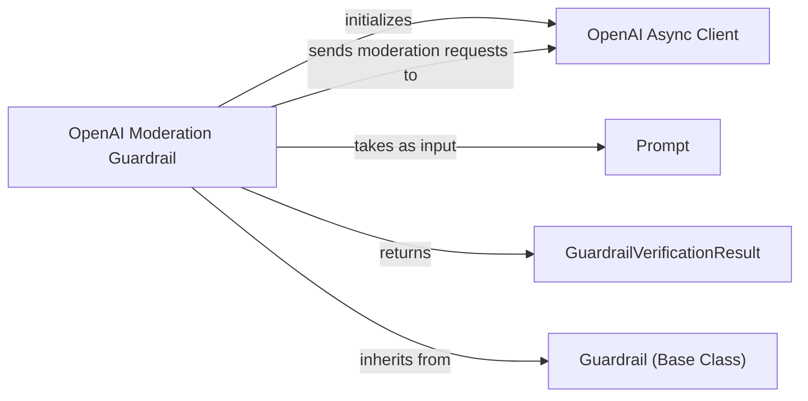

## Component Details

This graph illustrates the core components and their interactions within the Guardrail Service subsystem, specifically focusing on the OpenAI Moderation Guardrail. The main flow involves the OpenAI Moderation Guardrail receiving input (either a Prompt object or a string), utilizing the OpenAI Async Client to perform moderation checks via the OpenAI API, and then returning a GuardrailVerificationResult indicating the outcome. This subsystem's purpose is to provide safety and moderation functionalities by integrating with external moderation APIs.

### OpenAI Moderation Guardrail
This component implements a guardrail mechanism using OpenAI's moderation API. It initializes an asynchronous OpenAI client and provides a 'verify' method to check if given prompts or strings meet certain moderation criteria, returning a verification result.

**Related Classes/Methods**:

- <a href="https://github.com/deepsense-ai/ragbits/blob/master/packages/ragbits-guardrails/src/ragbits/guardrails/openai_moderation.py#L9-L51" target="_blank" rel="noopener noreferrer">`ragbits.packages.ragbits-guardrails.src.ragbits.guardrails.openai_moderation.OpenAIModerationGuardrail` (9:51)</a>
- <a href="https://github.com/deepsense-ai/ragbits/blob/master/packages/ragbits-guardrails/src/ragbits/guardrails/openai_moderation.py#L14-L16" target="_blank" rel="noopener noreferrer">`ragbits.packages.ragbits-guardrails.src.ragbits.guardrails.openai_moderation.OpenAIModerationGuardrail:__init__` (14:16)</a>
- <a href="https://github.com/deepsense-ai/ragbits/blob/master/packages/ragbits-guardrails/src/ragbits/guardrails/openai_moderation.py#L18-L51" target="_blank" rel="noopener noreferrer">`ragbits.packages.ragbits-guardrails.src.ragbits.guardrails.openai_moderation.OpenAIModerationGuardrail:verify` (18:51)</a>

### OpenAI Async Client
This component represents the asynchronous client for interacting with the OpenAI API. It is responsible for making API calls, such as creating moderation requests, to OpenAI's services.

**Related Classes/Methods**:

- `openai._client.AsyncOpenAI` (full file reference)
- `openai._client.AsyncOpenAI:moderations.create` (full file reference)

### GuardrailVerificationResult
A data structure that encapsulates the outcome of a guardrail's verification process, indicating whether the verification succeeded and providing a reason for failure if applicable.

**Related Classes/Methods**:

- <a href="https://github.com/deepsense-ai/ragbits/blob/master/packages/ragbits-guardrails/src/ragbits/guardrails/base.py#L8-L15" target="_blank" rel="noopener noreferrer">`ragbits.guardrails.base.GuardrailVerificationResult` (8:15)</a>

### Prompt
Represents a structured prompt, which can include user prompts, system prompts, and image data, used as input for the guardrail verification process.

**Related Classes/Methods**:

- <a href="https://github.com/deepsense-ai/ragbits/blob/master/packages/ragbits-core/src/ragbits/core/prompt/prompt.py#L21-L356" target="_blank" rel="noopener noreferrer">`ragbits.core.prompt.Prompt` (21:356)</a>

### Guardrail (Base Class)
An abstract base class that defines the common interface and contract for all guardrail implementations within the system.

**Related Classes/Methods**:

- <a href="https://github.com/deepsense-ai/ragbits/blob/master/packages/ragbits-guardrails/src/ragbits/guardrails/base.py#L18-L33" target="_blank" rel="noopener noreferrer">`ragbits.guardrails.base.Guardrail` (18:33)</a>

### [FAQ](https://github.com/CodeBoarding/GeneratedOnBoardings/tree/main?tab=readme-ov-file#faq)