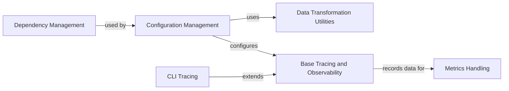

## Component Details

This subsystem provides foundational utility functions for configuration management, data transformations, and dependency validation. It also implements tracing and metric collection functionalities to monitor the execution flow and performance of the system. It encompasses components for handling application options, reading project configurations, dynamically importing classes, transforming dictionary structures, enforcing external dependencies, and providing comprehensive tracing and metrics capabilities for both general and CLI-specific contexts.

### Configuration Management
This component is responsible for handling application options, reading project configurations from pyproject.toml, and providing utilities for constructing objects from configuration dictionaries. It includes mechanisms for merging options, retrieving configuration instances, and dynamically importing classes based on paths specified in configurations. It leverages pydantic for configuration validation and data modeling.

**Related Classes/Methods**:

- <a href="https://github.com/deepsense-ai/ragbits/blob/master/packages/ragbits-core/src/ragbits/core/utils/config_handling.py#L78-L178" target="_blank" rel="noopener noreferrer">`ragbits.core.utils.config_handling.WithConstructionConfig` (78:178)</a>
- <a href="https://github.com/deepsense-ai/ragbits/blob/master/packages/ragbits-core/src/ragbits/core/utils/config_handling.py#L181-L210" target="_blank" rel="noopener noreferrer">`ragbits.core.utils.config_handling.ConfigurableComponent` (181:210)</a>
- <a href="https://github.com/deepsense-ai/ragbits/blob/master/packages/ragbits-core/src/ragbits/core/utils/config_handling.py#L31-L63" target="_blank" rel="noopener noreferrer">`ragbits.core.utils.config_handling.import_by_path` (31:63)</a>
- <a href="https://github.com/deepsense-ai/ragbits/blob/master/packages/ragbits-core/src/ragbits/core/utils/config_handling.py#L19-L22" target="_blank" rel="noopener noreferrer">`ragbits.core.utils.config_handling.InvalidConfigError` (19:22)</a>
- <a href="https://github.com/deepsense-ai/ragbits/blob/master/packages/ragbits-core/src/ragbits/core/utils/config_handling.py#L25-L28" target="_blank" rel="noopener noreferrer">`ragbits.core.utils.config_handling.NoPreferredConfigError` (25:28)</a>
- <a href="https://github.com/deepsense-ai/ragbits/blob/master/packages/ragbits-core/src/ragbits/core/utils/_pyproject.py#L33-L64" target="_blank" rel="noopener noreferrer">`ragbits.core.utils._pyproject.get_ragbits_config` (33:64)</a>
- <a href="https://github.com/deepsense-ai/ragbits/blob/master/packages/ragbits-core/src/ragbits/core/utils/_pyproject.py#L70-L94" target="_blank" rel="noopener noreferrer">`ragbits.core.utils._pyproject.get_config_instance` (70:94)</a>
- <a href="https://github.com/deepsense-ai/ragbits/blob/master/packages/ragbits-core/src/ragbits/core/options.py#L21-L35" target="_blank" rel="noopener noreferrer">`ragbits.core.options.Options.__or__` (21:35)</a>

### Data Transformation Utilities
This component provides utilities for transforming dictionary structures, specifically for flattening and unflattening nested dictionaries. It handles various data types within the dictionaries, including arrays and nested dictionaries, to facilitate easier processing or storage.

**Related Classes/Methods**:

- <a href="https://github.com/deepsense-ai/ragbits/blob/master/packages/ragbits-core/src/ragbits/core/utils/dict_transformations.py#L6-L43" target="_blank" rel="noopener noreferrer">`ragbits.core.utils.dict_transformations.flatten_dict` (6:43)</a>
- <a href="https://github.com/deepsense-ai/ragbits/blob/master/packages/ragbits-core/src/ragbits/core/utils/dict_transformations.py#L219-L267" target="_blank" rel="noopener noreferrer">`ragbits.core.utils.dict_transformations.unflatten_dict` (219:267)</a>

### Dependency Management
This component provides a decorator to enforce and validate external dependencies for functions or methods, ensuring that required packages are installed before execution.

**Related Classes/Methods**:

- <a href="https://github.com/deepsense-ai/ragbits/blob/master/packages/ragbits-core/src/ragbits/core/utils/decorators.py#L13-L56" target="_blank" rel="noopener noreferrer">`ragbits.core.utils.decorators.requires_dependencies` (13:56)</a>

### CLI Tracing
This component focuses on providing command-line interface (CLI) specific tracing capabilities. It defines how trace spans are updated and rendered for CLI output, including special attribute formatting and extraction of panel titles for better readability in a terminal environment. It extends the base tracing functionalities.

**Related Classes/Methods**:

- <a href="https://github.com/deepsense-ai/ragbits/blob/master/packages/ragbits-core/src/ragbits/core/audit/traces/cli.py#L38-L191" target="_blank" rel="noopener noreferrer">`ragbits.core.audit.traces.cli.CLISpan` (38:191)</a>
- <a href="https://github.com/deepsense-ai/ragbits/blob/master/packages/ragbits-core/src/ragbits/core/audit/traces/cli.py#L194-L277" target="_blank" rel="noopener noreferrer">`ragbits.core.audit.traces.cli.CLITraceHandler` (194:277)</a>

### Base Tracing and Observability
This core tracing component provides the foundational elements for tracing execution flows and formatting attributes for display. It includes a generic trace handler that manages the lifecycle of a trace (start, error, stop) and an attribute formatter that processes various data types (strings, lists, objects) into a human-readable format, handling special keys and shortening lists as needed. It also includes a traceable decorator for easy integration of tracing into functions. This component is also responsible for integrating with metrics handling for comprehensive observability.

**Related Classes/Methods**:

- <a href="https://github.com/deepsense-ai/ragbits/blob/master/packages/ragbits-core/src/ragbits/core/audit/traces/base.py#L13-L90" target="_blank" rel="noopener noreferrer">`ragbits.core.audit.traces.base.TraceHandler` (13:90)</a>
- <a href="https://github.com/deepsense-ai/ragbits/blob/master/packages/ragbits-core/src/ragbits/core/audit/traces/base.py#L93-L376" target="_blank" rel="noopener noreferrer">`ragbits.core.audit.traces.base.AttributeFormatter` (93:376)</a>
- `ragbits.core.audit.traces.traceable` (full file reference)

### Metrics Handling
This component is responsible for managing and recording metrics, specifically histograms. It provides functionalities to register new histograms and record values against them, contributing to the overall auditing and observability of the system.

**Related Classes/Methods**:

- <a href="https://github.com/deepsense-ai/ragbits/blob/master/packages/ragbits-core/src/ragbits/core/audit/metrics/base.py#L55-L142" target="_blank" rel="noopener noreferrer">`ragbits.core.audit.metrics.base.MetricHandler` (55:142)</a>

### [FAQ](https://github.com/CodeBoarding/GeneratedOnBoardings/tree/main?tab=readme-ov-file#faq)