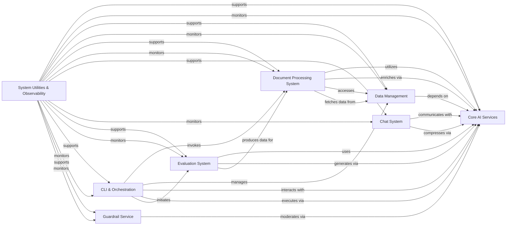

## Component Details

The `ragbits` project provides a comprehensive framework for building and evaluating Retrieval-Augmented Generation (RAG) systems. It integrates various AI services like LLMs and embeddings, manages data storage and retrieval, and offers robust document processing capabilities. The system includes a chat interface, an extensive evaluation framework, and a command-line interface for interaction, all supported by core utilities and observability features, with an optional guardrail service for content moderation.

### Core AI Services
Provides fundamental interfaces for interacting with Large Language Models (LLMs) for text generation, streaming, and token counting, and manages the creation of dense and sparse vector embeddings from diverse data types. It also handles the construction, rendering, and parsing of prompts for LLMs.

**Related Classes/Methods**:

- <a href="https://github.com/deepsense-ai/ragbits/blob/master/packages/ragbits-core/src/ragbits/core/llms/litellm.py#L45-L360" target="_blank" rel="noopener noreferrer">`ragbits.packages.ragbits-core.src.ragbits.core.llms.litellm.LiteLLM` (45:360)</a>
- <a href="https://github.com/deepsense-ai/ragbits/blob/master/packages/ragbits-core/src/ragbits/core/llms/mock.py#L21-L75" target="_blank" rel="noopener noreferrer">`ragbits.packages.ragbits-core.src.ragbits.core.llms.mock.MockLLM` (21:75)</a>
- <a href="https://github.com/deepsense-ai/ragbits/blob/master/packages/ragbits-core/src/ragbits/core/llms/local.py#L42-L216" target="_blank" rel="noopener noreferrer">`ragbits.packages.ragbits-core.src.ragbits.core.llms.local.LocalLLM` (42:216)</a>
- <a href="https://github.com/deepsense-ai/ragbits/blob/master/packages/ragbits-core/src/ragbits/core/llms/base.py#L42-L320" target="_blank" rel="noopener noreferrer">`ragbits.packages.ragbits-core.src.ragbits.core.llms.base.LLM` (42:320)</a>
- <a href="https://github.com/deepsense-ai/ragbits/blob/master/packages/ragbits-core/src/ragbits/core/llms/exceptions.py#L1-L8" target="_blank" rel="noopener noreferrer">`ragbits.packages.ragbits-core.src.ragbits.core.llms.exceptions.LLMError` (1:8)</a>
- <a href="https://github.com/deepsense-ai/ragbits/blob/master/packages/ragbits-core/src/ragbits/core/llms/exceptions.py#L16-L17" target="_blank" rel="noopener noreferrer">`ragbits.packages.ragbits-core.src.ragbits.core.llms.exceptions.LLMConnectionError:__init__` (16:17)</a>
- <a href="https://github.com/deepsense-ai/ragbits/blob/master/packages/ragbits-core/src/ragbits/core/llms/exceptions.py#L25-L27" target="_blank" rel="noopener noreferrer">`ragbits.packages.ragbits-core.src.ragbits.core.llms.exceptions.LLMStatusError:__init__` (25:27)</a>
- <a href="https://github.com/deepsense-ai/ragbits/blob/master/packages/ragbits-core/src/ragbits/core/llms/exceptions.py#L35-L36" target="_blank" rel="noopener noreferrer">`ragbits.packages.ragbits-core.src.ragbits.core.llms.exceptions.LLMResponseError:__init__` (35:36)</a>
- <a href="https://github.com/deepsense-ai/ragbits/blob/master/packages/ragbits-core/src/ragbits/core/llms/exceptions.py#L44-L45" target="_blank" rel="noopener noreferrer">`ragbits.packages.ragbits-core.src.ragbits.core.llms.exceptions.LLMEmptyResponseError:__init__` (44:45)</a>
- <a href="https://github.com/deepsense-ai/ragbits/blob/master/packages/ragbits-core/src/ragbits/core/llms/exceptions.py#L53-L54" target="_blank" rel="noopener noreferrer">`ragbits.packages.ragbits-core.src.ragbits.core.llms.exceptions.LLMNotSupportingImagesError:__init__` (53:54)</a>
- <a href="https://github.com/deepsense-ai/ragbits/blob/master/packages/ragbits-core/src/ragbits/core/embeddings/dense/litellm.py#L31-L168" target="_blank" rel="noopener noreferrer">`ragbits.packages.ragbits-core.src.ragbits.core.embeddings.dense.litellm.LiteLLMEmbedder` (31:168)</a>
- <a href="https://github.com/deepsense-ai/ragbits/blob/master/packages/ragbits-core/src/ragbits/core/embeddings/dense/fastembed.py#L20-L84" target="_blank" rel="noopener noreferrer">`ragbits.packages.ragbits-core.src.ragbits.core.embeddings.dense.fastembed.FastEmbedEmbedder` (20:84)</a>
- <a href="https://github.com/deepsense-ai/ragbits/blob/master/packages/ragbits-core/src/ragbits/core/embeddings/dense/vertex_multimodal.py#L24-L198" target="_blank" rel="noopener noreferrer">`ragbits.packages.ragbits-core.src.ragbits.core.embeddings.dense.vertex_multimodal.VertexAIMultimodelEmbedder` (24:198)</a>
- <a href="https://github.com/deepsense-ai/ragbits/blob/master/packages/ragbits-core/src/ragbits/core/embeddings/dense/local.py#L25-L91" target="_blank" rel="noopener noreferrer">`ragbits.packages.ragbits-core.src.ragbits.core.embeddings.dense.local.LocalEmbedder` (25:91)</a>
- <a href="https://github.com/deepsense-ai/ragbits/blob/master/packages/ragbits-core/src/ragbits/core/embeddings/sparse/fastembed.py#L11-L80" target="_blank" rel="noopener noreferrer">`ragbits.packages.ragbits-core.src.ragbits.core.embeddings.sparse.fastembed.FastEmbedSparseEmbedder` (11:80)</a>
- <a href="https://github.com/deepsense-ai/ragbits/blob/master/packages/ragbits-core/src/ragbits/core/embeddings/exceptions.py#L1-L8" target="_blank" rel="noopener noreferrer">`ragbits.packages.ragbits-core.src.ragbits.core.embeddings.exceptions.EmbeddingError` (1:8)</a>
- <a href="https://github.com/deepsense-ai/ragbits/blob/master/packages/ragbits-core/src/ragbits/core/embeddings/exceptions.py#L16-L17" target="_blank" rel="noopener noreferrer">`ragbits.packages.ragbits-core.src.ragbits.core.embeddings.exceptions.EmbeddingConnectionError:__init__` (16:17)</a>
- <a href="https://github.com/deepsense-ai/ragbits/blob/master/packages/ragbits-core/src/ragbits/core/embeddings/exceptions.py#L25-L27" target="_blank" rel="noopener noreferrer">`ragbits.packages.ragbits-core.src.ragbits.core.embeddings.exceptions.EmbeddingStatusError:__init__` (25:27)</a>
- <a href="https://github.com/deepsense-ai/ragbits/blob/master/packages/ragbits-core/src/ragbits/core/embeddings/exceptions.py#L35-L36" target="_blank" rel="noopener noreferrer">`ragbits.packages.ragbits-core.src.ragbits.core.embeddings.exceptions.EmbeddingResponseError:__init__` (35:36)</a>
- <a href="https://github.com/deepsense-ai/ragbits/blob/master/packages/ragbits-core/src/ragbits/core/embeddings/exceptions.py#L44-L45" target="_blank" rel="noopener noreferrer">`ragbits.packages.ragbits-core.src.ragbits.core.embeddings.exceptions.EmbeddingEmptyResponseError:__init__` (44:45)</a>
- <a href="https://github.com/deepsense-ai/ragbits/blob/master/packages/ragbits-core/src/ragbits/core/embeddings/base.py#L37-L92" target="_blank" rel="noopener noreferrer">`ragbits.packages.ragbits-core.src.ragbits.core.embeddings.base.Embedder` (37:92)</a>
- <a href="https://github.com/deepsense-ai/ragbits/blob/master/packages/ragbits-core/src/ragbits/core/prompt/prompt.py#L21-L356" target="_blank" rel="noopener noreferrer">`ragbits.packages.ragbits-core.src.ragbits.core.prompt.prompt.Prompt` (21:356)</a>
- <a href="https://github.com/deepsense-ai/ragbits/blob/master/packages/ragbits-core/src/ragbits/core/prompt/base.py#L11-L47" target="_blank" rel="noopener noreferrer">`ragbits.packages.ragbits-core.src.ragbits.core.prompt.base.BasePrompt` (11:47)</a>
- <a href="https://github.com/deepsense-ai/ragbits/blob/master/packages/ragbits-core/src/ragbits/core/prompt/discovery.py#L12-L74" target="_blank" rel="noopener noreferrer">`ragbits.packages.ragbits-core.src.ragbits.core.prompt.discovery.PromptDiscovery` (12:74)</a>
- <a href="https://github.com/deepsense-ai/ragbits/blob/master/packages/ragbits-core/src/ragbits/core/prompt/parsers.py#L19-L35" target="_blank" rel="noopener noreferrer">`ragbits.packages.ragbits-core.src.ragbits.core.prompt.parsers:int_parser` (19:35)</a>
- <a href="https://github.com/deepsense-ai/ragbits/blob/master/packages/ragbits-core/src/ragbits/core/prompt/parsers.py#L51-L67" target="_blank" rel="noopener noreferrer">`ragbits.packages.ragbits-core.src.ragbits.core.prompt.parsers:float_parser` (51:67)</a>
- <a href="https://github.com/deepsense-ai/ragbits/blob/master/packages/ragbits-core/src/ragbits/core/prompt/parsers.py#L70-L88" target="_blank" rel="noopener noreferrer">`ragbits.packages.ragbits-core.src.ragbits.core.prompt.parsers:bool_parser` (70:88)</a>
- <a href="https://github.com/deepsense-ai/ragbits/blob/master/packages/ragbits-core/src/ragbits/core/prompt/parsers.py#L91-L123" target="_blank" rel="noopener noreferrer">`ragbits.packages.ragbits-core.src.ragbits.core.prompt.parsers:build_pydantic_parser` (91:123)</a>
- <a href="https://github.com/deepsense-ai/ragbits/blob/master/packages/ragbits-core/src/ragbits/core/prompt/parsers.py#L9-L16" target="_blank" rel="noopener noreferrer">`ragbits.packages.ragbits-core.src.ragbits.core.prompt.parsers.ResponseParsingError` (9:16)</a>
- <a href="https://github.com/deepsense-ai/ragbits/blob/master/packages/ragbits-core/src/ragbits/core/prompt/exceptions.py#L1-L8" target="_blank" rel="noopener noreferrer">`ragbits.packages.ragbits-core.src.ragbits.core.prompt.exceptions.PromptError` (1:8)</a>
- <a href="https://github.com/deepsense-ai/ragbits/blob/master/packages/ragbits-core/src/ragbits/core/prompt/exceptions.py#L16-L19" target="_blank" rel="noopener noreferrer">`ragbits.packages.ragbits-core.src.ragbits.core.prompt.exceptions.PromptWithImagesOfInvalidFormat:__init__` (16:19)</a>
- <a href="https://github.com/deepsense-ai/ragbits/blob/master/packages/ragbits-core/src/ragbits/core/prompt/_cli.py#L65-L80" target="_blank" rel="noopener noreferrer">`ragbits.packages.ragbits-core.src.ragbits.core.prompt._cli:search` (65:80)</a>
- <a href="https://github.com/deepsense-ai/ragbits/blob/master/packages/ragbits-core/src/ragbits/core/prompt/_cli.py#L84-L90" target="_blank" rel="noopener noreferrer">`ragbits.packages.ragbits-core.src.ragbits.core.prompt._cli:render` (84:90)</a>
- <a href="https://github.com/deepsense-ai/ragbits/blob/master/packages/ragbits-core/src/ragbits/core/prompt/_cli.py#L94-L112" target="_blank" rel="noopener noreferrer">`ragbits.packages.ragbits-core.src.ragbits.core.prompt._cli:execute` (94:112)</a>

### Data Management
Offers a standardized interface for storing, querying, and managing vector data across different vector database implementations and provides mechanisms to connect to and retrieve data from various external and local sources.

**Related Classes/Methods**:

- <a href="https://github.com/deepsense-ai/ragbits/blob/master/packages/ragbits-core/src/ragbits/core/vector_stores/chroma.py#L29-L320" target="_blank" rel="noopener noreferrer">`ragbits.packages.ragbits-core.src.ragbits.core.vector_stores.chroma.ChromaVectorStore` (29:320)</a>
- <a href="https://github.com/deepsense-ai/ragbits/blob/master/packages/ragbits-core/src/ragbits/core/vector_stores/pgvector.py#L45-L471" target="_blank" rel="noopener noreferrer">`ragbits.packages.ragbits-core.src.ragbits.core.vector_stores.pgvector.PgVectorStore` (45:471)</a>
- <a href="https://github.com/deepsense-ai/ragbits/blob/master/packages/ragbits-core/src/ragbits/core/vector_stores/qdrant.py#L33-L361" target="_blank" rel="noopener noreferrer">`ragbits.packages.ragbits-core.src.ragbits.core.vector_stores.qdrant.QdrantVectorStore` (33:361)</a>
- <a href="https://github.com/deepsense-ai/ragbits/blob/master/packages/ragbits-core/src/ragbits/core/vector_stores/base.py#L155-L221" target="_blank" rel="noopener noreferrer">`ragbits.packages.ragbits-core.src.ragbits.core.vector_stores.base.VectorStoreWithDenseEmbedder` (155:221)</a>
- <a href="https://github.com/deepsense-ai/ragbits/blob/master/packages/ragbits-core/src/ragbits/core/vector_stores/base.py#L224-L291" target="_blank" rel="noopener noreferrer">`ragbits.packages.ragbits-core.src.ragbits.core.vector_stores.base.VectorStoreWithEmbedder` (224:291)</a>
- <a href="https://github.com/deepsense-ai/ragbits/blob/master/packages/ragbits-core/src/ragbits/core/vector_stores/hybrid_strategies.py#L123-L176" target="_blank" rel="noopener noreferrer">`ragbits.packages.ragbits-core.src.ragbits.core.vector_stores.hybrid_strategies.DistributionBasedScoreFusion` (123:176)</a>
- <a href="https://github.com/deepsense-ai/ragbits/blob/master/packages/ragbits-core/src/ragbits/core/vector_stores/_cli.py#L53-L72" target="_blank" rel="noopener noreferrer">`ragbits.packages.ragbits-core.src.ragbits.core.vector_stores._cli:list_entries` (53:72)</a>
- <a href="https://github.com/deepsense-ai/ragbits/blob/master/packages/ragbits-core/src/ragbits/core/vector_stores/_cli.py#L80-L97" target="_blank" rel="noopener noreferrer">`ragbits.packages.ragbits-core.src.ragbits.core.vector_stores._cli:remove` (80:97)</a>
- <a href="https://github.com/deepsense-ai/ragbits/blob/master/packages/ragbits-core/src/ragbits/core/vector_stores/_cli.py#L101-L128" target="_blank" rel="noopener noreferrer">`ragbits.packages.ragbits-core.src.ragbits.core.vector_stores._cli:query` (101:128)</a>
- <a href="https://github.com/deepsense-ai/ragbits/blob/master/packages/ragbits-core/src/ragbits/core/vector_stores/base.py#L84-L143" target="_blank" rel="noopener noreferrer">`ragbits.packages.ragbits-core.src.ragbits.core.vector_stores.base.VectorStore` (84:143)</a>
- <a href="https://github.com/deepsense-ai/ragbits/blob/master/packages/ragbits-core/src/ragbits/core/sources/hf.py#L19-L146" target="_blank" rel="noopener noreferrer">`ragbits.packages.ragbits-core.src.ragbits.core.sources.hf.HuggingFaceSource` (19:146)</a>
- <a href="https://github.com/deepsense-ai/ragbits/blob/master/packages/ragbits-core/src/ragbits/core/sources/git.py#L22-L213" target="_blank" rel="noopener noreferrer">`ragbits.packages.ragbits-core.src.ragbits.core.sources.git.GitSource` (22:213)</a>
- <a href="https://github.com/deepsense-ai/ragbits/blob/master/packages/ragbits-core/src/ragbits/core/sources/azure.py#L21-L192" target="_blank" rel="noopener noreferrer">`ragbits.packages.ragbits-core.src.ragbits.core.sources.azure.AzureBlobStorageSource` (21:192)</a>
- <a href="https://github.com/deepsense-ai/ragbits/blob/master/packages/ragbits-core/src/ragbits/core/sources/web.py#L14-L91" target="_blank" rel="noopener noreferrer">`ragbits.packages.ragbits-core.src.ragbits.core.sources.web.WebSource` (14:91)</a>
- <a href="https://github.com/deepsense-ai/ragbits/blob/master/packages/ragbits-core/src/ragbits/core/sources/s3.py#L19-L187" target="_blank" rel="noopener noreferrer">`ragbits.packages.ragbits-core.src.ragbits.core.sources.s3.S3Source` (19:187)</a>
- <a href="https://github.com/deepsense-ai/ragbits/blob/master/packages/ragbits-core/src/ragbits/core/sources/local.py#L12-L92" target="_blank" rel="noopener noreferrer">`ragbits.packages.ragbits-core.src.ragbits.core.sources.local.LocalFileSource` (12:92)</a>
- <a href="https://github.com/deepsense-ai/ragbits/blob/master/packages/ragbits-core/src/ragbits/core/sources/gcs.py#L16-L134" target="_blank" rel="noopener noreferrer">`ragbits.packages.ragbits-core.src.ragbits.core.sources.gcs.GCSSource` (16:134)</a>
- <a href="https://github.com/deepsense-ai/ragbits/blob/master/packages/ragbits-core/src/ragbits/core/sources/base.py#L20-L105" target="_blank" rel="noopener noreferrer">`ragbits.packages.ragbits-core.src.ragbits.core.sources.base.Source` (20:105)</a>
- <a href="https://github.com/deepsense-ai/ragbits/blob/master/packages/ragbits-core/src/ragbits/core/sources/exceptions.py#L1-L8" target="_blank" rel="noopener noreferrer">`ragbits.packages.ragbits-core.src.ragbits.core.sources.exceptions.SourceError` (1:8)</a>
- <a href="https://github.com/deepsense-ai/ragbits/blob/master/packages/ragbits-core/src/ragbits/core/sources/exceptions.py#L16-L17" target="_blank" rel="noopener noreferrer">`ragbits.packages.ragbits-core.src.ragbits.core.sources.exceptions.SourceConnectionError:__init__` (16:17)</a>
- <a href="https://github.com/deepsense-ai/ragbits/blob/master/packages/ragbits-core/src/ragbits/core/sources/exceptions.py#L25-L27" target="_blank" rel="noopener noreferrer">`ragbits.packages.ragbits-core.src.ragbits.core.sources.exceptions.SourceNotFoundError:__init__` (25:27)</a>
- <a href="https://github.com/deepsense-ai/ragbits/blob/master/packages/ragbits-core/src/ragbits/core/sources/exceptions.py#L35-L38" target="_blank" rel="noopener noreferrer">`ragbits.packages.ragbits-core.src.ragbits.core.sources.exceptions.SourceDownloadError:__init__` (35:38)</a>

### Document Processing System
The primary component responsible for orchestrating document search operations, managing the end-to-end process of ingesting documents (parsing, enriching, indexing), and improving search results by rephrasing user queries and reranking retrieved documents. It also defines the structured representation of documents and their constituent elements.

**Related Classes/Methods**:

- <a href="https://github.com/deepsense-ai/ragbits/blob/master/packages/ragbits-document-search/src/ragbits/document_search/_main.py#L62-L273" target="_blank" rel="noopener noreferrer">`ragbits.packages.ragbits-document-search.src.ragbits.document_search._main.DocumentSearch` (62:273)</a>
- <a href="https://github.com/deepsense-ai/ragbits/blob/master/packages/ragbits-document-search/src/ragbits/document_search/cli.py#L69-L92" target="_blank" rel="noopener noreferrer">`ragbits.packages.ragbits-document-search.src.ragbits.document_search.cli:search` (69:92)</a>
- <a href="https://github.com/deepsense-ai/ragbits/blob/master/packages/ragbits-document-search/src/ragbits/document_search/cli.py#L96-L109" target="_blank" rel="noopener noreferrer">`ragbits.packages.ragbits-document-search.src.ragbits.document_search.cli:ingest` (96:109)</a>
- <a href="https://github.com/deepsense-ai/ragbits/blob/master/packages/ragbits-document-search/src/ragbits/document_search/ingestion/strategies/batched.py#L30-L261" target="_blank" rel="noopener noreferrer">`ragbits.packages.ragbits-document-search.src.ragbits.document_search.ingestion.strategies.batched.BatchedIngestStrategy` (30:261)</a>
- <a href="https://github.com/deepsense-ai/ragbits/blob/master/packages/ragbits-document-search/src/ragbits/document_search/ingestion/parsers/unstructured.py#L35-L248" target="_blank" rel="noopener noreferrer">`ragbits.packages.ragbits-document-search.src.ragbits.document_search.ingestion.parsers.unstructured.UnstructuredDocumentParser` (35:248)</a>
- <a href="https://github.com/deepsense-ai/ragbits/blob/master/packages/ragbits-document-search/src/ragbits/document_search/ingestion/parsers/docling.py#L20-L156" target="_blank" rel="noopener noreferrer">`ragbits.packages.ragbits-document-search.src.ragbits.document_search.ingestion.parsers.docling.DoclingDocumentParser` (20:156)</a>
- <a href="https://github.com/deepsense-ai/ragbits/blob/master/packages/ragbits-document-search/src/ragbits/document_search/ingestion/parsers/base.py#L52-L73" target="_blank" rel="noopener noreferrer">`ragbits.packages.ragbits-document-search.src.ragbits.document_search.ingestion.parsers.base.TextDocumentParser` (52:73)</a>
- <a href="https://github.com/deepsense-ai/ragbits/blob/master/packages/ragbits-document-search/src/ragbits/document_search/ingestion/parsers/base.py#L76-L97" target="_blank" rel="noopener noreferrer">`ragbits.packages.ragbits-document-search.src.ragbits.document_search.ingestion.parsers.base.ImageDocumentParser` (76:97)</a>
- <a href="https://github.com/deepsense-ai/ragbits/blob/master/packages/ragbits-document-search/src/ragbits/document_search/ingestion/enrichers/image.py#L36-L107" target="_blank" rel="noopener noreferrer">`ragbits.packages.ragbits-document-search.src.ragbits.document_search.ingestion.enrichers.image.ImageElementEnricher` (36:107)</a>
- <a href="https://github.com/deepsense-ai/ragbits/blob/master/packages/ragbits-document-search/src/ragbits/document_search/ingestion/strategies/base.py#L25-L46" target="_blank" rel="noopener noreferrer">`ragbits.packages.ragbits-document-search.src.ragbits.document_search.ingestion.strategies.base.IngestError` (25:46)</a>
- <a href="https://github.com/deepsense-ai/ragbits/blob/master/packages/ragbits-document-search/src/ragbits/document_search/ingestion/parsers/exceptions.py#L4-L11" target="_blank" rel="noopener noreferrer">`ragbits.packages.ragbits-document-search.src.ragbits.document_search.ingestion.parsers.exceptions.ParserError` (4:11)</a>
- <a href="https://github.com/deepsense-ai/ragbits/blob/master/packages/ragbits-document-search/src/ragbits/document_search/ingestion/enrichers/exceptions.py#L4-L11" target="_blank" rel="noopener noreferrer">`ragbits.packages.ragbits-document-search.src.ragbits.document_search.ingestion.enrichers.exceptions.EnricherError` (4:11)</a>
- <a href="https://github.com/deepsense-ai/ragbits/blob/master/packages/ragbits-document-search/src/ragbits/document_search/ingestion/strategies/batched.py#L21-L27" target="_blank" rel="noopener noreferrer">`ragbits.packages.ragbits-document-search.src.ragbits.document_search.ingestion.strategies.batched.IngestTaskResult` (21:27)</a>
- <a href="https://github.com/deepsense-ai/ragbits/blob/master/packages/ragbits-document-search/src/ragbits/document_search/ingestion/parsers/exceptions.py#L19-L21" target="_blank" rel="noopener noreferrer">`ragbits.packages.ragbits-document-search.src.ragbits.document_search.ingestion.parsers.exceptions.ParserNotFoundError:__init__` (19:21)</a>
- <a href="https://github.com/deepsense-ai/ragbits/blob/master/packages/ragbits-document-search/src/ragbits/document_search/ingestion/parsers/exceptions.py#L29-L32" target="_blank" rel="noopener noreferrer">`ragbits.packages.ragbits-document-search.src.ragbits.document_search.ingestion.parsers.exceptions.ParserDocumentNotSupportedError:__init__` (29:32)</a>
- <a href="https://github.com/deepsense-ai/ragbits/blob/master/packages/ragbits-document-search/src/ragbits/document_search/ingestion/enrichers/exceptions.py#L19-L21" target="_blank" rel="noopener noreferrer">`ragbits.packages.ragbits-document-search.src.ragbits.document_search.ingestion.enrichers.exceptions.EnricherNotFoundError:__init__` (19:21)</a>
- <a href="https://github.com/deepsense-ai/ragbits/blob/master/packages/ragbits-document-search/src/ragbits/document_search/ingestion/enrichers/exceptions.py#L29-L32" target="_blank" rel="noopener noreferrer">`ragbits.packages.ragbits-document-search.src.ragbits.document_search.ingestion.enrichers.exceptions.EnricherElementNotSupportedError:__init__` (29:32)</a>
- <a href="https://github.com/deepsense-ai/ragbits/blob/master/packages/ragbits-document-search/src/ragbits/document_search/ingestion/strategies/base.py#L79-L268" target="_blank" rel="noopener noreferrer">`ragbits.packages.ragbits-document-search.src.ragbits.document_search.ingestion.strategies.base.IngestStrategy` (79:268)</a>
- <a href="https://github.com/deepsense-ai/ragbits/blob/master/packages/ragbits-document-search/src/ragbits/document_search/retrieval/rephrasers/llm.py#L69-L141" target="_blank" rel="noopener noreferrer">`ragbits.packages.ragbits-document-search.src.ragbits.document_search.retrieval.rephrasers.llm.LLMQueryRephraser` (69:141)</a>
- <a href="https://github.com/deepsense-ai/ragbits/blob/master/packages/ragbits-document-search/src/ragbits/document_search/retrieval/rerankers/llm.py#L57-L177" target="_blank" rel="noopener noreferrer">`ragbits.packages.ragbits-document-search.src.ragbits.document_search.retrieval.rerankers.llm.LLMReranker` (57:177)</a>
- <a href="https://github.com/deepsense-ai/ragbits/blob/master/packages/ragbits-document-search/src/ragbits/document_search/retrieval/rephrasers/llm.py#L24-L53" target="_blank" rel="noopener noreferrer">`ragbits.packages.ragbits-document-search.src.ragbits.document_search.retrieval.rephrasers.llm.LLMQueryRephraserPrompt` (24:53)</a>
- <a href="https://github.com/deepsense-ai/ragbits/blob/master/packages/ragbits-document-search/src/ragbits/document_search/retrieval/rephrasers/llm.py#L15-L21" target="_blank" rel="noopener noreferrer">`ragbits.packages.ragbits-document-search.src.ragbits.document_search.retrieval.rephrasers.llm.LLMQueryRephraserPromptInput` (15:21)</a>
- <a href="https://github.com/deepsense-ai/ragbits/blob/master/packages/ragbits-document-search/src/ragbits/document_search/retrieval/rerankers/llm.py#L27-L40" target="_blank" rel="noopener noreferrer">`ragbits.packages.ragbits-document-search.src.ragbits.document_search.retrieval.rerankers.llm.RerankerPrompt` (27:40)</a>
- <a href="https://github.com/deepsense-ai/ragbits/blob/master/packages/ragbits-document-search/src/ragbits/document_search/retrieval/rerankers/llm.py#L18-L24" target="_blank" rel="noopener noreferrer">`ragbits.packages.ragbits-document-search.src.ragbits.document_search.retrieval.rerankers.llm.RerankerInput` (18:24)</a>
- <a href="https://github.com/deepsense-ai/ragbits/blob/master/packages/ragbits-document-search/src/ragbits/document_search/retrieval/rephrasers/base.py#L19-L39" target="_blank" rel="noopener noreferrer">`ragbits.packages.ragbits-document-search.src.ragbits.document_search.retrieval.rephrasers.base.QueryRephraser` (19:39)</a>
- <a href="https://github.com/deepsense-ai/ragbits/blob/master/packages/ragbits-document-search/src/ragbits/document_search/retrieval/rerankers/base.py#L30-L56" target="_blank" rel="noopener noreferrer">`ragbits.packages.ragbits-document-search.src.ragbits.document_search.retrieval.rerankers.base.Reranker` (30:56)</a>
- <a href="https://github.com/deepsense-ai/ragbits/blob/master/packages/ragbits-document-search/src/ragbits/document_search/documents/document.py#L52-L161" target="_blank" rel="noopener noreferrer">`ragbits.packages.ragbits-document-search.src.ragbits.document_search.documents.document.DocumentMeta` (52:161)</a>
- <a href="https://github.com/deepsense-ai/ragbits/blob/master/packages/ragbits-document-search/src/ragbits/document_search/documents/document.py#L164-L187" target="_blank" rel="noopener noreferrer">`ragbits.packages.ragbits-document-search.src.ragbits.document_search.documents.document.Document` (164:187)</a>
- <a href="https://github.com/deepsense-ai/ragbits/blob/master/packages/ragbits-document-search/src/ragbits/document_search/documents/document.py#L190-L203" target="_blank" rel="noopener noreferrer">`ragbits.packages.ragbits-document-search.src.ragbits.document_search.documents.document.TextDocument` (190:203)</a>
- <a href="https://github.com/deepsense-ai/ragbits/blob/master/packages/ragbits-document-search/src/ragbits/document_search/documents/document.py#L14-L49" target="_blank" rel="noopener noreferrer">`ragbits.packages.ragbits-document-search.src.ragbits.document_search.documents.document.DocumentType` (14:49)</a>
- <a href="https://github.com/deepsense-ai/ragbits/blob/master/packages/ragbits-document-search/src/ragbits/document_search/documents/element.py#L22-L137" target="_blank" rel="noopener noreferrer">`ragbits.packages.ragbits-document-search.src.ragbits.document_search.documents.element.Element` (22:137)</a>
- <a href="https://github.com/deepsense-ai/ragbits/blob/master/packages/ragbits-document-search/src/ragbits/document_search/documents/element.py#L160-L208" target="_blank" rel="noopener noreferrer">`ragbits.packages.ragbits-document-search.src.ragbits.document_search.documents.element.ImageElement` (160:208)</a>

### Chat System
Provides the public API and internal interface for managing chat conversations, including handling user inputs, generating responses, and managing chat state. It also handles the storage and retrieval of chat conversation history.

**Related Classes/Methods**:

- <a href="https://github.com/deepsense-ai/ragbits/blob/master/packages/ragbits-chat/src/ragbits/chat/api.py#L43-L230" target="_blank" rel="noopener noreferrer">`ragbits.packages.ragbits-chat.src.ragbits.chat.api.RagbitsAPI` (43:230)</a>
- <a href="https://github.com/deepsense-ai/ragbits/blob/master/packages/ragbits-chat/src/ragbits/chat/interface/_interface.py#L75-L217" target="_blank" rel="noopener noreferrer">`ragbits.packages.ragbits-chat.src.ragbits.chat.interface._interface.ChatInterface` (75:217)</a>
- <a href="https://github.com/deepsense-ai/ragbits/blob/master/packages/ragbits-chat/src/ragbits/chat/interface/types.py#L47-L81" target="_blank" rel="noopener noreferrer">`ragbits.packages.ragbits-chat.src.ragbits.chat.interface.types.ChatResponse` (47:81)</a>
- <a href="https://github.com/deepsense-ai/ragbits/blob/master/packages/ragbits-chat/src/ragbits/chat/interface/types.py#L84-L90" target="_blank" rel="noopener noreferrer">`ragbits.packages.ragbits-chat.src.ragbits.chat.interface.types.ChatContext` (84:90)</a>
- <a href="https://github.com/deepsense-ai/ragbits/blob/master/packages/ragbits-chat/src/ragbits/chat/interface/types.py#L22-L27" target="_blank" rel="noopener noreferrer">`ragbits.packages.ragbits-chat.src.ragbits.chat.interface.types.Reference` (22:27)</a>
- <a href="https://github.com/deepsense-ai/ragbits/blob/master/packages/ragbits-chat/src/ragbits/chat/interface/types.py#L30-L34" target="_blank" rel="noopener noreferrer">`ragbits.packages.ragbits-chat.src.ragbits.chat.interface.types.StateUpdate` (30:34)</a>
- <a href="https://github.com/deepsense-ai/ragbits/blob/master/packages/ragbits-chat/src/ragbits/chat/history/compressors/llm.py#L40-L86" target="_blank" rel="noopener noreferrer">`ragbits.packages.ragbits-chat.src.ragbits.chat.history.compressors.llm.StandaloneMessageCompressor` (40:86)</a>
- <a href="https://github.com/deepsense-ai/ragbits/blob/master/packages/ragbits-chat/src/ragbits/chat/history/compressors/llm.py#L8-L14" target="_blank" rel="noopener noreferrer">`ragbits.packages.ragbits-chat.src.ragbits.chat.history.compressors.llm.LastMessageAndHistory` (8:14)</a>
- <a href="https://github.com/deepsense-ai/ragbits/blob/master/packages/ragbits-chat/src/ragbits/chat/history/compressors/llm.py#L17-L37" target="_blank" rel="noopener noreferrer">`ragbits.packages.ragbits-chat.src.ragbits.chat.history.compressors.llm.StandaloneMessageCompressorPrompt` (17:37)</a>
- <a href="https://github.com/deepsense-ai/ragbits/blob/master/packages/ragbits-chat/src/ragbits/chat/persistence/file.py#L8-L51" target="_blank" rel="noopener noreferrer">`ragbits.packages.ragbits-chat.src.ragbits.chat.persistence.file.FileHistoryPersistence` (8:51)</a>
- <a href="https://github.com/deepsense-ai/ragbits/blob/master/packages/ragbits-chat/src/ragbits/chat/persistence/sql.py#L136-L294" target="_blank" rel="noopener noreferrer">`ragbits.packages.ragbits-chat.src.ragbits.chat.persistence.sql.SQLHistoryPersistence` (136:294)</a>
- <a href="https://github.com/deepsense-ai/ragbits/blob/master/packages/ragbits-chat/src/ragbits/chat/persistence/sql.py#L124-L130" target="_blank" rel="noopener noreferrer">`ragbits.packages.ragbits-chat.src.ragbits.chat.persistence.sql.SQLHistoryPersistenceOptions` (124:130)</a>
- <a href="https://github.com/deepsense-ai/ragbits/blob/master/packages/ragbits-chat/src/ragbits/chat/persistence/sql.py#L41-L69" target="_blank" rel="noopener noreferrer">`ragbits.packages.ragbits-chat.src.ragbits.chat.persistence.sql.create_conversation_model` (41:69)</a>
- <a href="https://github.com/deepsense-ai/ragbits/blob/master/packages/ragbits-chat/src/ragbits/chat/persistence/sql.py#L72-L121" target="_blank" rel="noopener noreferrer">`ragbits.packages.ragbits-chat.src.ragbits.chat.persistence.sql.create_chat_interaction_model` (72:121)</a>
- <a href="https://github.com/deepsense-ai/ragbits/blob/master/packages/ragbits-chat/src/ragbits/chat/persistence/base.py#L16-L40" target="_blank" rel="noopener noreferrer">`ragbits.packages.ragbits-chat.src.ragbits.chat.persistence.base.HistoryPersistence` (16:40)</a>

### Evaluation System
The overarching framework for evaluating RAG systems, encompassing the execution of evaluation pipelines, metric computation, result logging, and optimization of evaluation parameters. It also provides tools for generating synthetic datasets and loading evaluation datasets.

**Related Classes/Methods**:

- <a href="https://github.com/deepsense-ai/ragbits/blob/master/packages/ragbits-evaluate/src/ragbits/evaluate/evaluator.py#L63-L224" target="_blank" rel="noopener noreferrer">`ragbits.packages.ragbits-evaluate.src.ragbits.evaluate.evaluator.Evaluator` (63:224)</a>
- <a href="https://github.com/deepsense-ai/ragbits/blob/master/packages/ragbits-evaluate/src/ragbits/evaluate/evaluator.py#L33-L41" target="_blank" rel="noopener noreferrer">`ragbits.packages.ragbits-evaluate.src.ragbits.evaluate.evaluator.EvaluatorResult` (33:41)</a>
- <a href="https://github.com/deepsense-ai/ragbits/blob/master/packages/ragbits-evaluate/src/ragbits/evaluate/evaluator.py#L22-L29" target="_blank" rel="noopener noreferrer">`ragbits.packages.ragbits-evaluate.src.ragbits.evaluate.evaluator.EvaluationTimePerf` (22:29)</a>
- <a href="https://github.com/deepsense-ai/ragbits/blob/master/packages/ragbits-evaluate/src/ragbits/evaluate/utils.py#L20-L50" target="_blank" rel="noopener noreferrer">`ragbits.packages.ragbits-evaluate.src.ragbits.evaluate.utils:log_evaluation_to_file` (20:50)</a>
- <a href="https://github.com/deepsense-ai/ragbits/blob/master/packages/ragbits-evaluate/src/ragbits/evaluate/utils.py#L104-L129" target="_blank" rel="noopener noreferrer">`ragbits.packages.ragbits-evaluate.src.ragbits.evaluate.utils:log_optimization_to_file` (104:129)</a>
- <a href="https://github.com/deepsense-ai/ragbits/blob/master/packages/ragbits-evaluate/src/ragbits/evaluate/utils.py#L132-L149" target="_blank" rel="noopener noreferrer">`ragbits.packages.ragbits-evaluate.src.ragbits.evaluate.utils._save_json` (132:149)</a>
- <a href="https://github.com/deepsense-ai/ragbits/blob/master/packages/ragbits-evaluate/src/ragbits/evaluate/optimizer.py#L28-L210" target="_blank" rel="noopener noreferrer">`ragbits.packages.ragbits-evaluate.src.ragbits.evaluate.optimizer.Optimizer` (28:210)</a>
- <a href="https://github.com/deepsense-ai/ragbits/blob/master/packages/ragbits-evaluate/src/ragbits/evaluate/pipelines/question_answer.py#L40-L96" target="_blank" rel="noopener noreferrer">`ragbits.packages.ragbits-evaluate.src.ragbits.evaluate.pipelines.question_answer.QuestionAnswerPipeline` (40:96)</a>
- <a href="https://github.com/deepsense-ai/ragbits/blob/master/packages/ragbits-evaluate/src/ragbits/evaluate/pipelines/document_search.py#L38-L106" target="_blank" rel="noopener noreferrer">`ragbits.packages.ragbits-evaluate.src.ragbits.evaluate.pipelines.document_search.DocumentSearchPipeline` (38:106)</a>
- <a href="https://github.com/deepsense-ai/ragbits/blob/master/packages/ragbits-evaluate/src/ragbits/evaluate/pipelines/base.py#L30-L64" target="_blank" rel="noopener noreferrer">`ragbits.packages.ragbits-evaluate.src.ragbits.evaluate.pipelines.base.EvaluationPipeline` (30:64)</a>
- <a href="https://github.com/deepsense-ai/ragbits/blob/master/packages/ragbits-evaluate/src/ragbits/evaluate/dataset_generator/pipeline.py#L88-L141" target="_blank" rel="noopener noreferrer">`ragbits.packages.ragbits-evaluate.src.ragbits.evaluate.dataset_generator.pipeline.DatasetGenerationPipeline` (88:141)</a>
- <a href="https://github.com/deepsense-ai/ragbits/blob/master/packages/ragbits-evaluate/src/ragbits/evaluate/dataset_generator/pipeline.py#L45-L85" target="_blank" rel="noopener noreferrer">`ragbits.packages.ragbits-evaluate.src.ragbits.evaluate.dataset_generator.pipeline.DatasetGenerationPipelineConfig` (45:85)</a>
- <a href="https://github.com/deepsense-ai/ragbits/blob/master/packages/ragbits-evaluate/src/ragbits/evaluate/dataset_generator/pipeline.py#L28-L42" target="_blank" rel="noopener noreferrer">`ragbits.packages.ragbits-evaluate.src.ragbits.evaluate.dataset_generator.pipeline.TaskConfig` (28:42)</a>
- <a href="https://github.com/deepsense-ai/ragbits/blob/master/packages/ragbits-evaluate/src/ragbits/evaluate/dataset_generator/pipeline.py#L15-L25" target="_blank" rel="noopener noreferrer">`ragbits.packages.ragbits-evaluate.src.ragbits.evaluate.dataset_generator.pipeline.LLMConfigForTask` (15:25)</a>
- <a href="https://github.com/deepsense-ai/ragbits/blob/master/packages/ragbits-evaluate/src/ragbits/evaluate/dataset_generator/tasks/corpus_generation.py#L15-L67" target="_blank" rel="noopener noreferrer">`ragbits.packages.ragbits-evaluate.src.ragbits.evaluate.dataset_generator.tasks.corpus_generation.CorpusGenerationStep` (15:67)</a>
- <a href="https://github.com/deepsense-ai/ragbits/blob/master/packages/ragbits-evaluate/src/ragbits/evaluate/dataset_generator/tasks/filter/dont_know.py#L14-L34" target="_blank" rel="noopener noreferrer">`ragbits.packages.ragbits-evaluate.src.ragbits.evaluate.dataset_generator.tasks.filter.dont_know.DontKnowFilter` (14:34)</a>
- <a href="https://github.com/deepsense-ai/ragbits/blob/master/packages/ragbits-evaluate/src/ragbits/evaluate/metrics/question_answer.py#L45-L104" target="_blank" rel="noopener noreferrer">`ragbits.packages.ragbits-evaluate.src.ragbits.evaluate.metrics.question_answer.QuestionAnswerMetric` (45:104)</a>
- <a href="https://github.com/deepsense-ai/ragbits/blob/master/packages/ragbits-evaluate/src/ragbits/evaluate/metrics/question_answer.py#L25-L42" target="_blank" rel="noopener noreferrer">`ragbits.packages.ragbits-evaluate.src.ragbits.evaluate.metrics.question_answer._MetricLMM` (25:42)</a>
- <a href="https://github.com/deepsense-ai/ragbits/blob/master/packages/ragbits-evaluate/src/ragbits/evaluate/metrics/document_search.py#L12-L72" target="_blank" rel="noopener noreferrer">`ragbits.packages.ragbits-evaluate.src.ragbits.evaluate.metrics.document_search.DocumentSearchMetric` (12:72)</a>
- <a href="https://github.com/deepsense-ai/ragbits/blob/master/packages/ragbits-evaluate/src/ragbits/evaluate/metrics/base.py#L44-L89" target="_blank" rel="noopener noreferrer">`ragbits.packages.ragbits-evaluate.src.ragbits.evaluate.metrics.base.MetricSet` (44:89)</a>
- <a href="https://github.com/deepsense-ai/ragbits/blob/master/packages/ragbits-evaluate/src/ragbits/evaluate/metrics/base.py#L13-L41" target="_blank" rel="noopener noreferrer">`ragbits.packages.ragbits-evaluate.src.ragbits.evaluate.metrics.base.Metric` (13:41)</a>
- <a href="https://github.com/deepsense-ai/ragbits/blob/master/packages/ragbits-evaluate/src/ragbits/evaluate/dataloaders/base.py#L25-L95" target="_blank" rel="noopener noreferrer">`ragbits.packages.ragbits-evaluate.src.ragbits.evaluate.dataloaders.base.DataLoader` (25:95)</a>
- <a href="https://github.com/deepsense-ai/ragbits/blob/master/packages/ragbits-evaluate/src/ragbits/evaluate/dataloaders/exceptions.py#L4-L12" target="_blank" rel="noopener noreferrer">`ragbits.packages.ragbits-evaluate.src.ragbits.evaluate.dataloaders.exceptions.DataLoaderError` (4:12)</a>
- <a href="https://github.com/deepsense-ai/ragbits/blob/master/packages/ragbits-evaluate/src/ragbits/evaluate/dataloaders/exceptions.py#L20-L25" target="_blank" rel="noopener noreferrer">`ragbits.packages.ragbits-evaluate.src.ragbits.evaluate.dataloaders.exceptions.DataLoaderIncorrectFormatDataError:__init__` (20:25)</a>
- `ragbits.packages.ragbits-evaluate.src.ragbits.evaluate.factories:basic_document_search_factory` (full file reference)

### System Utilities & Observability
Provides foundational utility functions for configuration management, data transformations, and dependency validation. It also implements tracing and metric collection functionalities to monitor the execution flow and performance of the system.

**Related Classes/Methods**:

- <a href="https://github.com/deepsense-ai/ragbits/blob/master/packages/ragbits-core/src/ragbits/core/utils/config_handling.py#L78-L178" target="_blank" rel="noopener noreferrer">`ragbits.packages.ragbits-core.src.ragbits.core.utils.config_handling.WithConstructionConfig` (78:178)</a>
- <a href="https://github.com/deepsense-ai/ragbits/blob/master/packages/ragbits-core/src/ragbits/core/utils/config_handling.py#L181-L210" target="_blank" rel="noopener noreferrer">`ragbits.packages.ragbits-core.src.ragbits.core.utils.config_handling.ConfigurableComponent` (181:210)</a>
- <a href="https://github.com/deepsense-ai/ragbits/blob/master/packages/ragbits-core/src/ragbits/core/utils/config_handling.py#L31-L63" target="_blank" rel="noopener noreferrer">`ragbits.packages.ragbits-core.src.ragbits.core.utils.config_handling.import_by_path` (31:63)</a>
- <a href="https://github.com/deepsense-ai/ragbits/blob/master/packages/ragbits-core/src/ragbits/core/utils/config_handling.py#L19-L22" target="_blank" rel="noopener noreferrer">`ragbits.packages.ragbits-core.src.ragbits.core.utils.config_handling.InvalidConfigError` (19:22)</a>
- <a href="https://github.com/deepsense-ai/ragbits/blob/master/packages/ragbits-core/src/ragbits/core/utils/config_handling.py#L25-L28" target="_blank" rel="noopener noreferrer">`ragbits.packages.ragbits-core.src.ragbits.core.utils.config_handling.NoPreferredConfigError` (25:28)</a>
- <a href="https://github.com/deepsense-ai/ragbits/blob/master/packages/ragbits-core/src/ragbits/core/utils/dict_transformations.py#L6-L43" target="_blank" rel="noopener noreferrer">`ragbits.packages.ragbits-core.src.ragbits.core.utils.dict_transformations:flatten_dict` (6:43)</a>
- <a href="https://github.com/deepsense-ai/ragbits/blob/master/packages/ragbits-core/src/ragbits/core/utils/dict_transformations.py#L219-L267" target="_blank" rel="noopener noreferrer">`ragbits.packages.ragbits-core.src.ragbits.core.utils.dict_transformations:unflatten_dict` (219:267)</a>
- <a href="https://github.com/deepsense-ai/ragbits/blob/master/packages/ragbits-core/src/ragbits/core/utils/decorators.py#L13-L56" target="_blank" rel="noopener noreferrer">`ragbits.packages.ragbits-core.src.ragbits.core.utils.decorators:requires_dependencies` (13:56)</a>
- <a href="https://github.com/deepsense-ai/ragbits/blob/master/packages/ragbits-core/src/ragbits/core/utils/_pyproject.py#L33-L64" target="_blank" rel="noopener noreferrer">`ragbits.packages.ragbits-core.src.ragbits.core.utils._pyproject:get_ragbits_config` (33:64)</a>
- <a href="https://github.com/deepsense-ai/ragbits/blob/master/packages/ragbits-core/src/ragbits/core/utils/_pyproject.py#L70-L94" target="_blank" rel="noopener noreferrer">`ragbits.packages.ragbits-core.src.ragbits.core.utils._pyproject:get_config_instance` (70:94)</a>
- <a href="https://github.com/deepsense-ai/ragbits/blob/master/packages/ragbits-core/src/ragbits/core/options.py#L21-L35" target="_blank" rel="noopener noreferrer">`ragbits.packages.ragbits-core.src.ragbits.core.options.Options:__or__` (21:35)</a>
- <a href="https://github.com/deepsense-ai/ragbits/blob/master/packages/ragbits-core/src/ragbits/core/audit/traces/cli.py#L38-L191" target="_blank" rel="noopener noreferrer">`ragbits.packages.ragbits-core.src.ragbits.core.audit.traces.cli.CLISpan` (38:191)</a>
- <a href="https://github.com/deepsense-ai/ragbits/blob/master/packages/ragbits-core/src/ragbits/core/audit/traces/cli.py#L194-L277" target="_blank" rel="noopener noreferrer">`ragbits.packages.ragbits-core.src.ragbits.core.audit.traces.cli.CLITraceHandler` (194:277)</a>
- <a href="https://github.com/deepsense-ai/ragbits/blob/master/packages/ragbits-core/src/ragbits/core/audit/traces/base.py#L13-L90" target="_blank" rel="noopener noreferrer">`ragbits.packages.ragbits-core.src.ragbits.core.audit.traces.base.TraceHandler` (13:90)</a>
- <a href="https://github.com/deepsense-ai/ragbits/blob/master/packages/ragbits-core/src/ragbits/core/audit/traces/base.py#L93-L376" target="_blank" rel="noopener noreferrer">`ragbits.packages.ragbits-core.src.ragbits.core.audit.traces.base.AttributeFormatter` (93:376)</a>
- <a href="https://github.com/deepsense-ai/ragbits/blob/master/packages/ragbits-core/src/ragbits/core/audit/metrics/base.py#L55-L142" target="_blank" rel="noopener noreferrer">`ragbits.packages.ragbits-core.src.ragbits.core.audit.metrics.base.MetricHandler` (55:142)</a>
- `ragbits.packages.ragbits-core.src.ragbits.core.audit.traces:traceable` (full file reference)

### CLI & Orchestration
The main entry point for the ragbits command-line interface, handling command parsing, execution, and output formatting. It also manages the execution of agents, which are high-level workflows or decision-making units within the RAGbits system.

**Related Classes/Methods**:

- `ragbits.packages.ragbits-cli.src.ragbits.cli:ragbits_cli` (16:50)
- `ragbits.packages.ragbits-cli.src.ragbits.cli:main` (full file reference)
- <a href="https://github.com/deepsense-ai/ragbits/blob/master/packages/ragbits-cli/src/ragbits/cli/state.py#L35-L84" target="_blank" rel="noopener noreferrer">`ragbits.packages.ragbits-cli.src.ragbits.cli.state:print_output_table` (35:84)</a>
- <a href="https://github.com/deepsense-ai/ragbits/blob/master/packages/ragbits-cli/src/ragbits/cli/state.py#L130-L151" target="_blank" rel="noopener noreferrer">`ragbits.packages.ragbits-cli.src.ragbits.cli.state:print_output` (130:151)</a>
- <a href="https://github.com/deepsense-ai/ragbits/blob/master/packages/ragbits-cli/src/ragbits/cli/state.py#L119-L127" target="_blank" rel="noopener noreferrer">`ragbits.packages.ragbits-cli.src.ragbits.cli.state.print_output_json` (119:127)</a>
- <a href="https://github.com/deepsense-ai/ragbits/blob/master/packages/ragbits-cli/src/ragbits/cli/_utils.py#L24-L67" target="_blank" rel="noopener noreferrer">`ragbits.packages.ragbits-cli.src.ragbits.cli._utils:get_instance_or_exit` (24:67)</a>
- `ragbits.packages.ragbits-cli.src.ragbits.cli:_init_for_mkdocs` (full file reference)
- `ragbits.packages.ragbits-cli.src.ragbits.cli.autoregister` (full file reference)
- <a href="https://github.com/deepsense-ai/ragbits/blob/master/packages/ragbits-agents/src/ragbits/agents/_main.py#L67-L71" target="_blank" rel="noopener noreferrer">`ragbits.packages.ragbits-agents.src.ragbits.agents._main.Agent:run` (67:71)</a>
- <a href="https://github.com/deepsense-ai/ragbits/blob/master/packages/ragbits-agents/src/ragbits/agents/_main.py#L14-L22" target="_blank" rel="noopener noreferrer">`ragbits.packages.ragbits-agents.src.ragbits.agents._main.AgentResult` (14:22)</a>
- <a href="https://github.com/deepsense-ai/ragbits/blob/master/packages/ragbits-agents/src/ragbits/agents/_main.py#L34-L102" target="_blank" rel="noopener noreferrer">`ragbits.packages.ragbits-agents.src.ragbits.agents._main.Agent` (34:102)</a>

### Guardrail Service
Provides safety and moderation functionalities, such as integrating with external moderation APIs.

**Related Classes/Methods**:

- <a href="https://github.com/deepsense-ai/ragbits/blob/master/packages/ragbits-guardrails/src/ragbits/guardrails/openai_moderation.py#L14-L16" target="_blank" rel="noopener noreferrer">`ragbits.packages.ragbits-guardrails.src.ragbits.guardrails.openai_moderation.OpenAIModerationGuardrail:__init__` (14:16)</a>
- <a href="https://github.com/deepsense-ai/ragbits/blob/master/packages/ragbits-guardrails/src/ragbits/guardrails/openai_moderation.py#L9-L51" target="_blank" rel="noopener noreferrer">`ragbits.packages.ragbits-guardrails.src.ragbits.guardrails.openai_moderation.OpenAIModerationGuardrail` (9:51)</a>

### [FAQ](https://github.com/CodeBoarding/GeneratedOnBoardings/tree/main?tab=readme-ov-file#faq)