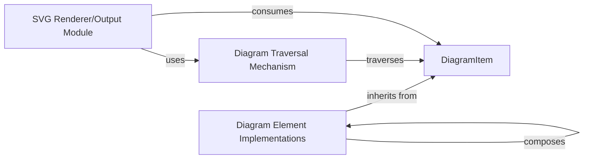

## Details

The `railroad-diagrams` library is structured around a core `DiagramItem` abstract component, which serves as the foundation for all diagram elements. Concrete implementations, such as `Terminal` and `Sequence`, extend `DiagramItem` to form the hierarchical in-memory representation of a railroad diagram. A dedicated traversal mechanism, embodied by the `walk` method, enables systematic navigation of this structure. The final SVG output is generated by an SVG Renderer/Output Module, which primarily utilizes the `writeSvg` method of `DiagramItem` to recursively translate the diagram's internal model into visual SVG elements. This architecture promotes modularity and extensibility, allowing for the creation of complex diagrams from reusable components.

### DiagramItem
The foundational abstract base class for all elements within a railroad diagram. It defines the common interface and structure for diagram components, acting as the core of the language-agnostic in-memory model. All concrete diagram elements (e.g., Terminal, NonTerminal, Sequence, Choice) inherit from this class.

**Related Classes/Methods**:

- <a href="https://github.com/tabatkins/railroad-diagrams/blob/gh-pages/railroad.py#L80-L128" target="_blank" rel="noopener noreferrer">`railroad.DiagramItem`:80-128</a>

### Diagram Element Implementations
Concrete classes that inherit from DiagramItem, representing specific visual and structural elements of a railroad diagram (e.g., Terminal, NonTerminal, Sequence, Choice, OneOrMore, Optional, Group, Comment, Skip). These components are instantiated and composed to build the hierarchical structure of the diagram.

**Related Classes/Methods**:

- <a href="https://github.com/tabatkins/railroad-diagrams/blob/gh-pages/railroad.py#L129-L1642" target="_blank" rel="noopener noreferrer">`Concrete Diagram Elements`:129-1642</a>

### Diagram Traversal Mechanism
A crucial method designed to recursively traverse the hierarchical tree of DiagramItem objects. It provides a standardized way to iterate over the diagram's structure, enabling operations like layout calculation or SVG rendering.

**Related Classes/Methods**:

- <a href="https://github.com/tabatkins/railroad-diagrams/blob/gh-pages/railroad.py#L124-L125" target="_blank" rel="noopener noreferrer">`railroad.DiagramItem.walk`:124-125</a>

### SVG Renderer/Output Module
This module is responsible for recursively traversing the diagram's internal representation (composed of `DiagramItem` objects) and translating it into the final SVG (Scalable Vector Graphics) format. It leverages the `writeSvg` method of `DiagramItem` and its subclasses to generate the visual output.

**Related Classes/Methods**:

- <a href="https://github.com/tabatkins/railroad-diagrams/blob/gh-pages/railroad.py#L110-L122" target="_blank" rel="noopener noreferrer">`railroad.DiagramItem.writeSvg`:110-122</a>

### [FAQ](https://github.com/CodeBoarding/GeneratedOnBoardings/tree/main?tab=readme-ov-file#faq)