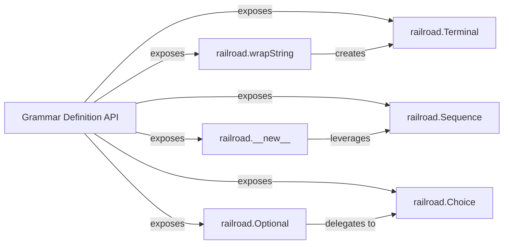

## Details

The `Grammar Definition API` subsystem is primarily encapsulated within the `railroad.py` file. Its boundaries are defined by the core classes and methods that allow users to programmatically construct railroad diagrams. These elements collectively form the public interface for defining grammar structures, acting as the initial stage of the diagram generation pipeline. Serves as the overarching user-facing interface for programmatically defining railroad diagram structures. It exposes the fundamental building blocks for hierarchical composition of diagram elements, embodying the initial stage of the Generator/Builder pattern.

### Grammar Definition API [[Expand]](./Grammar_Definition_API.md)
Serves as the overarching user-facing interface for programmatically defining railroad diagram structures. It exposes the fundamental building blocks for hierarchical composition of diagram elements, embodying the initial stage of the Generator/Builder pattern.

**Related Classes/Methods**:

- <a href="https://github.com/tabatkins/railroad-diagrams/blob/gh-pages/railroad.py#L1725-L1775" target="_blank" rel="noopener noreferrer">`railroad.Terminal`:1725-1775</a>
- <a href="https://github.com/tabatkins/railroad-diagrams/blob/gh-pages/railroad.py#L441-L489" target="_blank" rel="noopener noreferrer">`railroad.Sequence`:441-489</a>
- <a href="https://github.com/tabatkins/railroad-diagrams/blob/gh-pages/railroad.py#L952-L1124" target="_blank" rel="noopener noreferrer">`railroad.Choice`:952-1124</a>
- <a href="https://github.com/tabatkins/railroad-diagrams/blob/gh-pages/railroad.py#L1498-L1499" target="_blank" rel="noopener noreferrer">`railroad.Optional`:1498-1499</a>
- <a href="https://github.com/tabatkins/railroad-diagrams/blob/gh-pages/railroad.py#L1268-L1272" target="_blank" rel="noopener noreferrer">`railroad.__new__`:1268-1272</a>
- <a href="https://github.com/tabatkins/railroad-diagrams/blob/gh-pages/railroad.py#L266-L267" target="_blank" rel="noopener noreferrer">`railroad.wrapString`:266-267</a>

### railroad.Terminal
Represents the most basic, atomic element in a railroad diagram, typically a literal string or keyword. It acts as a leaf node in the diagram's structure, signifying a non-decomposable part of the grammar.

**Related Classes/Methods**:

- <a href="https://github.com/tabatkins/railroad-diagrams/blob/gh-pages/railroad.py#L1725-L1775" target="_blank" rel="noopener noreferrer">`railroad.Terminal`:1725-1775</a>

### railroad.Sequence
Defines an ordered series of diagram elements. It is crucial for establishing the sequential flow of grammar rules, ensuring elements are processed or rendered in a specific order.

**Related Classes/Methods**:

- <a href="https://github.com/tabatkins/railroad-diagrams/blob/gh-pages/railroad.py#L441-L489" target="_blank" rel="noopener noreferrer">`railroad.Sequence`:441-489</a>

### railroad.Choice
Provides a mechanism for alternative paths within the diagram, allowing for the selection of one element from a set of options. This is essential for representing "OR" conditions in grammar.

**Related Classes/Methods**:

- <a href="https://github.com/tabatkins/railroad-diagrams/blob/gh-pages/railroad.py#L952-L1124" target="_blank" rel="noopener noreferrer">`railroad.Choice`:952-1124</a>

### railroad.Optional
A higher-level construct that simplifies the definition of optional diagram elements. It internally leverages `Choice` to represent the presence or absence of an element.

**Related Classes/Methods**:

- <a href="https://github.com/tabatkins/railroad-diagrams/blob/gh-pages/railroad.py#L1498-L1499" target="_blank" rel="noopener noreferrer">`railroad.Optional`:1498-1499</a>

### railroad.__new__
Acts as a factory or constructor method, playing a key role in the initial creation and structuring of diagram elements, often leveraging `Sequence` for ordered compositions.

**Related Classes/Methods**:

- <a href="https://github.com/tabatkins/railroad-diagrams/blob/gh-pages/railroad.py#L1268-L1272" target="_blank" rel="noopener noreferrer">`railroad.__new__`:1268-1272</a>

### railroad.wrapString
A utility function that facilitates the easy integration of literal text into diagrams by converting simple string inputs into `Terminal` objects.

**Related Classes/Methods**:

- <a href="https://github.com/tabatkins/railroad-diagrams/blob/gh-pages/railroad.py#L266-L267" target="_blank" rel="noopener noreferrer">`railroad.wrapString`:266-267</a>

### [FAQ](https://github.com/CodeBoarding/GeneratedOnBoardings/tree/main?tab=readme-ov-file#faq)