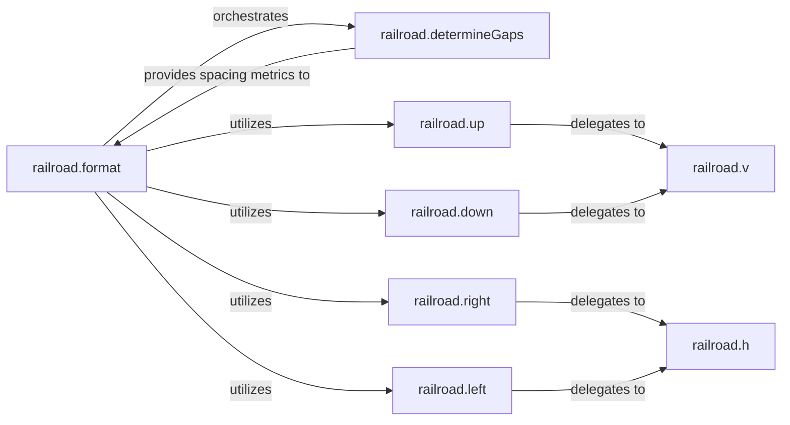

## Details

The `Layout Engine` subsystem is primarily encapsulated within the `railroad.py` file, specifically within the `railroad` module. It is responsible for the core algorithmic calculations of dimensions, positions, and SVG path coordinates for diagram elements.

### railroad.format
The orchestrator of the layout process. It recursively traverses diagram elements, calculates their dimensions and positions, and initiates the generation of SVG path commands. It serves as the central control flow for the entire layout operation.

**Related Classes/Methods**:

- <a href="https://github.com/tabatkins/railroad-diagrams/blob/gh-pages/railroad.py#L1881-L1883" target="_blank" rel="noopener noreferrer">`railroad.format`:1881-1883</a>

### railroad.determineGaps
Calculates the necessary horizontal and vertical spacing between diagram elements to ensure visual clarity, readability, and adherence to layout rules. It provides critical spacing metrics to the `format` function.

**Related Classes/Methods**:

- <a href="https://github.com/tabatkins/railroad-diagrams/blob/gh-pages/railroad.py#L56-L63" target="_blank" rel="noopener noreferrer">`railroad.determineGaps`:56-63</a>

### railroad.h
Manages and updates the current horizontal (x-axis) position during the layout process. It effectively moves the "drawing cursor" left or right by appending horizontal line commands (`h`) to the SVG path data.

**Related Classes/Methods**:

- <a href="https://github.com/tabatkins/railroad-diagrams/blob/gh-pages/railroad.py#L168-L170" target="_blank" rel="noopener noreferrer">`railroad.h`:168-170</a>

### railroad.v
Manages and updates the current vertical (y-axis) position during the layout process. It moves the "drawing cursor" up or down by appending vertical line commands (`v`) to the SVG path data.

**Related Classes/Methods**:

- <a href="https://github.com/tabatkins/railroad-diagrams/blob/gh-pages/railroad.py#L178-L180" target="_blank" rel="noopener noreferrer">`railroad.v`:178-180</a>

### railroad.up
Provides a semantic abstraction for moving the layout cursor upwards. It translates this high-level command into specific vertical (and potentially horizontal for curves) adjustments.

**Related Classes/Methods**:

- <a href="https://github.com/tabatkins/railroad-diagrams/blob/gh-pages/railroad.py" target="_blank" rel="noopener noreferrer">`railroad.up`</a>

### railroad.down
Provides a semantic abstraction for moving the layout cursor downwards. It translates this high-level command into specific vertical (and potentially horizontal for curves) adjustments.

**Related Classes/Methods**:

- <a href="https://github.com/tabatkins/railroad-diagrams/blob/gh-pages/railroad.py" target="_blank" rel="noopener noreferrer">`railroad.down`</a>

### railroad.right
Provides a semantic abstraction for moving the layout cursor to the right. It translates this high-level command into specific horizontal adjustments.

**Related Classes/Methods**:

- <a href="https://github.com/tabatkins/railroad-diagrams/blob/gh-pages/railroad.py" target="_blank" rel="noopener noreferrer">`railroad.right`</a>

### railroad.left
Provides a semantic abstraction for moving the layout cursor to the left. It translates this high-level command into specific horizontal adjustments.

**Related Classes/Methods**:

- <a href="https://github.com/tabatkins/railroad-diagrams/blob/gh-pages/railroad.py" target="_blank" rel="noopener noreferrer">`railroad.left`</a>

### [FAQ](https://github.com/CodeBoarding/GeneratedOnBoardings/tree/main?tab=readme-ov-file#faq)