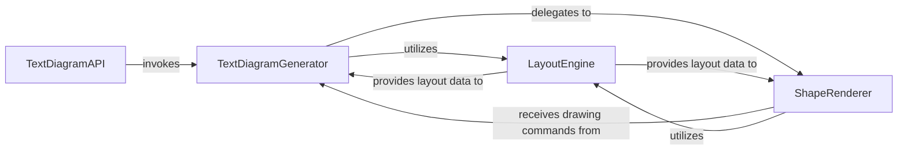

## Details

The `Text Diagram Renderer` subsystem is responsible for generating ASCII art representations of railroad diagrams. It acts as a specialized output module within the larger diagram generation library, adhering to the "Generator/Builder Pattern" by transforming an internal diagram representation into a text-based visual output.

### TextDiagramAPI
Serves as the public entry point for users to initiate the generation of text-based railroad diagrams. It abstracts the underlying complexity, providing a simplified interface for accessing the text diagram functionality. This component aligns with the "Language-Specific Adapters/APIs" pattern.

**Related Classes/Methods**:

- <a href="https://github.com/tabatkins/railroad-diagrams/blob/gh-pages/railroad.py#L420-L425" target="_blank" rel="noopener noreferrer">`railroad.writeText`:420-425</a>

### TextDiagramGenerator
This is the core "Generator" component. It orchestrates the entire process of converting an internal diagram representation into an ASCII art output. It manages the flow, determines the overall layout, and coordinates the drawing of various diagram elements by delegating to specialized sub-components.

**Related Classes/Methods**:

- <a href="https://github.com/tabatkins/railroad-diagrams/blob/gh-pages/railroad.py#L1893-L2278" target="_blank" rel="noopener noreferrer">`railroad.textDiagram`:1893-2278</a>

### LayoutEngine
Manages the spatial organization and dimensioning of all diagram elements within the ASCII grid. This component is crucial for ensuring that elements are correctly positioned, sized, and spaced, adhering to the "Layout/Positioning Engine" pattern. It calculates dimensions and coordinates for text-based rendering.

**Related Classes/Methods**:

- <a href="https://github.com/tabatkins/railroad-diagrams/blob/gh-pages/railroad.py#L1942-L1962" target="_blank" rel="noopener noreferrer">`railroad.appendRight`:1942-1962</a>
- <a href="https://github.com/tabatkins/railroad-diagrams/blob/gh-pages/railroad.py#L1925-L1940" target="_blank" rel="noopener noreferrer">`railroad.appendBelow`:1925-1940</a>
- <a href="https://github.com/tabatkins/railroad-diagrams/blob/gh-pages/railroad.py#L2092-L2108" target="_blank" rel="noopener noreferrer">`railroad._maxWidth`:2092-2108</a>
- <a href="https://github.com/tabatkins/railroad-diagrams/blob/gh-pages/railroad.py#L2118-L2124" target="_blank" rel="noopener noreferrer">`railroad._padR`:2118-2124</a>
- <a href="https://github.com/tabatkins/railroad-diagrams/blob/gh-pages/railroad.py#L2085-L2090" target="_blank" rel="noopener noreferrer">`railroad._getParts`:2085-2090</a>
- <a href="https://github.com/tabatkins/railroad-diagrams/blob/gh-pages/railroad.py#L2070-L2083" target="_blank" rel="noopener noreferrer">`railroad._gaps`:2070-2083</a>
- <a href="https://github.com/tabatkins/railroad-diagrams/blob/gh-pages/railroad.py#L2058-L2068" target="_blank" rel="noopener noreferrer">`railroad._encloseLines`:2058-2068</a>
- <a href="https://github.com/tabatkins/railroad-diagrams/blob/gh-pages/railroad.py#L1984-L2003" target="_blank" rel="noopener noreferrer">`railroad.expand`:1984-2003</a>
- <a href="https://github.com/tabatkins/railroad-diagrams/blob/gh-pages/railroad.py#L2110-L2116" target="_blank" rel="noopener noreferrer">`railroad._padL`:2110-2116</a>

### ShapeRenderer
Handles the fundamental drawing logic for basic geometric shapes (rectangles, rounded rectangles) using ASCII characters. It is a specialized "Renderer" component for text-based output, translating abstract shape definitions into concrete ASCII patterns.

**Related Classes/Methods**:

- <a href="https://github.com/tabatkins/railroad-diagrams/blob/gh-pages/railroad.py#L2126-L2169" target="_blank" rel="noopener noreferrer">`railroad._rectish`:2126-2169</a>
- <a href="https://github.com/tabatkins/railroad-diagrams/blob/gh-pages/railroad.py#L2005-L2010" target="_blank" rel="noopener noreferrer">`railroad.rect`:2005-2010</a>
- <a href="https://github.com/tabatkins/railroad-diagrams/blob/gh-pages/railroad.py#L2012-L2017" target="_blank" rel="noopener noreferrer">`railroad.roundrect`:2012-2017</a>

### [FAQ](https://github.com/CodeBoarding/GeneratedOnBoardings/tree/main?tab=readme-ov-file#faq)