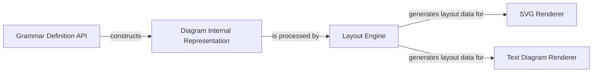

## Details

The `railroad-diagrams` project is structured around a clear pipeline for generating visual representations of railroad diagrams. The process begins with the Grammar Definition API, which allows users to define the structure of their diagrams using high-level constructs like Terminal, Sequence, and Choice. These definitions are then translated into a language-agnostic Diagram Internal Representation, an in-memory model that captures the hierarchical relationships and properties of the diagram elements. This internal representation is subsequently processed by the Layout Engine, the core algorithmic component responsible for calculating the precise dimensions, positions, and path coordinates for each element, including horizontal (h) and vertical (v) movements, and arcs. Finally, the layout data generated by the Layout Engine is consumed by two distinct rendering components: the SVG Renderer, which produces a scalable vector graphics output, and the Text Diagram Renderer, which generates an ASCII art representation. This modular design ensures flexibility in output formats while maintaining a clear separation of concerns between diagram definition, internal modeling, layout calculation, and rendering.

### Grammar Definition API [[Expand]](./Grammar_Definition_API.md)
Provides the user-facing interface for defining railroad diagram elements and their hierarchical relationships.

**Related Classes/Methods**:

- <a href="https://github.com/tabatkins/railroad-diagrams/blob/gh-pages/railroad.py#L1725-L1775" target="_blank" rel="noopener noreferrer">`Terminal`:1725-1775</a>
- <a href="https://github.com/tabatkins/railroad-diagrams/blob/gh-pages/railroad.py#L441-L489" target="_blank" rel="noopener noreferrer">`Sequence`:441-489</a>
- <a href="https://github.com/tabatkins/railroad-diagrams/blob/gh-pages/railroad.py#L952-L1124" target="_blank" rel="noopener noreferrer">`Choice`:952-1124</a>

### Diagram Internal Representation [[Expand]](./Diagram_Internal_Representation.md)
An abstract, language-agnostic in-memory model of the railroad diagram.

**Related Classes/Methods**:

- <a href="https://github.com/tabatkins/railroad-diagrams/blob/gh-pages/railroad.py#L80-L128" target="_blank" rel="noopener noreferrer">`DiagramItem`:80-128</a>
- <a href="https://github.com/tabatkins/railroad-diagrams/blob/gh-pages/railroad.py#L1643-L1647" target="_blank" rel="noopener noreferrer">`walk`:1643-1647</a>

### Layout Engine [[Expand]](./Layout_Engine.md)
The core algorithmic component responsible for calculating precise dimensions, positions, and path coordinates for diagram elements.

**Related Classes/Methods**:

- <a href="https://github.com/tabatkins/railroad-diagrams/blob/gh-pages/railroad.py#L1881-L1883" target="_blank" rel="noopener noreferrer">`format`:1881-1883</a>
- <a href="https://github.com/tabatkins/railroad-diagrams/blob/gh-pages/railroad.py#L56-L63" target="_blank" rel="noopener noreferrer">`determineGaps`:56-63</a>
- <a href="https://github.com/tabatkins/railroad-diagrams/blob/gh-pages/setup.py" target="_blank" rel="noopener noreferrer">`h`</a>
- <a href="https://github.com/tabatkins/railroad-diagrams/blob/gh-pages/railroad.py#L178-L180" target="_blank" rel="noopener noreferrer">`v`:178-180</a>

### SVG Renderer
Generates a complete SVG string or file from the geometric data provided by the Layout Engine.

**Related Classes/Methods**:

- <a href="https://github.com/tabatkins/railroad-diagrams/blob/gh-pages/railroad.py#L415-L418" target="_blank" rel="noopener noreferrer">`writeSvg`:415-418</a>
- <a href="https://github.com/tabatkins/railroad-diagrams/blob/gh-pages/railroad.py#L46-L49" target="_blank" rel="noopener noreferrer">`escapeAttr`:46-49</a>
- <a href="https://github.com/tabatkins/railroad-diagrams/blob/gh-pages/railroad.py#L52-L53" target="_blank" rel="noopener noreferrer">`escapeHtml`:52-53</a>
- <a href="https://github.com/tabatkins/railroad-diagrams/blob/gh-pages/railroad.py#L427-L438" target="_blank" rel="noopener noreferrer">`writeStandalone`:427-438</a>

### Text Diagram Renderer [[Expand]](./Text_Diagram_Renderer.md)
Provides an alternative, text-based (ASCII art) representation of the railroad diagram.

**Related Classes/Methods**:

- <a href="https://github.com/tabatkins/railroad-diagrams/blob/gh-pages/railroad.py#L1893-L2278" target="_blank" rel="noopener noreferrer">`textDiagram`:1893-2278</a>
- <a href="https://github.com/tabatkins/railroad-diagrams/blob/gh-pages/railroad.py#L420-L425" target="_blank" rel="noopener noreferrer">`writeText`:420-425</a>
- <a href="https://github.com/tabatkins/railroad-diagrams/blob/gh-pages/railroad.py#L2126-L2169" target="_blank" rel="noopener noreferrer">`_rectish`:2126-2169</a>

### [FAQ](https://github.com/CodeBoarding/GeneratedOnBoardings/tree/main?tab=readme-ov-file#faq)