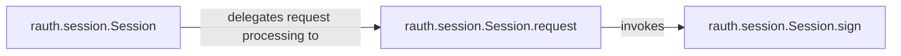

## Details

The HTTP Session Management subsystem is primarily defined by the rauth.session module, which encapsulates the core logic for managing HTTP communication and integrating OAuth signing.

### rauth.session.Session
Manages the overall HTTP session state, including OAuth credentials and configuration. It acts as a high-level facade, simplifying interactions with OAuth service providers and orchestrating the process of making authenticated requests. This component aligns with the "Session Management" and "Facade/Adapter" architectural patterns.

**Related Classes/Methods**:

- <a href="https://github.com/litl/rauth/blob/master/rauth/session.py" target="_blank" rel="noopener noreferrer">`rauth.session.Session`</a>

### rauth.session.Session.request
Orchestrates the complete lifecycle of an authenticated HTTP request. This includes preparing the URL, gathering OAuth parameters, invoking the signing mechanism, and executing the underlying HTTP call. This component embodies the "Request/Response Handlers" pattern.

**Related Classes/Methods**:

- <a href="https://github.com/litl/rauth/blob/master/rauth/session.py#L419-L467" target="_blank" rel="noopener noreferrer">`rauth.session.Session:request`:419-467</a>

### rauth.session.Session.sign
Applies the necessary cryptographic signatures to the HTTP request according to the specified OAuth protocol (1.0/a or 2.0). This ensures the authenticity and integrity of the request. This component is critical for the "Authentication Services/Providers" aspect.

**Related Classes/Methods**:

- <a href="https://github.com/litl/rauth/blob/master/rauth/session.py#L469-L515" target="_blank" rel="noopener noreferrer">`rauth.session.Session:sign`:469-515</a>

### [FAQ](https://github.com/CodeBoarding/GeneratedOnBoardings/tree/main?tab=readme-ov-file#faq)