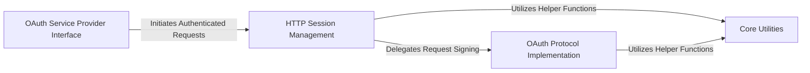

## Details

The `rauth` library is structured around a clear separation of concerns, facilitating robust OAuth integration. At its highest level, the OAuth Service Provider Interface (`rauth/service.py`) serves as the primary entry point, abstracting the complexities of OAuth flows for developers. This interface orchestrates the authentication process by interacting with the HTTP Session Management component (`rauth/session.py`), which is responsible for handling all network communications and integrating the necessary OAuth signatures. The intricate details of OAuth 1.0/a and 2.0 protocol adherence, including request signing and parameter normalization, are encapsulated within the OAuth Protocol Implementation (`rauth/oauth.py`), which is directly utilized by the HTTP Session Management layer. This layered architecture, supported by underlying Core Utilities (`rauth/utils.py`), ensures a modular, extensible, and maintainable system for secure API interactions.

### OAuth Service Provider Interface
The public-facing API for developers to initiate OAuth flows, acquire tokens, and manage authenticated sessions. It orchestrates the high-level authentication process.

**Related Classes/Methods**:

- <a href="https://github.com/litl/rauth/blob/master/rauth/service.py#L218-L245" target="_blank" rel="noopener noreferrer">`rauth.service.get_request_token`:218-245</a>
- <a href="https://github.com/litl/rauth/blob/master/rauth/service.py#L521-L543" target="_blank" rel="noopener noreferrer">`rauth.service.get_access_token`:521-543</a>
- <a href="https://github.com/litl/rauth/blob/master/rauth/service.py#L664-L674" target="_blank" rel="noopener noreferrer">`rauth.service.get_auth_session`:664-674</a>

### HTTP Session Management [[Expand]](./HTTP_Session_Management.md)
Manages HTTP communication with OAuth service providers, integrating OAuth signing into standard requests. It acts as an intermediary between the service interface and the protocol implementation.

**Related Classes/Methods**:

- <a href="https://github.com/litl/rauth/blob/master/rauth/session.py#L419-L467" target="_blank" rel="noopener noreferrer">`rauth.session.request`:419-467</a>
- <a href="https://github.com/litl/rauth/blob/master/rauth/session.py#L469-L515" target="_blank" rel="noopener noreferrer">`rauth.session.sign`:469-515</a>

### OAuth Protocol Implementation
Encapsulates the core logic for OAuth 1.0/a and OAuth 2.0 protocols, handling request signing, parameter normalization, and specific encoding rules. This component ensures protocol compliance.

**Related Classes/Methods**:

- <a href="https://github.com/litl/rauth/blob/master/rauth/oauth.py#L228-L248" target="_blank" rel="noopener noreferrer">`rauth.oauth.sign`:228-248</a>
- <a href="https://github.com/litl/rauth/blob/master/rauth/oauth.py#L48-L103" target="_blank" rel="noopener noreferrer">`rauth.oauth._normalize_request_parameters`:48-103</a>

### Core Utilities
Provides essential helper functions for data manipulation and header generation, ensuring compliance and efficiency across the authentication process.

**Related Classes/Methods**:

- <a href="https://github.com/litl/rauth/blob/master/rauth/utils.py" target="_blank" rel="noopener noreferrer">`rauth.utils`</a>

### [FAQ](https://github.com/CodeBoarding/GeneratedOnBoardings/tree/main?tab=readme-ov-file#faq)