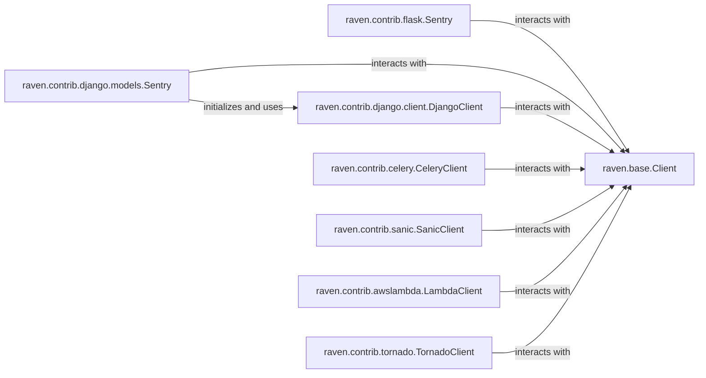

## Details

The raven-python project provides a robust error reporting framework, primarily centered around the raven.base.Client. This core client is extended and specialized by various raven.contrib components to integrate with different web frameworks and asynchronous task queues. Each contrib component, such as raven.contrib.flask.Sentry, raven.contrib.django.models.Sentry (via SentryDjangoHandler), raven.contrib.celery.CeleryClient (via SentryCeleryHandler), raven.contrib.sanic.SanicClient (via Sentry), raven.contrib.awslambda.LambdaClient, and raven.contrib.tornado.TornadoClient (via AsyncSentryClient), is responsible for capturing framework-specific context and exceptions. These specialized clients then delegate the actual error processing and transmission to the raven.base.Client, ensuring a consistent reporting mechanism across diverse application environments. The raven.contrib.django.models.Sentry component further initializes and utilizes raven.contrib.django.client.DjangoClient for more granular Django-specific context extraction before interacting with the base client. This modular design allows for flexible integration while maintaining a centralized error handling core.

### raven.contrib.flask.Sentry
Integrates Sentry with Flask applications, typically via a Flask extension, to capture exceptions and messages within the Flask request/response cycle.

**Related Classes/Methods**:

- <a href="https://github.com/getsentry/raven-python/blob/master/raven/contrib/flask.py#L59-L344" target="_blank" rel="noopener noreferrer">`raven.contrib.flask.Sentry`:59-344</a>

### raven.contrib.django.models.Sentry
Provides comprehensive Sentry integration for Django, handling signals, middleware, and potentially database query logging.

**Related Classes/Methods**:

- <a href="https://github.com/getsentry/raven-python/blob/master/raven/contrib/django/models.py#L151-L214" target="_blank" rel="noopener noreferrer">`raven.contrib.django.models.SentryDjangoHandler`:151-214</a>

### raven.contrib.django.client.DjangoClient
A specialized client for Django that extends the base Sentry client to extract Django-specific context, such as request data, user information, and potentially SQL queries.

**Related Classes/Methods**:

- <a href="https://github.com/getsentry/raven-python/blob/master/raven/contrib/django/client.py#L145-L315" target="_blank" rel="noopener noreferrer">`raven.contrib.django.client.DjangoClient`:145-315</a>

### raven.contrib.celery.CeleryClient
Integrates Sentry with Celery, monitoring task execution and capturing exceptions that occur during asynchronous task processing.

**Related Classes/Methods**:

- <a href="https://github.com/getsentry/raven-python/blob/master/raven/contrib/celery/__init__.py#L55-L96" target="_blank" rel="noopener noreferrer">`raven.contrib.celery.SentryCeleryHandler`:55-96</a>

### raven.contrib.sanic.SanicClient
Provides Sentry integration for Sanic web applications, focusing on capturing exceptions and collecting request context specific to Sanic's asynchronous nature.

**Related Classes/Methods**:

- <a href="https://github.com/getsentry/raven-python/blob/master/raven/contrib/sanic.py#L45-L224" target="_blank" rel="noopener noreferrer">`raven.contrib.sanic.Sentry`:45-224</a>

### raven.contrib.awslambda.LambdaClient
Integrates Sentry with AWS Lambda functions, wrapping the Lambda handler to capture exceptions and extract relevant event data from the Lambda execution environment.

**Related Classes/Methods**:

- <a href="https://github.com/getsentry/raven-python/blob/master/raven/contrib/awslambda/__init__.py#L36-L177" target="_blank" rel="noopener noreferrer">`raven.contrib.awslambda.LambdaClient`:36-177</a>

### raven.contrib.tornado.TornadoClient
Integrates Sentry with Tornado web applications, capturing exceptions and collecting request context within Tornado's event-driven framework.

**Related Classes/Methods**:

- <a href="https://github.com/getsentry/raven-python/blob/master/raven/contrib/tornado/__init__.py#L19-L95" target="_blank" rel="noopener noreferrer">`raven.contrib.tornado.AsyncSentryClient`:19-95</a>

### raven.base.Client
The core Sentry client responsible for processing, enriching, and transmitting error data. While not strictly an "integration" component, it is fundamental as all integration components rely on it to perform the actual error reporting.

**Related Classes/Methods**:

- <a href="https://github.com/getsentry/raven-python/blob/master/raven/base.py#L122-L926" target="_blank" rel="noopener noreferrer">`raven.base.Client`:122-926</a>

### [FAQ](https://github.com/CodeBoarding/GeneratedOnBoardings/tree/main?tab=readme-ov-file#faq)