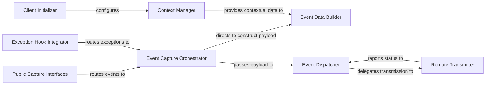

## Details

The `raven-python` client's core functionality resides within the `raven.base` subsystem, primarily orchestrated by the `Client` class. This subsystem manages the entire lifecycle of event reporting, from initial configuration and context management to event capture, data processing, and remote transmission. The `Client Initializer` sets up the client and its DSN, while `Public Capture Interfaces` and the `Exception Hook Integrator` provide the entry points for event and exception capture. The `Event Capture Orchestrator` (the `Client` itself) coordinates the flow, leveraging the `Context Manager` for enriching event data and the `Event Data Builder` for structuring the payload. Finally, the `Event Dispatcher` prepares the data for sending, delegating the actual network communication to the `Remote Transmitter` component, which handles the interaction with the Sentry server.

### Client Initializer
Responsible for the initial setup of the Raven client, including DSN configuration, transport setup, and the establishment of system-wide hooks.

**Related Classes/Methods**:

- <a href="https://github.com/getsentry/raven-python/blob/master/raven/base.py" target="_blank" rel="noopener noreferrer">`raven.base.Client.__init__`</a>
- <a href="https://github.com/getsentry/raven-python/blob/master/raven/base.py" target="_blank" rel="noopener noreferrer">`raven.base.Client.set_dsn`</a>

### Public Capture Interfaces
These are the primary public entry points that allow applications to explicitly capture different types of events (e.g., messages, exceptions).

**Related Classes/Methods**:

- <a href="https://github.com/getsentry/raven-python/blob/master/raven/base.py" target="_blank" rel="noopener noreferrer">`raven.base.Client.captureException`</a>
- <a href="https://github.com/getsentry/raven-python/blob/master/raven/base.py" target="_blank" rel="noopener noreferrer">`raven.base.Client.captureMessage`</a>
- <a href="https://github.com/getsentry/raven-python/blob/master/raven/base.py" target="_blank" rel="noopener noreferrer">`raven.base.Client.capture`</a>

### Exception Hook Integrator
Facilitates automatic capture of unhandled exceptions by integrating with Python's exception handling mechanisms.

**Related Classes/Methods**:

- <a href="https://github.com/getsentry/raven-python/blob/master/raven/base.py" target="_blank" rel="noopener noreferrer">`raven.base.Client.install_sys_hook`</a>

### Event Capture Orchestrator
The central control point within the Client that manages the entire event capture workflow, from receiving capture requests to delegating tasks for data processing and transmission.

**Related Classes/Methods**:

- <a href="https://github.com/getsentry/raven-python/blob/master/raven/base.py#L122-L926" target="_blank" rel="noopener noreferrer">`raven.base.Client`:122-926</a>
- <a href="https://github.com/getsentry/raven-python/blob/master/raven/base.py" target="_blank" rel="noopener noreferrer">`raven.base.Client._send`</a>

### Context Manager
Provides and manages contextual data (e.g., user information, HTTP request details, custom tags, breadcrumbs) that enriches the captured events.

**Related Classes/Methods**:

- <a href="https://github.com/getsentry/raven-python/blob/master/raven/context.py#L37-L142" target="_blank" rel="noopener noreferrer">`raven.context.Context`:37-142</a>

### Event Data Builder
Assembles raw event data into a structured, Sentry-compatible message payload, applying necessary transformations and processors.

**Related Classes/Methods**:

- <a href="https://github.com/getsentry/raven-python/blob/master/raven/base.py" target="_blank" rel="noopener noreferrer">`raven.base.Client.get_processors`</a>

### Event Dispatcher
Manages the encoding (serialization) of the event message and delegates the actual transmission to the remote sender. This involves RemoteConfig which holds transport details.

**Related Classes/Methods**:

- <a href="https://github.com/getsentry/raven-python/blob/master/raven/conf/remote.py#L39-L126" target="_blank" rel="noopener noreferrer">`raven.conf.remote.RemoteConfig`:39-126</a>
- <a href="https://github.com/getsentry/raven-python/blob/master/raven/base.py" target="_blank" rel="noopener noreferrer">`raven.base.Client.remote`</a>

### Remote Transmitter
Handles the actual network communication to send the encoded event payload to the Sentry server, including retry logic and error handling for network failures. This is abstracted by the TransportRegistry and concrete transport implementations.

**Related Classes/Methods**:

- <a href="https://github.com/getsentry/raven-python/blob/master/raven/transport/registry.py#L23-L63" target="_blank" rel="noopener noreferrer">`raven.transport.registry.TransportRegistry`:23-63</a>
- <a href="https://github.com/getsentry/raven-python/blob/master/raven/transport/base.py#L15-L31" target="_blank" rel="noopener noreferrer">`raven.transport.base.Transport`:15-31</a>

### [FAQ](https://github.com/CodeBoarding/GeneratedOnBoardings/tree/main?tab=readme-ov-file#faq)