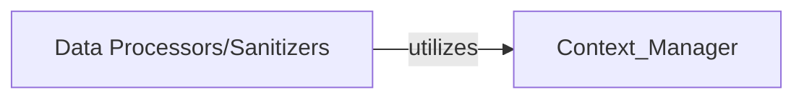

## Details

Added 'Data Processors/Sanitizers' component and its relationship with 'Context Manager' based on investigation of `raven.processors` module.

### Data Processors/Sanitizers
Handles the processing and sanitization of data within the Raven system.

**Related Classes/Methods**:

- <a href="https://github.com/getsentry/raven-python/blob/master/raven/processors.py#L149-L185" target="_blank" rel="noopener noreferrer">`raven.processors.SanitizePasswordsProcessor`:149-185</a>
- <a href="https://github.com/getsentry/raven-python/blob/master/raven/processors.py#L53-L57" target="_blank" rel="noopener noreferrer">`raven.processors.RemovePostDataProcessor`:53-57</a>

### [FAQ](https://github.com/CodeBoarding/GeneratedOnBoardings/tree/main?tab=readme-ov-file#faq)