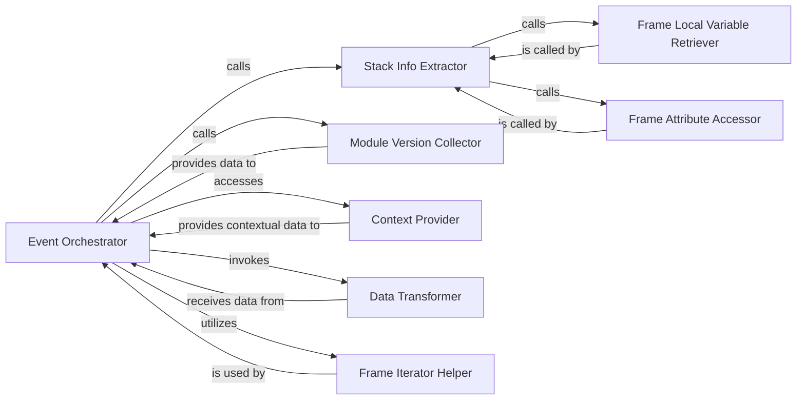

## Details

The Event Orchestrator serves as the core component, initiating the event payload construction. It leverages the Context Provider to gather contextual data and the Module Version Collector for environment details. For stack trace information, the Event Orchestrator calls the Stack Info Extractor, which in turn relies on the Frame Local Variable Retriever and Frame Attribute Accessor to detail individual stack frames. Additionally, the Event Orchestrator utilizes the Frame Iterator Helper to process stack frames for application-specific path filtering. Finally, all collected data is passed to the Data Transformer for initial pre-processing before the event is finalized.

### Event Orchestrator
The central component (raven.base.build_msg) that orchestrates the entire process of constructing the raw event payload. It coordinates calls to other components to gather all necessary data points, such as stack traces, module versions, and contextual information.

**Related Classes/Methods**:

- <a href="https://github.com/getsentry/raven-python/blob/master/raven/base.py#L372-L515" target="_blank" rel="noopener noreferrer">`raven.base.build_msg`:372-515</a>

### Stack Info Extractor
Responsible for extracting comprehensive details from stack frames, including local variables and code lines, which are essential for debugging and error analysis. (raven.utils.stacks.get_stack_info)

**Related Classes/Methods**:

- <a href="https://github.com/getsentry/raven-python/blob/master/raven/utils/stacks.py#L226-L311" target="_blank" rel="noopener noreferrer">`raven.utils.stacks.get_stack_info`:226-311</a>

### Module Version Collector
Gathers version information for all installed Python modules, providing crucial context about the application's environment at the time of the event. (raven.base.get_module_versions)

**Related Classes/Methods**:

- <a href="https://github.com/getsentry/raven-python/blob/master/raven/base.py#L302-L313" target="_blank" rel="noopener noreferrer">`raven.base.get_module_versions`:302-313</a>

### Context Provider
Manages and provides access to various contextual data (e.g., user information, HTTP request details, extra data, tags) that enrich the event payload. (raven.base.context)

**Related Classes/Methods**:

- <a href="https://github.com/getsentry/raven-python/blob/master/raven/base.py#L522-L534" target="_blank" rel="noopener noreferrer">`raven.base.context`:522-534</a>

### Data Transformer
Performs initial, pre-processing transformations on the event data, shaping it into the required raw event structure before any deeper processing or sanitization occurs. (raven.events.transform)

**Related Classes/Methods**:

- <a href="https://github.com/getsentry/raven-python/blob/master/raven/events.py#L32-L33" target="_blank" rel="noopener noreferrer">`raven.events.transform`:32-33</a>

### Frame Iterator Helper
Provides a mechanism for iterating through stack frames, primarily used by the Event Orchestrator to determine if frames are "in-app" based on configured paths. (raven.base._iter_frames)

**Related Classes/Methods**:

- <a href="https://github.com/getsentry/raven-python/blob/master/raven/base.py#L666-L672" target="_blank" rel="noopener noreferrer">`raven.base._iter_frames`:666-672</a>

### Frame Local Variable Retriever
Specializes in retrieving local variables from a given stack frame, used by the Stack Info Extractor. (raven.utils.stacks.get_frame_locals)

**Related Classes/Methods**:

- <a href="https://github.com/getsentry/raven-python/blob/master/raven/utils/stacks.py#L143-L164" target="_blank" rel="noopener noreferrer">`raven.utils.stacks.get_frame_locals`:143-164</a>

### Frame Attribute Accessor
Safely accesses attributes of stack frames, preventing potential errors during stack trace collection. (raven.utils.stacks._getitem_from_frame)

**Related Classes/Methods**:

- <a href="https://github.com/getsentry/raven-python/blob/master/raven/utils/stacks.py#L85-L93" target="_blank" rel="noopener noreferrer">`raven.utils.stacks._getitem_from_frame`:85-93</a>

### [FAQ](https://github.com/CodeBoarding/GeneratedOnBoardings/tree/main?tab=readme-ov-file#faq)