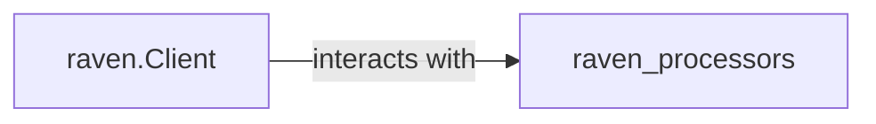

## Details

Added raven.Client as a core component and refined its relationship with raven.processors.

### raven.Client
The core client responsible for initiating the event processing pipeline.

**Related Classes/Methods**:

- <a href="https://github.com/getsentry/raven-python/blob/master/raven/base.py#L122-L926" target="_blank" rel="noopener noreferrer">`raven.base.Client`:122-926</a>

### [FAQ](https://github.com/CodeBoarding/GeneratedOnBoardings/tree/main?tab=readme-ov-file#faq)