```mermaid
graph LR
    Application_Framework_Integrations["Application/Framework Integrations"]
    Client_Core["Client Core"]
    Context_Breadcrumb_Manager["Context & Breadcrumb Manager"]
    Event_Builder["Event Builder"]
    Payload_Pipeline_Transport["Payload Pipeline & Transport"]
    Application_Framework_Integrations -- "passes data to" --> Client_Core
    Application_Framework_Integrations -- "populates data via" --> Context_Breadcrumb_Manager
    Client_Core -- "interacts with" --> Context_Breadcrumb_Manager
    Client_Core -- "requests payload construction from" --> Event_Builder
    Event_Builder -- "submits payload to" --> Payload_Pipeline_Transport
    click Application_Framework_Integrations href "https://github.com/CodeBoarding/GeneratedOnBoardings/blob/main/raven-python/Application_Framework_Integrations.md" "Details"
    click Client_Core href "https://github.com/CodeBoarding/GeneratedOnBoardings/blob/main/raven-python/Client_Core.md" "Details"
    click Context_Breadcrumb_Manager href "https://github.com/CodeBoarding/GeneratedOnBoardings/blob/main/raven-python/Context_Breadcrumb_Manager.md" "Details"
    click Event_Builder href "https://github.com/CodeBoarding/GeneratedOnBoardings/blob/main/raven-python/Event_Builder.md" "Details"
    click Payload_Pipeline_Transport href "https://github.com/CodeBoarding/GeneratedOnBoardings/blob/main/raven-python/Payload_Pipeline_Transport.md" "Details"
```

## Details

The Raven SDK's architecture is designed around a clear, sequential data flow for error and event capture. The process begins with Application/Framework Integrations, which are specialized modules that hook into various host environments (e.g., Django, Flask, Celery). These integrations act as the initial entry points, detecting errors and extracting raw contextual data. This initial data is then passed to the Client Core, the central orchestrator of the SDK. The Client Core coordinates the entire event capture workflow. It interacts with the Context & Breadcrumb Manager to enrich the event with dynamic contextual information (like user data, HTTP details) and a chronological trail of actions (breadcrumbs) leading up to the error. Once the context is gathered, the Client Core delegates to the Event Builder, which is responsible for constructing the initial raw event payload, including stack traces and module versions. Finally, the constructed event payload is submitted to the Payload Pipeline & Transport component. This composite component handles the crucial steps of sanitizing, filtering, serializing (e.g., to JSON), compressing, and ultimately transmitting the event data to the Sentry server using various transport mechanisms. This modular design ensures a robust and extensible error reporting system.

### Application/Framework Integrations [[Expand]](./Application_Framework_Integrations.md)
These components serve as the initial capture points, integrating with various host applications and web frameworks (e.g., Django, Flask, Celery, AWS Lambda). They are responsible for hooking into the application's lifecycle to detect errors and extract initial contextual data.

**Related Classes/Methods**:

- <a href="https://github.com/getsentry/raven-python/blob/master/raven/contrib/flask.py" target="_blank" rel="noopener noreferrer">`raven/contrib/flask.py`</a>
- <a href="https://github.com/getsentry/raven-python/blob/master/raven/contrib/django/models.py" target="_blank" rel="noopener noreferrer">`raven/contrib/django/models.py`</a>
- <a href="https://github.com/getsentry/raven-python/blob/master/raven/contrib/celery/__init__.py" target="_blank" rel="noopener noreferrer">`raven/contrib/celery/__init__.py`</a>
- <a href="https://github.com/getsentry/raven-python/blob/master/raven/contrib/sanic.py" target="_blank" rel="noopener noreferrer">`raven/contrib/sanic.py`</a>
- <a href="https://github.com/getsentry/raven-python/blob/master/raven/contrib/awslambda/__init__.py" target="_blank" rel="noopener noreferrer">`raven/contrib/awslambda/__init__.py`</a>
- <a href="https://github.com/getsentry/raven-python/blob/master/raven/contrib/tornado/__init__.py" target="_blank" rel="noopener noreferrer">`raven/contrib/tornado/__init__.py`</a>

### Client Core [[Expand]](./Client_Core.md)
The central orchestrator of the Raven SDK. It manages the overall event capture workflow, handles DSN configuration, and delegates tasks to other internal components for context management, event construction, and payload handling.

**Related Classes/Methods**:

- <a href="https://github.com/getsentry/raven-python/blob/master/raven/base.py" target="_blank" rel="noopener noreferrer">`raven/base.py`</a>

### Context & Breadcrumb Manager [[Expand]](./Context_Breadcrumb_Manager.md)
Manages dynamic contextual data (e.g., user information, HTTP request details, extra data, tags) and captures a chronological trail of events (breadcrumbs) leading up to an error, enriching the event payload for better debugging.

**Related Classes/Methods**:

- <a href="https://github.com/getsentry/raven-python/blob/master/raven/context.py" target="_blank" rel="noopener noreferrer">`raven/context.py`</a>
- <a href="https://github.com/getsentry/raven-python/blob/master/raven/breadcrumbs.py" target="_blank" rel="noopener noreferrer">`raven/breadcrumbs.py`</a>

### Event Builder [[Expand]](./Event_Builder.md)
Responsible for constructing the initial raw event payload from captured data, including stack traces, module versions, and basic event structure, before any processing or sanitization occurs.

**Related Classes/Methods**:

- <a href="https://github.com/getsentry/raven-python/blob/master/raven/base.py" target="_blank" rel="noopener noreferrer">`raven/base.py:build_msg`</a>
- <a href="https://github.com/getsentry/raven-python/blob/master/raven/events.py" target="_blank" rel="noopener noreferrer">`raven/events.py`</a>
- <a href="https://github.com/getsentry/raven-python/blob/master/raven/utils/stacks.py" target="_blank" rel="noopener noreferrer">`raven/utils/stacks.py`</a>

### Payload Pipeline & Transport [[Expand]](./Payload_Pipeline_Transport.md)
A composite component that handles the sequential processing (sanitization, filtering), encoding (serialization to JSON, compression), and final network transmission of the event payload to the Sentry server, supporting various transport mechanisms.

**Related Classes/Methods**:

- <a href="https://github.com/getsentry/raven-python/blob/master/raven/processors.py" target="_blank" rel="noopener noreferrer">`raven/processors.py`</a>
- <a href="https://github.com/getsentry/raven-python/blob/master/raven/utils/json.py" target="_blank" rel="noopener noreferrer">`raven/utils/json.py`</a>
- <a href="https://github.com/getsentry/raven-python/blob/master/raven/utils/serializer/manager.py" target="_blank" rel="noopener noreferrer">`raven/utils/serializer/manager.py`</a>
- <a href="https://github.com/getsentry/raven-python/blob/master/raven/transport/registry.py" target="_blank" rel="noopener noreferrer">`raven/transport/registry.py`</a>
- <a href="https://github.com/getsentry/raven-python/blob/master/raven/transport/threaded.py" target="_blank" rel="noopener noreferrer">`raven/transport/threaded.py`</a>
- <a href="https://github.com/getsentry/raven-python/blob/master/raven/transport/tornado.py" target="_blank" rel="noopener noreferrer">`raven/transport/tornado.py`</a>

### [FAQ](https://github.com/CodeBoarding/GeneratedOnBoardings/tree/main?tab=readme-ov-file#faq)