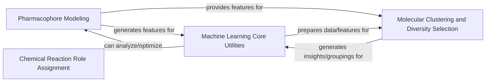

## Details

This component provides higher-level computational chemistry capabilities within RDKit, focusing on predictive modeling and advanced analysis. It encompasses functionalities for identifying, generating, and manipulating pharmacophoric features, alongside a suite of machine learning tools for data preparation, clustering, statistical analysis, and specialized tasks like chemical reaction role assignment.

### Pharmacophore Modeling
This component is fundamental because it deals with the identification and representation of molecular features crucial for drug discovery. Pharmacophores are abstract representations of molecular features that are necessary for molecular recognition of a ligand by a biological macromolecule. This component provides the tools to define, generate, and manipulate these features in both 2D and 3D, which is a core aspect of rational drug design and virtual screening.

**Related Classes/Methods**:

- <a href="https://github.com/rdkit/rdkit/rdkit/Chem/FeatMaps/FeatMapParser.py#L39-L178" target="_blank" rel="noopener noreferrer">`rdkit.Chem.FeatMaps.FeatMapParser` (39:178)</a>
- <a href="https://github.com/rdkit/rdkit/rdkit/Chem/FeatMaps/FeatMaps.py#L0-L0" target="_blank" rel="noopener noreferrer">`rdkit.Chem.FeatMaps.FeatMaps` (0:0)</a>
- <a href="https://github.com/rdkit/rdkit/rdkit/Chem/Features/FeatDirUtilsRD.py#L0-L0" target="_blank" rel="noopener noreferrer">`rdkit.Chem.Features.FeatDirUtilsRD` (0:0)</a>
- <a href="https://github.com/rdkit/rdkit/rdkit/Chem/Pharm2D/Generate.py#L0-L0" target="_blank" rel="noopener noreferrer">`rdkit.Chem.Pharm2D.Generate` (0:0)</a>
- <a href="https://github.com/rdkit/rdkit/rdkit/Chem/Pharm2D/SigFactory.py#L24-L334" target="_blank" rel="noopener noreferrer">`rdkit.Chem.Pharm2D.SigFactory` (24:334)</a>
- <a href="https://github.com/rdkit/rdkit/rdkit/Chem/Pharm3D/EmbedLib.py#L0-L0" target="_blank" rel="noopener noreferrer">`rdkit.Chem.Pharm3D.EmbedLib` (0:0)</a>
- <a href="https://github.com/rdkit/rdkit/rdkit/Chem/Pharm3D/Pharmacophore.py#L18-L129" target="_blank" rel="noopener noreferrer">`rdkit.Chem.Pharm3D.Pharmacophore` (18:129)</a>

### Machine Learning Core Utilities
This component is fundamental as it provides the foundational tools for applying machine learning techniques to chemical data. It covers data preparation, feature generation (descriptors), information theory for feature selection, and scoring mechanisms for model evaluation. These are generic but essential building blocks for any predictive modeling task in cheminformatics, enabling the development and application of QSAR/QSPR models.

**Related Classes/Methods**:

- <a href="https://github.com/rdkit/rdkit/rdkit/ML/Data/DataUtils.py#L0-L0" target="_blank" rel="noopener noreferrer">`rdkit.ML.Data.DataUtils` (0:0)</a>
- <a href="https://github.com/rdkit/rdkit/rdkit/ML/Data/MLData.py#L0-L0" target="_blank" rel="noopener noreferrer">`rdkit.ML.Data.MLData` (0:0)</a>
- <a href="https://github.com/rdkit/rdkit/rdkit/ML/Descriptors/MoleculeDescriptors.py#L0-L0" target="_blank" rel="noopener noreferrer">`rdkit.ML.Descriptors.MoleculeDescriptors` (0:0)</a>
- <a href="https://github.com/rdkit/rdkit/rdkit/ML/InfoTheory/BitRank.py#L0-L0" target="_blank" rel="noopener noreferrer">`rdkit.ML.InfoTheory.BitRank` (0:0)</a>
- <a href="https://github.com/rdkit/rdkit/rdkit/ML/Scoring/Scoring.py#L0-L0" target="_blank" rel="noopener noreferrer">`rdkit.ML.Scoring.Scoring` (0:0)</a>
- <a href="https://github.com/rdkit/rdkit/rdkit/ML/SLT/Risk.py#L0-L0" target="_blank" rel="noopener noreferrer">`rdkit.ML.SLT.Risk` (0:0)</a>

### Molecular Clustering and Diversity Selection
This component is fundamental for managing and analyzing large chemical datasets. Clustering helps in grouping similar molecules, which is vital for understanding chemical space and identifying representative compounds. Diversity selection ensures that chosen subsets cover a broad range of chemical structures, crucial for library design, lead optimization, and reducing redundancy in experimental sets.

**Related Classes/Methods**:

- <a href="https://github.com/rdkit/rdkit/rdkit/ML/Cluster/Butina.py#L0-L0" target="_blank" rel="noopener noreferrer">`rdkit.ML.Cluster.Butina` (0:0)</a>
- <a href="https://github.com/rdkit/rdkit/rdkit/ML/Cluster/Murtagh.py#L0-L0" target="_blank" rel="noopener noreferrer">`rdkit.ML.Cluster.Murtagh` (0:0)</a>
- <a href="https://github.com/rdkit/rdkit/rdkit/SimDivFilters/SimilarityPickers.py#L0-L0" target="_blank" rel="noopener noreferrer">`rdkit.SimDivFilters.SimilarityPickers` (0:0)</a>

### Chemical Reaction Role Assignment
This specialized component is fundamental for automating the analysis and understanding of chemical reactions. Assigning roles to molecules within a reaction (e.g., reactant, product) is a prerequisite for building structured reaction databases, predicting reaction outcomes, and analyzing reaction mechanisms, which are increasingly important in automated synthesis and retrosynthesis.

**Related Classes/Methods**:

- <a href="https://github.com/rdkit/rdkit/Contrib/RxnRoleAssignment/identifyReactants.py#L388-L432" target="_blank" rel="noopener noreferrer">`rdkit.Contrib.RxnRoleAssignment.identifyReactants` (388:432)</a>

### [FAQ](https://github.com/CodeBoarding/GeneratedOnBoardings/tree/main?tab=readme-ov-file#faq)