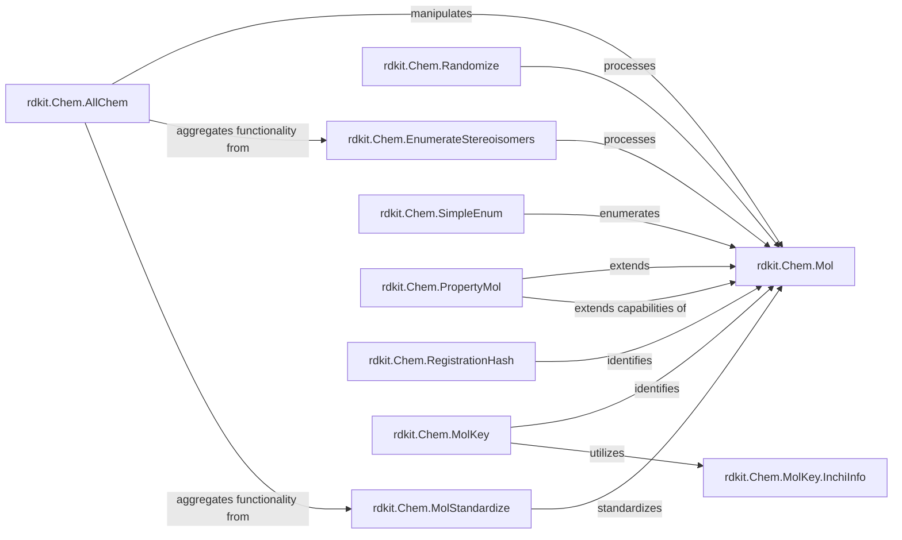

## Details

Component Overview: Core Molecular Chemistry

### rdkit.Chem.Mol
The fundamental data structure representing a chemical molecule. It encapsulates atoms, bonds, and basic molecular properties, serving as the central entity manipulated by all other components in this subsystem.

**Related Classes/Methods**:

- `rdkit.Chem.Mol` (0:0)

### rdkit.Chem.AllChem
A high-level convenience module that aggregates and exposes a broad range of common cheminformatics functionalities from various `rdkit.Chem` submodules. It simplifies access to complex operations like conformer generation and molecular mechanics.

**Related Classes/Methods**:

- <a href="https://github.com/rdkit/rdkit/rdkit/Chem/AllChem.py#L0-L0" target="_blank" rel="noopener noreferrer">`rdkit.Chem.AllChem` (0:0)</a>

### rdkit.Chem.EnumerateStereoisomers
Provides algorithms for systematically generating all possible stereoisomeric forms of a given molecule. This is essential for comprehensive chemical representation and analysis, especially for molecules with chiral centers or double bond stereochemistry.

**Related Classes/Methods**:

- <a href="https://github.com/rdkit/rdkit/rdkit/Chem/EnumerateStereoisomers.py#L169-L371" target="_blank" rel="noopener noreferrer">`rdkit.Chem.EnumerateStereoisomers` (169:371)</a>

### rdkit.Chem.Randomize
Implements methods for introducing randomness into molecular structures. This functionality is useful for generating diverse molecular sets, performing statistical analyses, or for specific computational experiments requiring randomized molecular inputs.

**Related Classes/Methods**:

- <a href="https://github.com/rdkit/rdkit/rdkit/Chem/Randomize.py#L0-L0" target="_blank" rel="noopener noreferrer">`rdkit.Chem.Randomize` (0:0)</a>

### rdkit.Chem.MolStandardize
Offers tools for standardizing chemical structures by applying a set of rules to normalize functional groups, neutralize charges, and remove common fragments. This ensures consistency in molecular representations across different datasets and applications.

**Related Classes/Methods**:

- `rdkit.Chem.MolStandardize` (0:0)

### rdkit.Chem.SimpleEnum
Contains basic enumeration functionalities, potentially for simpler or more generic combinatorial tasks related to molecular structures, complementing the more specialized stereoisomer enumeration.

**Related Classes/Methods**:

- `rdkit.Chem.SimpleEnum` (0:0)

### rdkit.Chem.PropertyMol
Extends the core `Mol` object to allow for the attachment and management of arbitrary molecular properties. This enhances the flexibility of molecular data representation by enabling the storage of custom attributes alongside the structural information.

**Related Classes/Methods**:

- <a href="https://github.com/rdkit/rdkit/rdkit/Chem/PropertyMol.py#L7-L113" target="_blank" rel="noopener noreferrer">`rdkit.Chem.PropertyMol` (7:113)</a>

### rdkit.Chem.RegistrationHash
Generates unique, persistent hash identifiers for molecules. These hashes are crucial for unambiguous molecular registration and tracking within chemical databases, ensuring data integrity and efficient retrieval.

**Related Classes/Methods**:

- <a href="https://github.com/rdkit/rdkit/rdkit/Chem/RegistrationHash.py#L0-L0" target="_blank" rel="noopener noreferrer">`rdkit.Chem.RegistrationHash` (0:0)</a>

### rdkit.Chem.MolKey
Manages the generation and handling of unique molecular identifiers, primarily InChI keys. InChI keys provide a standardized, non-proprietary way to identify chemical substances globally, facilitating data exchange and interoperability.

**Related Classes/Methods**:

- `rdkit.Chem.MolKey` (0:0)

### rdkit.Chem.MolKey.InchiInfo
A submodule of `MolKey` specifically responsible for processing and extracting information related to InChI (International Chemical Identifier) strings and keys. It provides the underlying logic for InChI-based molecular identification.

**Related Classes/Methods**:

- <a href="https://github.com/rdkit/rdkit/rdkit/Chem/MolKey/InchiInfo.py#L72-L168" target="_blank" rel="noopener noreferrer">`rdkit.Chem.MolKey.InchiInfo` (72:168)</a>

### [FAQ](https://github.com/CodeBoarding/GeneratedOnBoardings/tree/main?tab=readme-ov-file#faq)