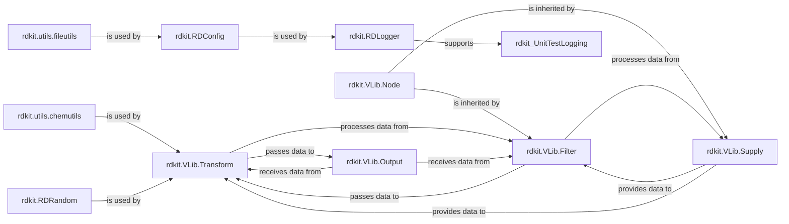

## Details

This component provides the foundational services and general-purpose utilities that underpin the entire RDKit library. It includes the logging infrastructure, file handling operations, general chemical string parsing, a virtual library (VLib) for constructing data processing pipelines, configuration management, and random number generation. It serves as a support layer for all other high-level components. These components are fundamental because they provide the essential, cross-cutting services and foundational building blocks necessary for the overall operation, development, and extensibility of the RDKit library, independent of specific chemical concepts. Logging (rdkit.RDLogger) is critical for debugging, monitoring, and understanding the behavior of any complex software. File Utilities (rdkit.utils.fileutils) are indispensable for interacting with the file system, a common requirement for data input, output, and configuration. General Chemical Utilities (rdkit.utils.chemutils) offer common helper functions that streamline various chemical data manipulations not tied to specific object models. The Virtual Library (rdkit.VLib.Node, Supply, Filter, Transform, Output) provides a powerful, generic framework for building data processing pipelines. This architectural pattern is highly reusable for diverse cheminformatics tasks, making it a core piece of infrastructure for data flow and extensibility. Configuration Management (rdkit.RDConfig) is vital for adaptability, centralizing settings and paths, allowing the library to be configured without modifying source code. Random Number Generation (rdkit.RDRandom) is crucial for many scientific and cheminformatics algorithms that rely on stochastic processes or statistical sampling. Together, these components form the bedrock upon which RDKit's higher-level chemical functionalities are built, enabling robust operation, efficient development, and flexible deployment.

### rdkit.RDLogger
Provides the foundational logging infrastructure for the RDKit library, enabling standardized output of messages for debugging, information, warnings, and errors across all components. It is fundamental for monitoring and understanding the library's runtime behavior.

**Related Classes/Methods**:

- <a href="https://github.com/rdkit/rdkit/rdkit/RDLogger.py#L1-L1" target="_blank" rel="noopener noreferrer">`rdkit.RDLogger` (1:1)</a>

### rdkit.utils.fileutils
Offers general-purpose utilities for file system operations, including path manipulation, existence checks, and basic file I/O. This component is fundamental for any part of RDKit that needs to interact with the local file system, ensuring consistent and robust file handling.

**Related Classes/Methods**:

- <a href="https://github.com/rdkit/rdkit/rdkit/utils/fileutils.py#L1-L1" target="_blank" rel="noopener noreferrer">`rdkit.utils.fileutils` (1:1)</a>

### rdkit.utils.chemutils
Contains general chemical utility functions that are not tied to specific molecule representations but assist in common chemical data manipulations, conversions, or string parsing. It provides essential helpers for various chemical data processing tasks.

**Related Classes/Methods**:

- <a href="https://github.com/rdkit/rdkit/rdkit/utils/chemutils.py#L1-L1" target="_blank" rel="noopener noreferrer">`rdkit.utils.chemutils` (1:1)</a>

### rdkit.VLib.Node
Serves as the abstract base class for all nodes within the Virtual Library (VLib) data processing pipeline, defining the common interface and fundamental behaviors for any processing step. It is the architectural backbone of the VLib framework.

**Related Classes/Methods**:

- <a href="https://github.com/rdkit/rdkit/rdkit/VLib/Node.py#L1-L1" target="_blank" rel="noopener noreferrer">`rdkit.VLib.Node` (1:1)</a>

### rdkit.VLib.Supply
A concrete VLib node type responsible for originating data within a pipeline, acting as a data source that provides input to subsequent processing steps. It is fundamental for introducing data into any VLib workflow.

**Related Classes/Methods**:

- <a href="https://github.com/rdkit/rdkit/rdkit/VLib/Supply.py#L1-L1" target="_blank" rel="noopener noreferrer">`rdkit.VLib.Supply` (1:1)</a>

### rdkit.VLib.Filter
A concrete VLib node type that processes data by applying filtering logic, selecting or excluding data based on defined criteria within the pipeline. It is a core component for data refinement in VLib pipelines.

**Related Classes/Methods**:

- <a href="https://github.com/rdkit/rdkit/rdkit/VLib/Filter.py#L1-L1" target="_blank" rel="noopener noreferrer">`rdkit.VLib.Filter` (1:1)</a>

### rdkit.VLib.Transform
A concrete VLib node type that modifies or enriches data as it flows through the pipeline, performing transformations on the input data. It is essential for data manipulation and feature generation within VLib workflows.

**Related Classes/Methods**:

- <a href="https://github.com/rdkit/rdkit/rdkit/VLib/Transform.py#L1-L1" target="_blank" rel="noopener noreferrer">`rdkit.VLib.Transform` (1:1)</a>

### rdkit.VLib.Output
A concrete VLib node type that acts as a data sink, consuming processed data from the pipeline and typically handling its storage, display, or final disposition. It is the terminal point for data processing in VLib pipelines.

**Related Classes/Methods**:

- <a href="https://github.com/rdkit/rdkit/rdkit/VLib/Output.py#L1-L1" target="_blank" rel="noopener noreferrer">`rdkit.VLib.Output` (1:1)</a>

### rdkit.RDConfig
Manages global configuration settings and paths for the RDKit library, providing a centralized point for accessing environment-specific or default parameters. This component is fundamental for the library's adaptability and deployment across different environments.

**Related Classes/Methods**:

- <a href="https://github.com/rdkit/rdkit/rdkit/RDConfig.py#L1-L1" target="_blank" rel="noopener noreferrer">`rdkit.RDConfig` (1:1)</a>

### rdkit.RDRandom
Provides utilities for generating random numbers, which are crucial for various RDKit algorithms, such as generating random conformations, statistical sampling, or initializing stochastic processes. It ensures consistent and reproducible randomness where needed.

**Related Classes/Methods**:

- <a href="https://github.com/rdkit/rdkit/rdkit/RDRandom.py#L1-L1" target="_blank" rel="noopener noreferrer">`rdkit.RDRandom` (1:1)</a>

### [FAQ](https://github.com/CodeBoarding/GeneratedOnBoardings/tree/main?tab=readme-ov-file#faq)