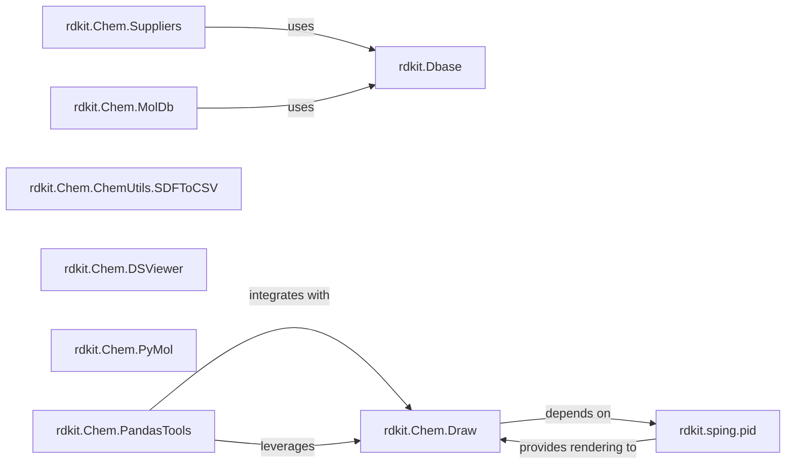

## Details

The `Data Management & Visualization` component in RDKit is a crucial subsystem responsible for handling the input, output, and storage of chemical data, as well as providing extensive capabilities for rendering and visualizing molecular structures. It integrates various data sources and external visualization tools, enhancing the utility of chemical data within analytical workflows.

### rdkit.Chem.Suppliers
This component is responsible for reading chemical data from various file formats (like SMILES, SDFiles) and database connections. It acts as the primary entry point for ingesting molecular information into the RDKit environment.

**Related Classes/Methods**:

- <a href="https://github.com/rdkit/rdkit/rdkit/Chem/Suppliers/DbMolSupplier.py#L22-L98" target="_blank" rel="noopener noreferrer">`rdkit.Chem.Suppliers.DbMolSupplier` (22:98)</a>
- <a href="https://github.com/rdkit/rdkit/rdkit/Chem/Suppliers/MolSupplier.py#L14-L42" target="_blank" rel="noopener noreferrer">`rdkit.Chem.Suppliers.MolSupplier` (14:42)</a>

### rdkit.Dbase
Provides the foundational utilities for establishing and managing connections to databases. It is essential for persistent storage and retrieval of chemical data, supporting other components that interact with databases.

**Related Classes/Methods**:

- <a href="https://github.com/rdkit/rdkit/rdkit/Dbase/DbConnection.py#L1-L1" target="_blank" rel="noopener noreferrer">`rdkit.Dbase.DbConnection` (1:1)</a>
- <a href="https://github.com/rdkit/rdkit/rdkit/Dbase/DbUtils.py#L1-L1" target="_blank" rel="noopener noreferrer">`rdkit.Dbase.DbUtils` (1:1)</a>

### rdkit.Chem.MolDb
Specializes in the loading and storage of molecular data within a database context. It often includes optimized structures and methods for handling large chemical datasets efficiently.

**Related Classes/Methods**:

- <a href="https://github.com/rdkit/rdkit/rdkit/Chem/MolDb/Loader_orig.py#L1-L1" target="_blank" rel="noopener noreferrer">`rdkit.Chem.MolDb.Loader_orig` (1:1)</a>
- <a href="https://github.com/rdkit/rdkit/rdkit/Chem/MolDb/Loader_sa.py#L1-L1" target="_blank" rel="noopener noreferrer">`rdkit.Chem.MolDb.Loader_sa` (1:1)</a>

### rdkit.Chem.ChemUtils.SDFToCSV
A utility component focused on converting Structure-Data Files (SDFiles) into a more universally accessible CSV format. This facilitates interoperability and allows for easier analysis of chemical data using standard spreadsheet or data processing tools.

**Related Classes/Methods**:

- <a href="https://github.com/rdkit/rdkit/rdkit/Chem/ChemUtils/SDFToCSV.py#L1-L1" target="_blank" rel="noopener noreferrer">`rdkit.Chem.ChemUtils.SDFToCSV` (1:1)</a>

### rdkit.Chem.Draw
This is the core component for generating 2D images of chemical structures. It provides the fundamental drawing primitives and logic required to visually represent molecules, which is critical for analysis and communication.

**Related Classes/Methods**:

- `rdkit.Chem.Draw` (1:1)
- <a href="https://github.com/rdkit/rdkit/rdkit/Chem/Draw/MolDrawing.py#L81-L571" target="_blank" rel="noopener noreferrer">`rdkit.Chem.Draw.MolDrawing` (81:571)</a>
- <a href="https://github.com/rdkit/rdkit/rdkit/Chem/Draw/SimilarityMaps.py#L1-L1" target="_blank" rel="noopener noreferrer">`rdkit.Chem.Draw.SimilarityMaps` (1:1)</a>
- <a href="https://github.com/rdkit/rdkit/rdkit/Chem/Draw/IPythonConsole.py#L1-L1" target="_blank" rel="noopener noreferrer">`rdkit.Chem.Draw.IPythonConsole` (1:1)</a>

### rdkit.Chem.DSViewer
Acts as an interface to integrate RDKit with DSViewer, an external molecular visualization tool. It enables users to leverage advanced 3D rendering and analysis capabilities provided by DSViewer for RDKit molecules.

**Related Classes/Methods**:

- <a href="https://github.com/rdkit/rdkit/rdkit/Chem/DSViewer.py#L1-L1" target="_blank" rel="noopener noreferrer">`rdkit.Chem.DSViewer` (1:1)</a>

### rdkit.Chem.PyMol
Provides an interface for visualizing RDKit molecules using PyMol, a widely used open-source molecular visualization system. Similar to DSViewer, it extends RDKit's visualization capabilities to a powerful external tool.

**Related Classes/Methods**:

- <a href="https://github.com/rdkit/rdkit/rdkit/Chem/PyMol.py#L1-L1" target="_blank" rel="noopener noreferrer">`rdkit.Chem.PyMol` (1:1)</a>

### rdkit.Chem.PandasTools
Enhances the popular Pandas DataFrame library with cheminformatics functionalities. This component allows for direct handling, manipulation, and visualization of RDKit molecular objects within a DataFrame, streamlining data analysis workflows.

**Related Classes/Methods**:

- <a href="https://github.com/rdkit/rdkit/rdkit/Chem/PandasPatcher.py#L1-L1" target="_blank" rel="noopener noreferrer">`rdkit.Chem.PandasPatcher` (1:1)</a>
- <a href="https://github.com/rdkit/rdkit/rdkit/Chem/PandasTools.py#L1-L1" target="_blank" rel="noopener noreferrer">`rdkit.Chem.PandasTools` (1:1)</a>

### rdkit.sping.pid
Serves as the underlying graphics abstraction layer for RDKit's drawing functionalities. It provides a unified interface for rendering graphics to various output formats (e.g., PDF, PIL, PostScript, SVG, Tkinter, WX), making the drawing capabilities highly versatile.

**Related Classes/Methods**:

- <a href="https://github.com/rdkit/rdkit/rdkit/sping/pid.py#L1-L1" target="_blank" rel="noopener noreferrer">`rdkit.sping.pid` (1:1)</a>

### [FAQ](https://github.com/CodeBoarding/GeneratedOnBoardings/tree/main?tab=readme-ov-file#faq)