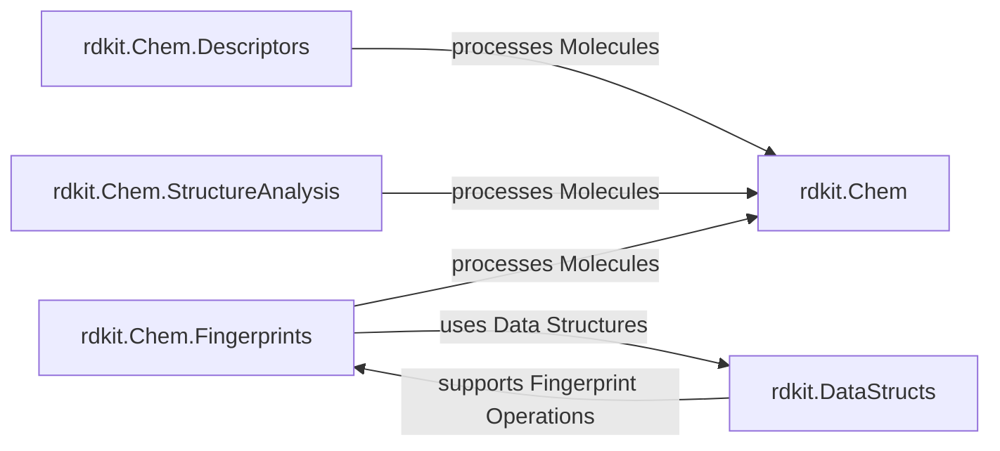

## Details

This subsystem, Molecular Feature Extraction & Analysis, is a core part of the RDKit cheminformatics library, dedicated to transforming molecular structures into quantifiable data and insights. It encompasses a broad spectrum of functionalities, from calculating fundamental physicochemical properties and structural descriptors to generating various types of molecular fingerprints for similarity-based tasks, and advanced structural decomposition and analysis.

### rdkit.Chem.Descriptors
This component is responsible for the calculation of a comprehensive set of 1D, 2D, and 3D molecular descriptors and physicochemical properties. These numerical values quantify various aspects of a molecule's structure, such as size, shape, electronic properties, and topological features. They are crucial for building quantitative structure-activity/property relationship (QSAR/QSPR) models, predicting chemical properties, and performing lead optimization in drug discovery.

**Related Classes/Methods**:

- <a href="https://github.com/rdkit/rdkit/rdkit/Chem/Crippen.py#L1-L1" target="_blank" rel="noopener noreferrer">`rdkit.Chem.Crippen` (1:1)</a>
- <a href="https://github.com/rdkit/rdkit/rdkit/Chem/Descriptors.py#L1-L1" target="_blank" rel="noopener noreferrer">`rdkit.Chem.Descriptors` (1:1)</a>
- <a href="https://github.com/rdkit/rdkit/rdkit/Chem/Descriptors3D.py#L1-L1" target="_blank" rel="noopener noreferrer">`rdkit.Chem.Descriptors3D` (1:1)</a>
- <a href="https://github.com/rdkit/rdkit/rdkit/Chem/GraphDescriptors.py#L1-L1" target="_blank" rel="noopener noreferrer">`rdkit.Chem.GraphDescriptors` (1:1)</a>
- <a href="https://github.com/rdkit/rdkit/rdkit/Chem/MolSurf.py#L1-L1" target="_blank" rel="noopener noreferrer">`rdkit.Chem.MolSurf` (1:1)</a>
- <a href="https://github.com/rdkit/rdkit/rdkit/Chem/QED.py#L1-L1" target="_blank" rel="noopener noreferrer">`rdkit.Chem.QED` (1:1)</a>
- `rdkit.Chem.EState` (1:1)
- <a href="https://github.com/rdkit/rdkit/rdkit/Chem/SpacialScore.py#L1-L1" target="_blank" rel="noopener noreferrer">`rdkit.Chem.SpacialScore` (1:1)</a>

### rdkit.Chem.Fingerprints
This component specializes in generating diverse molecular fingerprints, which are compact bit vectors or arrays encoding the presence or absence of specific structural features within a molecule. It also includes functionalities for calculating molecular similarity based on these fingerprints. Fingerprints are widely used for rapid similarity searching, clustering, diversity analysis, and as input features for machine learning models in cheminformatics.

**Related Classes/Methods**:

- <a href="https://github.com/rdkit/rdkit/rdkit/Chem/MACCSkeys.py#L1-L1" target="_blank" rel="noopener noreferrer">`rdkit.Chem.MACCSkeys` (1:1)</a>
- <a href="https://github.com/rdkit/rdkit/rdkit/Chem/TorsionFingerprints.py#L1-L1" target="_blank" rel="noopener noreferrer">`rdkit.Chem.TorsionFingerprints` (1:1)</a>
- <a href="https://github.com/rdkit/rdkit/rdkit/Chem/AtomPairs/Pairs.py#L1-L1" target="_blank" rel="noopener noreferrer">`rdkit.Chem.AtomPairs.Pairs` (1:1)</a>
- <a href="https://github.com/rdkit/rdkit/rdkit/Chem/AtomPairs/Torsions.py#L1-L1" target="_blank" rel="noopener noreferrer">`rdkit.Chem.AtomPairs.Torsions` (1:1)</a>
- <a href="https://github.com/rdkit/rdkit/rdkit/Chem/Fingerprints/FingerprintMols.py#L1-L1" target="_blank" rel="noopener noreferrer">`rdkit.Chem.Fingerprints.FingerprintMols` (1:1)</a>
- <a href="https://github.com/rdkit/rdkit/rdkit/Chem/Fingerprints/MolSimilarity.py#L1-L1" target="_blank" rel="noopener noreferrer">`rdkit.Chem.Fingerprints.MolSimilarity` (1:1)</a>
- <a href="https://github.com/rdkit/rdkit/rdkit/Chem/Fraggle/FraggleSim.py#L1-L1" target="_blank" rel="noopener noreferrer">`rdkit.Chem.Fraggle.FraggleSim` (1:1)</a>

### rdkit.Chem.StructureAnalysis
This component provides advanced tools for dissecting and analyzing molecular structures. This includes functionalities for molecular fragmentation (e.g., BRICS, RECAP), identifying maximum common substructures (MCS) between molecules, and recognizing functional groups and scaffolds. These capabilities are essential for understanding structure-activity relationships, designing chemical libraries, and optimizing lead compounds.

**Related Classes/Methods**:

- <a href="https://github.com/rdkit/rdkit/rdkit/Chem/BRICS.py#L1-L1" target="_blank" rel="noopener noreferrer">`rdkit.Chem.BRICS` (1:1)</a>
- <a href="https://github.com/rdkit/rdkit/rdkit/Chem/BuildFragmentCatalog.py#L1-L1" target="_blank" rel="noopener noreferrer">`rdkit.Chem.BuildFragmentCatalog` (1:1)</a>
- <a href="https://github.com/rdkit/rdkit/rdkit/Chem/FunctionalGroups.py#L1-L1" target="_blank" rel="noopener noreferrer">`rdkit.Chem.FunctionalGroups` (1:1)</a>
- <a href="https://github.com/rdkit/rdkit/rdkit/Chem/MCS.py#L1-L1" target="_blank" rel="noopener noreferrer">`rdkit.Chem.MCS` (1:1)</a>
- <a href="https://github.com/rdkit/rdkit/rdkit/Chem/Recap.py#L1-L1" target="_blank" rel="noopener noreferrer">`rdkit.Chem.Recap` (1:1)</a>
- <a href="https://github.com/rdkit/rdkit/rdkit/Chem/Scaffolds/MurckoScaffold.py#L1-L1" target="_blank" rel="noopener noreferrer">`rdkit.Chem.Scaffolds.MurckoScaffold` (1:1)</a>

### rdkit.DataStructs
While not directly performing feature extraction, this package provides the underlying, highly optimized data structures necessary for efficient storage and manipulation of chemical data, particularly bit vectors and other collections used by molecular fingerprints and similarity calculations. It acts as a foundational utility layer for other components, ensuring performance and scalability.

**Related Classes/Methods**:

- <a href="https://github.com/rdkit/rdkit/rdkit/DataStructs/BitEnsemble.py#L16-L55" target="_blank" rel="noopener noreferrer">`rdkit.DataStructs.BitEnsemble` (16:55)</a>
- <a href="https://github.com/rdkit/rdkit/rdkit/DataStructs/TopNContainer.py#L14-L70" target="_blank" rel="noopener noreferrer">`rdkit.DataStructs.TopNContainer` (14:70)</a>
- <a href="https://github.com/rdkit/rdkit/rdkit/DataStructs/VectCollection.py#L17-L268" target="_blank" rel="noopener noreferrer">`rdkit.DataStructs.VectCollection` (17:268)</a>
- `rdkit.DataStructs` (1:1)

### rdkit.Chem
Core RDKit module for representing and manipulating molecular structures (Mol objects).

**Related Classes/Methods**: _None_

### [FAQ](https://github.com/CodeBoarding/GeneratedOnBoardings/tree/main?tab=readme-ov-file#faq)