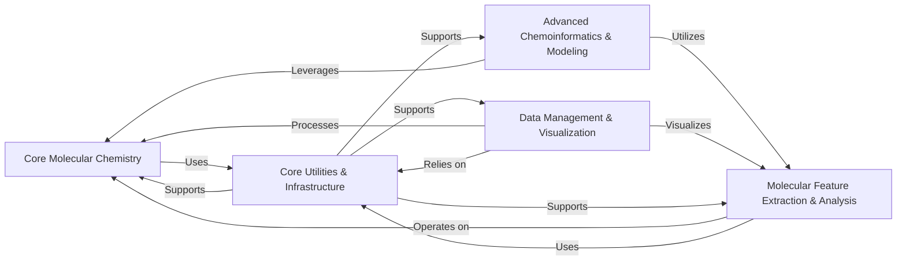

## Details

The RDKit library is structured around a core set of molecular operations, with specialized components building upon this foundation to provide comprehensive cheminformatics capabilities.

### Core Molecular Chemistry [[Expand]](./Core_Molecular_Chemistry.md)
This is the foundational layer of RDKit, providing the essential functionalities for manipulating molecular structures. It encompasses operations such as generating conformers, enumerating reactions and stereoisomers, randomizing molecules, and standardizing chemical structures. It also handles general molecule properties and provides unique molecular identification through InChI keys and registration hashes. Most other components directly interact with this core to perform their functions.

**Related Classes/Methods**:

- <a href="https://github.com/rdkit/rdkit/rdkit/Chem/AllChem.py#L0-L0" target="_blank" rel="noopener noreferrer">`rdkit/Chem/AllChem.py` (0:0)</a>
- <a href="https://github.com/rdkit/rdkit/rdkit/Chem/EnumerateStereoisomers.py#L0-L0" target="_blank" rel="noopener noreferrer">`rdkit/Chem/EnumerateStereoisomers.py` (0:0)</a>
- <a href="https://github.com/rdkit/rdkit/rdkit/Chem/Randomize.py#L0-L0" target="_blank" rel="noopener noreferrer">`rdkit/Chem/Randomize.py` (0:0)</a>
- `rdkit/Chem/MolStandardize.py` (0:0)
- `rdkit/Chem/SimpleEnum.py` (0:0)
- <a href="https://github.com/rdkit/rdkit/rdkit/Chem/PropertyMol.py#L0-L0" target="_blank" rel="noopener noreferrer">`rdkit/Chem/PropertyMol.py` (0:0)</a>
- <a href="https://github.com/rdkit/rdkit/rdkit/Chem/RegistrationHash.py#L0-L0" target="_blank" rel="noopener noreferrer">`rdkit/Chem/RegistrationHash.py` (0:0)</a>
- <a href="https://github.com/rdkit/rdkit/rdkit/Chem/MolKey/MolKey.py#L0-L0" target="_blank" rel="noopener noreferrer">`rdkit/Chem/MolKey/MolKey.py` (0:0)</a>
- <a href="https://github.com/rdkit/rdkit/rdkit/Chem/MolKey/InchiInfo.py#L0-L0" target="_blank" rel="noopener noreferrer">`rdkit/Chem/MolKey/InchiInfo.py` (0:0)</a>

### Molecular Feature Extraction & Analysis [[Expand]](./Molecular_Feature_Extraction_Analysis.md)
This component is responsible for deriving various chemical insights and numerical representations from molecular structures. It includes the calculation of a wide range of 1D, 2D, and 3D molecular descriptors and physicochemical properties. Additionally, it generates diverse molecular fingerprints (e.g., MACCS keys, atom pairs, RDKit fingerprints) for similarity analyses and provides tools for structural fragmentation (e.g., BRICS, RECAP) and identifying maximum common substructures (MCS) or functional groups.

**Related Classes/Methods**:

- <a href="https://github.com/rdkit/rdkit/rdkit/Chem/Crippen.py#L0-L0" target="_blank" rel="noopener noreferrer">`rdkit/Chem/Crippen.py` (0:0)</a>
- <a href="https://github.com/rdkit/rdkit/rdkit/Chem/Descriptors.py#L0-L0" target="_blank" rel="noopener noreferrer">`rdkit/Chem/Descriptors.py` (0:0)</a>
- <a href="https://github.com/rdkit/rdkit/rdkit/Chem/Descriptors3D.py#L0-L0" target="_blank" rel="noopener noreferrer">`rdkit/Chem/Descriptors3D.py` (0:0)</a>
- <a href="https://github.com/rdkit/rdkit/rdkit/Chem/GraphDescriptors.py#L0-L0" target="_blank" rel="noopener noreferrer">`rdkit/Chem/GraphDescriptors.py` (0:0)</a>
- <a href="https://github.com/rdkit/rdkit/rdkit/Chem/MolSurf.py#L0-L0" target="_blank" rel="noopener noreferrer">`rdkit/Chem/MolSurf.py` (0:0)</a>
- <a href="https://github.com/rdkit/rdkit/rdkit/Chem/QED.py#L0-L0" target="_blank" rel="noopener noreferrer">`rdkit/Chem/QED.py` (0:0)</a>
- `rdkit/Chem/EState.py` (0:0)
- <a href="https://github.com/rdkit/rdkit/rdkit/Chem/SpacialScore.py#L0-L0" target="_blank" rel="noopener noreferrer">`rdkit/Chem/SpacialScore.py` (0:0)</a>
- <a href="https://github.com/rdkit/rdkit/rdkit/Chem/MACCSkeys.py#L0-L0" target="_blank" rel="noopener noreferrer">`rdkit/Chem/MACCSkeys.py` (0:0)</a>
- <a href="https://github.com/rdkit/rdkit/rdkit/Chem/TorsionFingerprints.py#L0-L0" target="_blank" rel="noopener noreferrer">`rdkit/Chem/TorsionFingerprints.py` (0:0)</a>
- <a href="https://github.com/rdkit/rdkit/rdkit/Chem/AtomPairs/Pairs.py#L0-L0" target="_blank" rel="noopener noreferrer">`rdkit/Chem/AtomPairs/Pairs.py` (0:0)</a>
- <a href="https://github.com/rdkit/rdkit/rdkit/Chem/AtomPairs/Torsions.py#L0-L0" target="_blank" rel="noopener noreferrer">`rdkit/Chem/AtomPairs/Torsions.py` (0:0)</a>
- <a href="https://github.com/rdkit/rdkit/rdkit/Chem/Fingerprints/FingerprintMols.py#L0-L0" target="_blank" rel="noopener noreferrer">`rdkit/Chem/Fingerprints/FingerprintMols.py` (0:0)</a>
- <a href="https://github.com/rdkit/rdkit/rdkit/Chem/Fingerprints/MolSimilarity.py#L0-L0" target="_blank" rel="noopener noreferrer">`rdkit/Chem/Fingerprints/MolSimilarity.py` (0:0)</a>
- <a href="https://github.com/rdkit/rdkit/rdkit/Chem/Fraggle/FraggleSim.py#L0-L0" target="_blank" rel="noopener noreferrer">`rdkit/Chem/Fraggle/FraggleSim.py` (0:0)</a>
- <a href="https://github.com/rdkit/rdkit/rdkit/DataStructs/BitEnsemble.py#L0-L0" target="_blank" rel="noopener noreferrer">`rdkit/DataStructs/BitEnsemble.py` (0:0)</a>
- <a href="https://github.com/rdkit/rdkit/rdkit/DataStructs/TopNContainer.py#L0-L0" target="_blank" rel="noopener noreferrer">`rdkit/DataStructs/TopNContainer.py` (0:0)</a>
- <a href="https://github.com/rdkit/rdkit/rdkit/DataStructs/VectCollection.py#L0-L0" target="_blank" rel="noopener noreferrer">`rdkit/DataStructs/VectCollection.py` (0:0)</a>
- <a href="https://github.com/rdkit/rdkit/rdkit/Chem/BRICS.py#L0-L0" target="_blank" rel="noopener noreferrer">`rdkit/Chem/BRICS.py` (0:0)</a>
- <a href="https://github.com/rdkit/rdkit/rdkit/Chem/BuildFragmentCatalog.py#L0-L0" target="_blank" rel="noopener noreferrer">`rdkit/Chem/BuildFragmentCatalog.py` (0:0)</a>
- <a href="https://github.com/rdkit/rdkit/rdkit/Chem/FunctionalGroups.py#L0-L0" target="_blank" rel="noopener noreferrer">`rdkit/Chem/FunctionalGroups.py` (0:0)</a>
- <a href="https://github.com/rdkit/rdkit/rdkit/Chem/MCS.py#L0-L0" target="_blank" rel="noopener noreferrer">`rdkit/Chem/MCS.py` (0:0)</a>
- <a href="https://github.com/rdkit/rdkit/rdkit/Chem/Recap.py#L0-L0" target="_blank" rel="noopener noreferrer">`rdkit/Chem/Recap.py` (0:0)</a>
- <a href="https://github.com/rdkit/rdkit/rdkit/Chem/Scaffolds/MurckoScaffold.py#L0-L0" target="_blank" rel="noopener noreferrer">`rdkit/Chem/Scaffolds/MurckoScaffold.py` (0:0)</a>

### Advanced Chemoinformatics & Modeling [[Expand]](./Advanced_Chemoinformatics_Modeling.md)
This component provides higher-level computational chemistry capabilities, focusing on predictive modeling and advanced analysis. It includes the identification, generation, and manipulation of pharmacophoric features and models in both 2D and 3D space. Furthermore, it offers a suite of machine learning tools for tasks such as data preparation, clustering, statistical analysis, and scoring, along with specialized functionalities like chemical reaction role assignment.

**Related Classes/Methods**:

- <a href="https://github.com/rdkit/rdkit/rdkit/Chem/FeatMaps/FeatMapParser.py#L0-L0" target="_blank" rel="noopener noreferrer">`rdkit/Chem/FeatMaps/FeatMapParser.py` (0:0)</a>
- <a href="https://github.com/rdkit/rdkit/rdkit/Chem/FeatMaps/FeatMaps.py#L0-L0" target="_blank" rel="noopener noreferrer">`rdkit/Chem/FeatMaps/FeatMaps.py` (0:0)</a>
- <a href="https://github.com/rdkit/rdkit/rdkit/Chem/Features/FeatDirUtilsRD.py#L0-L0" target="_blank" rel="noopener noreferrer">`rdkit/Chem/Features/FeatDirUtilsRD.py` (0:0)</a>
- <a href="https://github.com/rdkit/rdkit/rdkit/Chem/Pharm2D/Generate.py#L0-L0" target="_blank" rel="noopener noreferrer">`rdkit/Chem/Pharm2D/Generate.py` (0:0)</a>
- <a href="https://github.com/rdkit/rdkit/rdkit/Chem/Pharm2D/SigFactory.py#L0-L0" target="_blank" rel="noopener noreferrer">`rdkit/Chem/Pharm2D/SigFactory.py` (0:0)</a>
- <a href="https://github.com/rdkit/rdkit/rdkit/Chem/Pharm3D/EmbedLib.py#L0-L0" target="_blank" rel="noopener noreferrer">`rdkit/Chem/Pharm3D/EmbedLib.py` (0:0)</a>
- <a href="https://github.com/rdkit/rdkit/rdkit/Chem/Pharm3D/Pharmacophore.py#L0-L0" target="_blank" rel="noopener noreferrer">`rdkit/Chem/Pharm3D/Pharmacophore.py` (0:0)</a>
- <a href="https://github.com/rdkit/rdkit/rdkit/ML/Cluster/Butina.py#L0-L0" target="_blank" rel="noopener noreferrer">`rdkit/ML/Cluster/Butina.py` (0:0)</a>
- <a href="https://github.com/rdkit/rdkit/rdkit/ML/Cluster/Murtagh.py#L0-L0" target="_blank" rel="noopener noreferrer">`rdkit/ML/Cluster/Murtagh.py` (0:0)</a>
- <a href="https://github.com/rdkit/rdkit/rdkit/ML/Data/DataUtils.py#L0-L0" target="_blank" rel="noopener noreferrer">`rdkit/ML/Data/DataUtils.py` (0:0)</a>
- <a href="https://github.com/rdkit/rdkit/rdkit/ML/Data/MLData.py#L0-L0" target="_blank" rel="noopener noreferrer">`rdkit/ML/Data/MLData.py` (0:0)</a>
- <a href="https://github.com/rdkit/rdkit/rdkit/ML/Descriptors/MoleculeDescriptors.py#L0-L0" target="_blank" rel="noopener noreferrer">`rdkit/ML/Descriptors/MoleculeDescriptors.py` (0:0)</a>
- <a href="https://github.com/rdkit/rdkit/rdkit/ML/InfoTheory/BitRank.py#L0-L0" target="_blank" rel="noopener noreferrer">`rdkit/ML/InfoTheory/BitRank.py` (0:0)</a>
- <a href="https://github.com/rdkit/rdkit/rdkit/ML/Scoring/Scoring.py#L0-L0" target="_blank" rel="noopener noreferrer">`rdkit/ML/Scoring/Scoring.py` (0:0)</a>
- <a href="https://github.com/rdkit/rdkit/rdkit/ML/SLT/Risk.py#L0-L0" target="_blank" rel="noopener noreferrer">`rdkit/ML/SLT/Risk.py` (0:0)</a>
- <a href="https://github.com/rdkit/rdkit/rdkit/SimDivFilters/SimilarityPickers.py#L0-L0" target="_blank" rel="noopener noreferrer">`rdkit/SimDivFilters/SimilarityPickers.py` (0:0)</a>
- <a href="https://github.com/rdkit/rdkit/Contrib/RxnRoleAssignment/identifyReactants.py#L0-L0" target="_blank" rel="noopener noreferrer">`rdkit/Contrib/RxnRoleAssignment/identifyReactants.py` (0:0)</a>

### Data Management & Visualization [[Expand]](./Data_Management_Visualization.md)
This component handles the input, output, and storage of chemical data from various sources, including SMILES strings, SDFiles, and different database connections. It also provides comprehensive capabilities for rendering 2D and 3D molecular structures, integrating with external visualization tools (e.g., PyMol, DSViewer), and enhancing the display of chemical data within analytical environments like Pandas DataFrames. The underlying `sping` package provides the graphics abstraction layer.

**Related Classes/Methods**:

- <a href="https://github.com/rdkit/rdkit/rdkit/Chem/Suppliers/DbMolSupplier.py#L0-L0" target="_blank" rel="noopener noreferrer">`rdkit/Chem/Suppliers/DbMolSupplier.py` (0:0)</a>
- <a href="https://github.com/rdkit/rdkit/rdkit/Chem/Suppliers/MolSupplier.py#L0-L0" target="_blank" rel="noopener noreferrer">`rdkit/Chem/Suppliers/MolSupplier.py` (0:0)</a>
- <a href="https://github.com/rdkit/rdkit/rdkit/Dbase/DbConnection.py#L0-L0" target="_blank" rel="noopener noreferrer">`rdkit/Dbase/DbConnection.py` (0:0)</a>
- <a href="https://github.com/rdkit/rdkit/rdkit/Dbase/DbUtils.py#L0-L0" target="_blank" rel="noopener noreferrer">`rdkit/Dbase/DbUtils.py` (0:0)</a>
- <a href="https://github.com/rdkit/rdkit/rdkit/Chem/MolDb/Loader_orig.py#L0-L0" target="_blank" rel="noopener noreferrer">`rdkit/Chem/MolDb/Loader_orig.py` (0:0)</a>
- <a href="https://github.com/rdkit/rdkit/rdkit/Chem/MolDb/Loader_sa.py#L0-L0" target="_blank" rel="noopener noreferrer">`rdkit/Chem/MolDb/Loader_sa.py` (0:0)</a>
- <a href="https://github.com/rdkit/rdkit/rdkit/Chem/ChemUtils/SDFToCSV.py#L0-L0" target="_blank" rel="noopener noreferrer">`rdkit/Chem/ChemUtils/SDFToCSV.py` (0:0)</a>
- <a href="https://github.com/rdkit/rdkit/rdkit/Chem/Draw/__init__.py#L0-L0" target="_blank" rel="noopener noreferrer">`rdkit/Chem/Draw/__init__.py` (0:0)</a>
- <a href="https://github.com/rdkit/rdkit/rdkit/Chem/Draw/MolDrawing.py#L0-L0" target="_blank" rel="noopener noreferrer">`rdkit/Chem/Draw/MolDrawing.py` (0:0)</a>
- <a href="https://github.com/rdkit/rdkit/rdkit/Chem/Draw/SimilarityMaps.py#L0-L0" target="_blank" rel="noopener noreferrer">`rdkit/Chem/Draw/SimilarityMaps.py` (0:0)</a>
- <a href="https://github.com/rdkit/rdkit/rdkit/Chem/Draw/IPythonConsole.py#L0-L0" target="_blank" rel="noopener noreferrer">`rdkit/Chem/Draw/IPythonConsole.py` (0:0)</a>
- <a href="https://github.com/rdkit/rdkit/rdkit/Chem/DSViewer.py#L0-L0" target="_blank" rel="noopener noreferrer">`rdkit/Chem/DSViewer.py` (0:0)</a>
- <a href="https://github.com/rdkit/rdkit/rdkit/Chem/PyMol.py#L0-L0" target="_blank" rel="noopener noreferrer">`rdkit/Chem/PyMol.py` (0:0)</a>
- <a href="https://github.com/rdkit/rdkit/rdkit/Chem/PandasPatcher.py#L0-L0" target="_blank" rel="noopener noreferrer">`rdkit/Chem/PandasPatcher.py` (0:0)</a>
- <a href="https://github.com/rdkit/rdkit/rdkit/Chem/PandasTools.py#L0-L0" target="_blank" rel="noopener noreferrer">`rdkit/Chem/PandasTools.py` (0:0)</a>
- <a href="https://github.com/rdkit/rdkit/rdkit/sping/pid.py#L0-L0" target="_blank" rel="noopener noreferrer">`rdkit/sping/pid.py` (0:0)</a>

### Core Utilities & Infrastructure [[Expand]](./Core_Utilities_Infrastructure.md)
This component provides the foundational services and general-purpose utilities that underpin the entire RDKit library. It includes the logging infrastructure, unit testing utilities, file handling operations, chemical string parsing, ChemDraw integration, and a virtual library (VLib) for constructing data processing pipelines. It serves as a support layer for all other high-level components.

**Related Classes/Methods**:

- <a href="https://github.com/rdkit/rdkit/rdkit/RDLogger.py#L0-L0" target="_blank" rel="noopener noreferrer">`rdkit/RDLogger.py` (0:0)</a>
- <a href="https://github.com/rdkit/rdkit/rdkit/UnitTestLogging.py#L0-L0" target="_blank" rel="noopener noreferrer">`rdkit/UnitTestLogging.py` (0:0)</a>
- <a href="https://github.com/rdkit/rdkit/rdkit/utils/chemutils.py#L0-L0" target="_blank" rel="noopener noreferrer">`rdkit/utils/chemutils.py` (0:0)</a>
- <a href="https://github.com/rdkit/rdkit/rdkit/utils/fileutils.py#L0-L0" target="_blank" rel="noopener noreferrer">`rdkit/utils/fileutils.py` (0:0)</a>
- <a href="https://github.com/rdkit/rdkit/rdkit/utils/chemdraw.py#L0-L0" target="_blank" rel="noopener noreferrer">`rdkit/utils/chemdraw.py` (0:0)</a>
- <a href="https://github.com/rdkit/rdkit/rdkit/VLib/Node.py#L0-L0" target="_blank" rel="noopener noreferrer">`rdkit/VLib/Node.py` (0:0)</a>
- <a href="https://github.com/rdkit/rdkit/rdkit/VLib/Supply.py#L0-L0" target="_blank" rel="noopener noreferrer">`rdkit/VLib/Supply.py` (0:0)</a>
- <a href="https://github.com/rdkit/rdkit/rdkit/VLib/Filter.py#L0-L0" target="_blank" rel="noopener noreferrer">`rdkit/VLib/Filter.py` (0:0)</a>
- <a href="https://github.com/rdkit/rdkit/rdkit/VLib/Output.py#L0-L0" target="_blank" rel="noopener noreferrer">`rdkit/VLib/Output.py` (0:0)</a>
- <a href="https://github.com/rdkit/rdkit/rdkit/VLib/Transform.py#L0-L0" target="_blank" rel="noopener noreferrer">`rdkit/VLib/Transform.py` (0:0)</a>

### [FAQ](https://github.com/CodeBoarding/GeneratedOnBoardings/tree/main?tab=readme-ov-file#faq)