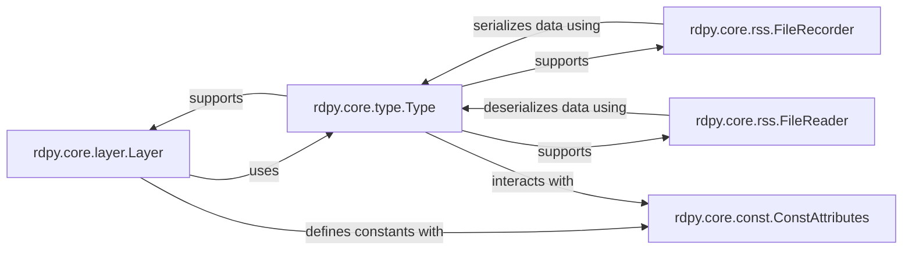

## Details

The `rdpy.core` subsystem provides the fundamental building blocks for network protocol implementation and session recording. At its heart, `rdpy.core.type.Type` offers robust low-level data handling, enabling serialization and deserialization of complex data structures. This capability is leveraged by `rdpy.core.layer.Layer`, which defines the abstract interface for network protocol layers, facilitating modular protocol stack development. For session management, `rdpy.core.rss.FileRecorder` and `rdpy.core.rss.FileReader` utilize `rdpy.core.type.Type` to efficiently capture and replay remote session events. Complementing these, `rdpy.core.const.ConstAttributes` ensures consistency by providing a mechanism for defining immutable constants across the various components, thereby maintaining data integrity and protocol adherence. This interconnected design allows `rdpy` to flexibly handle diverse network protocols and manage session data effectively.

### rdpy.core.layer.Layer
Serves as the abstract base for all network protocol layers. It defines the fundamental lifecycle methods for network connections, such as `connect` and `close`, and provides mechanisms for managing layer-specific state. This component is essential for building a modular and extensible protocol stack, embodying the "Protocol Core" and "Network Abstraction Layer" patterns.

**Related Classes/Methods**:

- <a href="https://github.com/citronneur/rdpy/blob/master/rdpy/core/layer.py#L50-L81" target="_blank" rel="noopener noreferrer">`rdpy.core.layer.Layer`:50-81</a>

### rdpy.core.type.Type
This component provides foundational utilities for manipulating various data types at a low level. It includes functionalities for calculating data sizes (`sizeof`), reading from (`read`, `readType`), and writing to (`write`, `writeType`) byte streams, and managing Unicode encoding/decoding. It acts as a base class for defining structured data types, crucial for a network protocol library that frequently processes raw byte data.

**Related Classes/Methods**:

- <a href="https://github.com/citronneur/rdpy/blob/master/rdpy/core/type.py#L49-L128" target="_blank" rel="noopener noreferrer">`rdpy.core.type.Type`:49-128</a>

### rdpy.core.const.ConstAttributes
This component is implemented as a decorator that transforms class attributes into constant, immutable attributes. Its primary role is to enforce consistency and maintainability of fixed values across the project, which is particularly vital in protocol implementations where specific byte values or flags carry defined meanings.

**Related Classes/Methods**:

- <a href="https://github.com/citronneur/rdpy/blob/master/rdpy/core/const.py#L73-L81" target="_blank" rel="noopener noreferrer">`rdpy.core.const.ConstAttributes`:73-81</a>

### rdpy.core.rss.FileRecorder
Responsible for capturing and recording remote session events, such as screen updates, credential inputs, and keyboard actions, into a structured file format. This component is key for "Session Management" in scenarios like honeypots or proxy/man-in-the-middle operations.

**Related Classes/Methods**:

- <a href="https://github.com/citronneur/rdpy/blob/master/rdpy/core/rss.py#L154-L263" target="_blank" rel="noopener noreferrer">`rdpy.core.rss.FileRecorder`:154-263</a>

### rdpy.core.rss.FileReader
Manages the playback of recorded remote session events by reading and reconstructing them from a file. It complements `FileRecorder` by enabling the re-creation of captured network interactions.

**Related Classes/Methods**:

- <a href="https://github.com/citronneur/rdpy/blob/master/rdpy/core/rss.py#L265-L283" target="_blank" rel="noopener noreferrer">`rdpy.core.rss.FileReader`:265-283</a>

### [FAQ](https://github.com/CodeBoarding/GeneratedOnBoardings/tree/main?tab=readme-ov-file#faq)