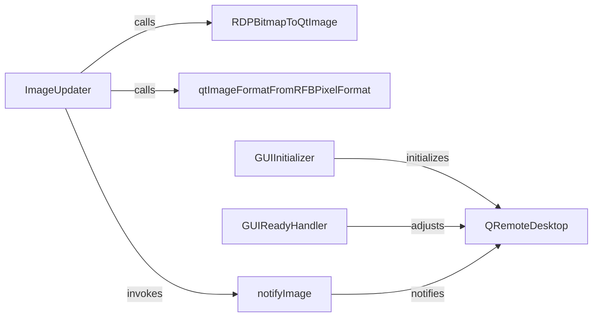

## Details

The GUI Integration Layer is encapsulated within the rdpy.ui.qt4 module. Its primary responsibility is to bridge the RDP protocol data and session events with a PyQt4-based graphical user interface, specifically for rendering the remote desktop stream.

### QRemoteDesktop
The primary PyQt4 widget responsible for rendering and displaying the remote desktop stream. It acts as the visual canvas for the RDP content.

**Related Classes/Methods**:

- <a href="https://github.com/citronneur/rdpy/blob/master/rdpy/ui/qt4.py#L333-L431" target="_blank" rel="noopener noreferrer">`QRemoteDesktop`:333-431</a>

### ImageUpdater
Orchestrates the processing of incoming RDP bitmap data, its conversion into a displayable format, and triggering the QRemoteDesktop widget to refresh its display. It acts as the data flow controller for visual updates.

**Related Classes/Methods**:

- <a href="https://github.com/citronneur/rdpy/blob/master/rdpy/ui/qt4.py" target="_blank" rel="noopener noreferrer">`ImageUpdater`</a>

### RDPBitmapToQtImage
A utility component specifically designed to convert raw RDP bitmap data (e.g., from rdpy.protocol.bitmap) into a QImage or QPixmap object compatible with PyQt4.

**Related Classes/Methods**:

- <a href="https://github.com/citronneur/rdpy/blob/master/rdpy/ui/qt4.py#L182-L228" target="_blank" rel="noopener noreferrer">`RDPBitmapToQtImage`:182-228</a>

### qtImageFormatFromRFBPixelFormat
A helper utility that determines the appropriate Qt image format (e.g., QImage.Format_RGB32) based on the pixel format specified by the RDP protocol, ensuring correct color representation.

**Related Classes/Methods**:

- <a href="https://github.com/citronneur/rdpy/blob/master/rdpy/ui/qt4.py#L70-L77" target="_blank" rel="noopener noreferrer">`qtImageFormatFromRFBPixelFormat`:70-77</a>

### notifyImage
A signaling mechanism (likely a PyQt signal or a callback function) used to inform the QRemoteDesktop widget that new image data is available and that it should repaint itself to reflect the updated content.

**Related Classes/Methods**:

- <a href="https://github.com/citronneur/rdpy/blob/master/rdpy/ui/qt4.py#L353-L364" target="_blank" rel="noopener noreferrer">`notifyImage`:353-364</a>

### GUIInitializer
Handles the initial setup and configuration of the QRemoteDesktop widget, including its instantiation and setting up its initial display dimensions.

**Related Classes/Methods**:

- <a href="https://github.com/citronneur/rdpy/blob/master/rdpy/ui/qt4.py" target="_blank" rel="noopener noreferrer">`GUIInitializer`</a>

### GUIReadyHandler
Manages post-initialization adjustments and final sizing of the QRemoteDesktop widget once the GUI is fully prepared or a connection to the remote desktop is established.

**Related Classes/Methods**:

- <a href="https://github.com/citronneur/rdpy/blob/master/rdpy/ui/qt4.py" target="_blank" rel="noopener noreferrer">`GUIReadyHandler`</a>

### [FAQ](https://github.com/CodeBoarding/GeneratedOnBoardings/tree/main?tab=readme-ov-file#faq)