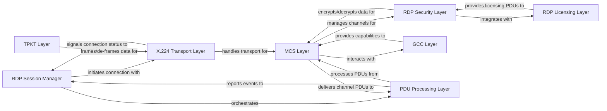

## Details

The RDP subsystem in `rdpy` is structured as a layered protocol stack, mirroring the standard RDP architecture. The `RDP Session Manager` acts as the central orchestrator, initiating connections and managing the overall session lifecycle. At the lowest level, the `TPKT Layer` handles packet framing, passing data to the `X.224 Transport Layer` for reliable transport over the network. Above the transport layer, the `MCS Layer` establishes and manages virtual channels, facilitating multiplexed communication. The `RDP Security Layer` provides encryption, decryption, and authentication services, often integrating with the `RDP Licensing Layer` for compliance. The `GCC Layer` assists the MCS layer by exchanging capabilities. Finally, the `PDU Processing Layer` is responsible for handling various RDP Protocol Data Units, reporting significant events back to the `RDP Session Manager`.

### RDP Session Manager
Acts as the high-level coordinator for the RDP session lifecycle. It orchestrates the connection process, manages session parameters, and delegates control to specific client/server implementations.

**Related Classes/Methods**:

- <a href="https://github.com/citronneur/rdpy/blob/master/rdpy/protocol/rdp/rdp.py#L1-L100" target="_blank" rel="noopener noreferrer">`rdpy.protocol.rdp.rdp`:1-100</a>

### TPKT Layer
Handles the framing and de-framing of RDP data streams into TPKT (TPDU over TCP) packets. Ensures proper message boundaries and reliable segmentation/reassembly of RDP payloads.

**Related Classes/Methods**:

- <a href="https://github.com/citronneur/rdpy/blob/master/rdpy/protocol/rdp/tpkt.py#L1-L100" target="_blank" rel="noopener noreferrer">`rdpy.protocol.rdp.tpkt`:1-100</a>

### X.224 Transport Layer
Manages the initial connection establishment and basic data transport over the underlying network, adhering to the ITU-T T.125/X.224 protocol specification. It handles connection setup and teardown at the transport level.

**Related Classes/Methods**:

- <a href="https://github.com/citronneur/rdpy/blob/master/rdpy/protocol/rdp/x224.py#L1-L100" target="_blank" rel="noopener noreferrer">`rdpy.protocol.rdp.x224`:1-100</a>

### RDP Security Layer
Manages all aspects of RDP security, including negotiation of security capabilities, key exchange, encryption/decryption of RDP data, and message authentication. It supports various security protocols, including NLA.

**Related Classes/Methods**:

- <a href="https://github.com/citronneur/rdpy/blob/master/rdpy/protocol/rdp/sec.py#L1-L100" target="_blank" rel="noopener noreferrer">`rdpy.protocol.rdp.sec`:1-100</a>

### RDP Licensing Layer
Implements the RDP client and server licensing procedures. This includes handling license challenge-response mechanisms and requests for new licenses, ensuring compliance with RDP licensing requirements.

**Related Classes/Methods**:

- <a href="https://github.com/citronneur/rdpy/blob/master/rdpy/protocol/rdp/lic.py#L1-L100" target="_blank" rel="noopener noreferrer">`rdpy.protocol.rdp.lic`:1-100</a>

### MCS Layer
Establishes and manages virtual channels for multiplexing various RDP traffic types (e.g., graphics, input, sound, clipboard) over a single underlying connection, adhering to the T.125 MCS (Multiplexed Communication Service) protocol.

**Related Classes/Methods**:

- <a href="https://github.com/citronneur/rdpy/blob/master/rdpy/protocol/rdp/t125/mcs.py#L1-L100" target="_blank" rel="noopener noreferrer">`rdpy.protocol.rdp.t125.mcs`:1-100</a>

### GCC Layer
Facilitates the exchange of RDP capabilities and settings between the client and server during the MCS connection phase (General Conference Control). This ensures that both parties agree on compatible session parameters.

**Related Classes/Methods**:

- <a href="https://github.com/citronneur/rdpy/blob/master/rdpy/protocol/rdp/t125/gcc.py#L1-L100" target="_blank" rel="noopener noreferrer">`rdpy.protocol.rdp.t125.gcc`:1-100</a>

### PDU Processing Layer
Processes and generates various RDP Protocol Data Units (PDUs) that represent specific RDP events and data, such as input events, display updates, and session management messages.

**Related Classes/Methods**:

- <a href="https://github.com/citronneur/rdpy/blob/master/rdpy/protocol/rdp/pdu/layer.py#L1-L100" target="_blank" rel="noopener noreferrer">`rdpy.protocol.rdp.pdu.layer`:1-100</a>

### [FAQ](https://github.com/CodeBoarding/GeneratedOnBoardings/tree/main?tab=readme-ov-file#faq)