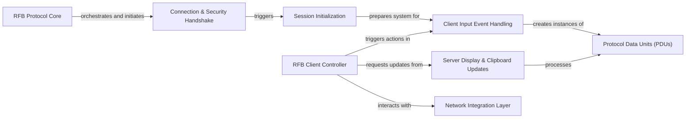

## Details

The feedback provided highlights critical issues regarding the accuracy of source file references and the logical consistency of component relationships, both of which directly impact the clarity and correctness of the architectural documentation and diagrams. Specifically, references to executable scripts or incorrect protocol implementations (RDP instead of RFB) for `Client Input Event Handling` and `Protocol Data Units (PDUs)` have been corrected to point to the definitive RFB protocol source code within `rdpy/protocol/rfb/rfb.py`. Additionally, the relationship between `Session Initialization` and `Client Input Event Handling` has been rephrased to accurately reflect that session initialization completes a setup phase, thereby preparing the system for subsequent client input events, rather than directly leading to the sending of preferences by the input handler. These adjustments ensure that the architectural analysis is grounded in the correct implementation details and that the depicted interactions are logically sound, making the output suitable for both detailed documentation and clear visual representation in flow graphs.

### RFB Protocol Core
The central class that encapsulates the overall state and logic of the RFB protocol. It orchestrates the various phases of the VNC connection, acting as the main state machine and dispatcher for protocol messages.

**Related Classes/Methods**:

- <a href="https://github.com/citronneur/rdpy/blob/master/rdpy/protocol/rfb/rfb.py#L176-L493" target="_blank" rel="noopener noreferrer">`RFB`:176-493</a>

### Connection & Security Handshake
Manages the initial phase of establishing a VNC connection, including protocol version negotiation (`recvProtocolVersion`), security type negotiation (`recvSecurityList`, `recvSecurityResult`), and the client's initial message (`sendClientInit`).

**Related Classes/Methods**:

- <a href="https://github.com/citronneur/rdpy/blob/master/rdpy/core/layer.py#L67-L73" target="_blank" rel="noopener noreferrer">`connect`:67-73</a>
- <a href="https://github.com/citronneur/rdpy/blob/master/rdpy/protocol/rfb/rfb.py#L256-L275" target="_blank" rel="noopener noreferrer">`RFB.recvProtocolVersion`:256-275</a>
- <a href="https://github.com/citronneur/rdpy/blob/master/rdpy/protocol/rfb/rfb.py#L286-L306" target="_blank" rel="noopener noreferrer">`RFB.recvSecurityList`:286-306</a>
- <a href="https://github.com/citronneur/rdpy/blob/master/rdpy/protocol/rfb/rfb.py#L327-L341" target="_blank" rel="noopener noreferrer">`RFB.recvSecurityResult`:327-341</a>
- <a href="https://github.com/citronneur/rdpy/blob/master/rdpy/protocol/rfb/rfb.py#L446-L451" target="_blank" rel="noopener noreferrer">`RFB.sendClientInit`:446-451</a>
- <a href="https://github.com/citronneur/rdpy/blob/master/rdpy/protocol/rfb/rfb.py#L343-L348" target="_blank" rel="noopener noreferrer">`RFB.recvSecurityFailed`:343-348</a>

### Session Initialization
Handles the post-security negotiation phase where the server sends its initial framebuffer information (`recvServerInit`, `recvServerName`), and the client responds with its preferred encoding (`sendSetEncoding`) and pixel format (`sendPixelFormat`).

**Related Classes/Methods**:

- <a href="https://github.com/citronneur/rdpy/blob/master/rdpy/protocol/rfb/rfb.py#L350-L356" target="_blank" rel="noopener noreferrer">`RFB.recvServerInit`:350-356</a>
- <a href="https://github.com/citronneur/rdpy/blob/master/rdpy/protocol/rfb/rfb.py#L358-L374" target="_blank" rel="noopener noreferrer">`RFB.recvServerName`:358-374</a>
- <a href="https://github.com/citronneur/rdpy/blob/master/rdpy/protocol/rfb/rfb.py#L461-L466" target="_blank" rel="noopener noreferrer">`RFB.sendSetEncoding`:461-466</a>
- <a href="https://github.com/citronneur/rdpy/blob/master/rdpy/protocol/rfb/rfb.py#L453-L459" target="_blank" rel="noopener noreferrer">`RFB.sendPixelFormat`:453-459</a>

### Client Input Event Handling
Responsible for constructing and sending client-originated input events, specifically keyboard (`sendKeyEvent`) and pointer (`sendPointerEvent`) actions, to the VNC server.

**Related Classes/Methods**:

- <a href="https://github.com/citronneur/rdpy/blob/master/rdpy/protocol/rfb/rfb.py#L616-L632" target="_blank" rel="noopener noreferrer">`RFB.sendKeyEvent`:616-632</a>
- <a href="https://github.com/citronneur/rdpy/blob/master/rdpy/protocol/rfb/rfb.py#L634-L652" target="_blank" rel="noopener noreferrer">`RFB.sendPointerEvent`:634-652</a>

### Server Display & Clipboard Updates
Processes incoming messages from the VNC server related to display updates (`recvServerOrder`, `recvFrameBufferUpdateHeader`) and clipboard content changes (`recvServerCutTextHeader`). It acts as a dispatcher for various server messages.

**Related Classes/Methods**:

- <a href="https://github.com/citronneur/rdpy/blob/master/rdpy/protocol/rfb/rfb.py#L376-L391" target="_blank" rel="noopener noreferrer">`RFB.recvServerOrder`:376-391</a>
- <a href="https://github.com/citronneur/rdpy/blob/master/rdpy/protocol/rfb/rfb.py#L393-L402" target="_blank" rel="noopener noreferrer">`RFB.recvFrameBufferUpdateHeader`:393-402</a>
- <a href="https://github.com/citronneur/rdpy/blob/master/rdpy/protocol/rfb/rfb.py#L429-L436" target="_blank" rel="noopener noreferrer">`RFB.recvServerCutTextHeader`:429-436</a>

### Protocol Data Units (PDUs)
Defines the structure and serialization/deserialization logic for key RFB protocol messages (Protocol Data Units) exchanged between client and server, such as framebuffer update requests, key events, and pointer events.

**Related Classes/Methods**:

- <a href="https://github.com/citronneur/rdpy/blob/master/rdpy/protocol/rfb/rfb.py#L107-L119" target="_blank" rel="noopener noreferrer">`FrameBufferUpdateRequest`:107-119</a>
- <a href="https://github.com/citronneur/rdpy/blob/master/bin/rdpy-rssplayer.py#L41-L42" target="_blank" rel="noopener noreferrer">`KeyEvent`:41-42</a>
- <a href="https://github.com/citronneur/rdpy/blob/master/bin/rdpy-rdphoneypot.py#L74-L75" target="_blank" rel="noopener noreferrer">`PointerEvent`:74-75</a>

### RFB Client Controller
Provides a high-level interface for external components (e.g., a GUI or CLI application) to interact with and control the RFB client's behavior, such as triggering framebuffer updates or sending input events.

**Related Classes/Methods**:

- <a href="https://github.com/citronneur/rdpy/blob/master/rdpy/protocol/rfb/rfb.py#L523-L658" target="_blank" rel="noopener noreferrer">`RFBClientController`:523-658</a>

### Network Integration Layer
Responsible for integrating the RFB protocol logic with the underlying network transport and event loop mechanisms, setting up raw data layers (`buildRawLayer`) and event observers (`buildObserver`) for asynchronous communication.

**Related Classes/Methods**:

- <a href="https://github.com/citronneur/rdpy/blob/master/rdpy/core/layer.py#L153-L158" target="_blank" rel="noopener noreferrer">`buildRawLayer`:153-158</a>
- <a href="https://github.com/citronneur/rdpy/blob/master/bin/rdpy-rdphoneypot.py#L117-L124" target="_blank" rel="noopener noreferrer">`buildObserver`:117-124</a>

### [FAQ](https://github.com/CodeBoarding/GeneratedOnBoardings/tree/main?tab=readme-ov-file#faq)