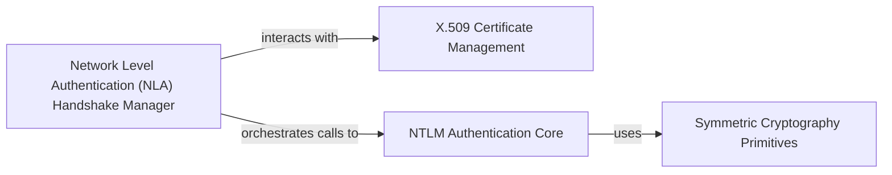

## Details

The Security & Cryptography Module is a core subsystem within rdpy, providing essential cryptographic primitives, NTLM authentication, and X.509 certificate parsing for secure communication, particularly within the RDP protocol implementation.

### Symmetric Cryptography Primitives
Provides fundamental symmetric encryption/decryption algorithms (like RC4 and DES) and hashing functions (e.g., HMAC-MD5) crucial for data confidentiality and integrity across various protocol layers.

**Related Classes/Methods**:

- <a href="https://github.com/citronneur/rdpy/blob/master/rdpy/security/rc4.py" target="_blank" rel="noopener noreferrer">`rdpy.security.rc4`</a>
- <a href="https://github.com/citronneur/rdpy/blob/master/rdpy/security/pyDes.py" target="_blank" rel="noopener noreferrer">`rdpy.security.pyDes`</a>
- <a href="https://github.com/citronneur/rdpy/blob/master/rdpy/protocol/rdp/nla/ntlm.py" target="_blank" rel="noopener noreferrer">`rdpy.protocol.rdp.nla.ntlm`</a>

### X.509 Certificate Management
Handles the parsing, validation, and processing of X.509 digital certificates, primarily for extracting public key information and verifying identities in secure communication channels.

**Related Classes/Methods**:

- <a href="https://github.com/citronneur/rdpy/blob/master/rdpy/security/x509.py" target="_blank" rel="noopener noreferrer">`rdpy.security.x509`</a>

### NTLM Authentication Core
Encapsulates the intricate logic for NTLMv2 authentication, including challenge-response mechanisms and credential processing, forming a critical part of Windows-based network protocols.

**Related Classes/Methods**:

- <a href="https://github.com/citronneur/rdpy/blob/master/rdpy/protocol/rdp/nla/ntlm.py" target="_blank" rel="noopener noreferrer">`rdpy.protocol.rdp.nla.ntlm`</a>

### Network Level Authentication (NLA) Handshake Manager
Manages the sequential operations and state transitions for the RDP Network Level Authentication (NLA) handshake, orchestrating interactions between NTLM and X.509 components to establish a secure session.

**Related Classes/Methods**:

- <a href="https://github.com/citronneur/rdpy/blob/master/rdpy/protocol/rdp/nla/cssp.py" target="_blank" rel="noopener noreferrer">`rdpy.protocol.rdp.nla.cssp`</a>

### [FAQ](https://github.com/CodeBoarding/GeneratedOnBoardings/tree/main?tab=readme-ov-file#faq)