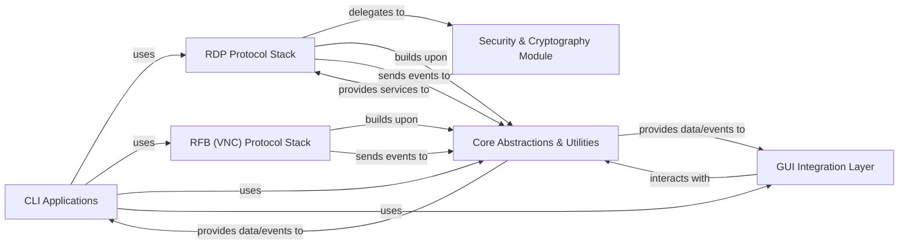

## Details

The `rdpy` project is structured around a core set of components designed for interacting with Remote Desktop Protocol (RDP) and Remote Framebuffer (RFB/VNC) services. At its foundation, the **Core Abstractions & Utilities** component provides essential building blocks, including generic protocol layering and remote session stream (RSS) management, which are leveraged by higher-level components. The **RDP Protocol Stack** and **RFB (VNC) Protocol Stack** are central to the application, each encapsulating the complexities of their respective protocols. These protocol stacks build upon the **Core Abstractions & Utilities** for fundamental operations and send events back to this core layer for processing or relay. The **RDP Protocol Stack** specifically delegates security-related tasks to the **Security & Cryptography Module**, which offers cryptographic primitives, NTLM authentication, and X.509 parsing to ensure secure communication. **CLI Applications** serve as the primary user-facing entry points, orchestrating interactions with both RDP and RFB protocol stacks. These command-line tools utilize the **Core Abstractions & Utilities** for common functionalities and, in some cases, interact with the **GUI Integration Layer** for tasks involving visual data processing or display, such as screenshot generation or RSS playback. The **GUI Integration Layer** itself interacts with the **Core Abstractions & Utilities** to receive and process data and events for its PyQt4-based graphical interface. This architecture promotes modularity, allowing for independent development and maintenance of protocol implementations, security features, and user interfaces, all unified by a robust core utility layer.

### CLI Applications
Primary entry points for various command-line utilities, some of which may incorporate or leverage GUI components for specific tasks (e.g., displaying or processing visual data). These applications orchestrate interactions with underlying protocol stacks and core utilities.

**Related Classes/Methods**:

- <a href="https://github.com/citronneur/rdpy/blob/master/bin/rdpy-rdpclient.py" target="_blank" rel="noopener noreferrer">`rdpy-rdpclient`</a>
- <a href="https://github.com/citronneur/rdpy/blob/master/bin/rdpy-rdphoneypot.py" target="_blank" rel="noopener noreferrer">`rdpy-rdphoneypot`</a>
- <a href="https://github.com/citronneur/rdpy/blob/master/bin/rdpy-rdpmitm.py" target="_blank" rel="noopener noreferrer">`rdpy-rdpmitm`</a>
- <a href="https://github.com/citronneur/rdpy/blob/master/bin/rdpy-rssplayer.py" target="_blank" rel="noopener noreferrer">`rdpy-rssplayer`</a>
- <a href="https://github.com/citronneur/rdpy/blob/master/bin/rdpy-rdpscreenshot.py" target="_blank" rel="noopener noreferrer">`rdpy-rdpscreenshot`</a>
- <a href="https://github.com/citronneur/rdpy/blob/master/bin/rdpy-vncclient.py" target="_blank" rel="noopener noreferrer">`rdpy-vncclient`</a>
- <a href="https://github.com/citronneur/rdpy/blob/master/bin/rdpy-vncscreenshot.py" target="_blank" rel="noopener noreferrer">`rdpy-vncscreenshot`</a>

### RDP Protocol Stack [[Expand]](./RDP_Protocol_Stack.md)
Comprehensive implementation of the Remote Desktop Protocol, handling all layers from TPKT to PDU, security negotiations, and licensing.

**Related Classes/Methods**:

- <a href="https://github.com/citronneur/rdpy/blob/master/rdpy/protocol/rdp/rdp.py" target="_blank" rel="noopener noreferrer">`rdpy.protocol.rdp.rdp`</a>
- <a href="https://github.com/citronneur/rdpy/blob/master/rdpy/protocol/rdp/sec.py" target="_blank" rel="noopener noreferrer">`rdpy.protocol.rdp.sec`</a>
- <a href="https://github.com/citronneur/rdpy/blob/master/rdpy/protocol/rdp/lic.py" target="_blank" rel="noopener noreferrer">`rdpy.protocol.rdp.lic`</a>
- <a href="https://github.com/citronneur/rdpy/blob/master/rdpy/protocol/rdp/pdu/layer.py" target="_blank" rel="noopener noreferrer">`rdpy.protocol.rdp.pdu.layer`</a>

### RFB (VNC) Protocol Stack [[Expand]](./RFB_VNC_Protocol_Stack.md)
Core implementation of the Remote Framebuffer (RFB) protocol, managing framebuffer updates, input events, and encoding schemes specific to VNC.

**Related Classes/Methods**:

- <a href="https://github.com/citronneur/rdpy/blob/master/rdpy/protocol/rfb/rfb.py" target="_blank" rel="noopener noreferrer">`rdpy.protocol.rfb.rfb`</a>

### Security & Cryptography Module [[Expand]](./Security_Cryptography_Module.md)
Provides essential cryptographic primitives, algorithms, NTLM authentication, and X.509 certificate parsing for secure communication.

**Related Classes/Methods**:

- <a href="https://github.com/citronneur/rdpy/blob/master/rdpy/security/rc4.py" target="_blank" rel="noopener noreferrer">`rdpy.security.rc4`</a>
- <a href="https://github.com/citronneur/rdpy/blob/master/rdpy/security/pyDes.py" target="_blank" rel="noopener noreferrer">`rdpy.security.pyDes`</a>
- <a href="https://github.com/citronneur/rdpy/blob/master/rdpy/security/x509.py" target="_blank" rel="noopener noreferrer">`rdpy.security.x509`</a>
- <a href="https://github.com/citronneur/rdpy/blob/master/rdpy/protocol/rdp/nla/ntlm.py" target="_blank" rel="noopener noreferrer">`rdpy.protocol.rdp.nla.ntlm`</a>
- <a href="https://github.com/citronneur/rdpy/blob/master/rdpy/protocol/rdp/nla/cssp.py" target="_blank" rel="noopener noreferrer">`rdpy.protocol.rdp.nla.cssp`</a>

### Core Abstractions & Utilities [[Expand]](./Core_Abstractions_Utilities.md)
A foundational layer offering reusable components and abstractions common across the project, including generic protocol layering and remote session stream (RSS) management.

**Related Classes/Methods**:

- <a href="https://github.com/citronneur/rdpy/blob/master/rdpy/core/layer.py" target="_blank" rel="noopener noreferrer">`rdpy.core.layer`</a>
- <a href="https://github.com/citronneur/rdpy/blob/master/rdpy/core/rss.py" target="_blank" rel="noopener noreferrer">`rdpy.core.rss`</a>
- <a href="https://github.com/citronneur/rdpy/blob/master/rdpy/core/const.py" target="_blank" rel="noopener noreferrer">`rdpy.core.const`</a>
- <a href="https://github.com/citronneur/rdpy/blob/master/rdpy/core/type.py" target="_blank" rel="noopener noreferrer">`rdpy.core.type`</a>

### GUI Integration Layer [[Expand]](./GUI_Integration_Layer.md)
Provides components and logic to integrate rdpy's protocol data and session events with a PyQt4-based graphical user interface.

**Related Classes/Methods**:

- <a href="https://github.com/citronneur/rdpy/blob/master/rdpy/ui/qt4.py" target="_blank" rel="noopener noreferrer">`rdpy.ui.qt4`</a>

### [FAQ](https://github.com/CodeBoarding/GeneratedOnBoardings/tree/main?tab=readme-ov-file#faq)