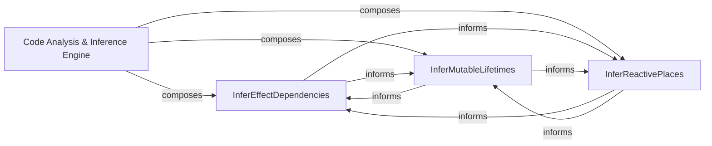

## Details

The Code Analysis & Inference Engine subsystem is a core part of the React Compiler, dedicated to analyzing the High-level Intermediate Representation (HIR) of React components. Its primary function is to infer critical properties such as side effects, mutability, and reactive dependencies. These inferences are fundamental for enabling advanced optimizations, ensuring the efficient and performant rendering of UI components within the React framework.

### Code Analysis & Inference Engine [[Expand]](./Code_Analysis_Inference_Engine.md)
This top-level component orchestrates the entire inference process. It takes the HIR as input and coordinates its sub-components to produce a comprehensive analysis of component behavior, including side effects, mutable state, and reactive dependencies. This analysis is then consumed by subsequent compiler passes for optimization.

**Related Classes/Methods**:

- <a href="https://github.com/facebook/react/blob/main/compiler/packages/babel-plugin-react-compiler/src/HIR/Environment.ts#L291-L300" target="_blank" rel="noopener noreferrer">`InferEffectDependencies`:291-300</a>
- <a href="https://github.com/facebook/react/blob/main/compiler/packages/babel-plugin-react-compiler/src/Inference/InferMutableLifetimes.ts#L117-L218" target="_blank" rel="noopener noreferrer">`InferMutableLifetimes`:117-218</a>
- <a href="https://github.com/facebook/react/blob/main/compiler/packages/babel-plugin-react-compiler/src/Inference/InferReactivePlaces.ts#L207-L406" target="_blank" rel="noopener noreferrer">`InferReactivePlaces`:207-406</a>

### InferEffectDependencies
A specialized sub-component responsible for identifying and tracking all side effects within the HIR, such as DOM manipulations, network requests, or console logs. It also determines the dependencies of these effects, crucial for understanding when effects need to be re-run or cleaned up.

**Related Classes/Methods**:

- <a href="https://github.com/facebook/react/blob/main/compiler/packages/babel-plugin-react-compiler/src/HIR/Environment.ts#L291-L300" target="_blank" rel="noopener noreferrer">`InferEffectDependencies`:291-300</a>

### InferMutableLifetimes
This sub-component focuses on analyzing and inferring the "lifetime" of mutable variables. It determines when a variable is created, modified, and no longer used, which is vital for optimizing memory usage and preventing unnecessary re-renders caused by mutable state changes.

**Related Classes/Methods**:

- <a href="https://github.com/facebook/react/blob/main/compiler/packages/babel-plugin-react-compiler/src/Inference/InferMutableLifetimes.ts#L117-L218" target="_blank" rel="noopener noreferrer">`InferMutableLifetimes`:117-218</a>

### InferReactivePlaces
Responsible for identifying "reactive places" within the code – those expressions or statements that depend on specific data and thus need to re-execute when that data changes. This component is key to enabling fine-grained reactivity and minimizing unnecessary computations during updates.

**Related Classes/Methods**:

- <a href="https://github.com/facebook/react/blob/main/compiler/packages/babel-plugin-react-compiler/src/Inference/InferReactivePlaces.ts#L207-L406" target="_blank" rel="noopener noreferrer">`InferReactivePlaces`:207-406</a>

### [FAQ](https://github.com/CodeBoarding/GeneratedOnBoardings/tree/main?tab=readme-ov-file#faq)