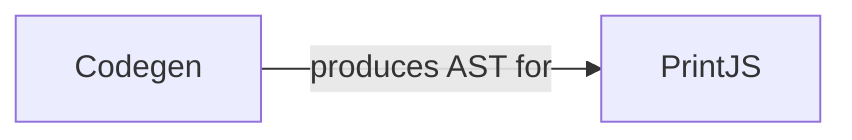

## Details

The core of this subsystem revolves around the transformation of React components into optimized JavaScript. The process begins with the `Codegen` component, which takes the Hierarchical Intermediate Representation (HIR) of React components and translates it into an intermediate representation, likely an Abstract Syntax Tree (AST). This AST is enriched with necessary runtime calls for memoization and reactivity. Following this, the `PrintJS` component takes the generated AST and is responsible for its final serialization into a syntactically correct and readable JavaScript string, ready for execution. This two-stage process ensures a clear separation of concerns between the generation of the intermediate representation and its final output formatting.

### Codegen
This component acts as the primary orchestrator for the code generation process. It takes the optimized HIR of React components and translates it into an intermediate representation, typically an Abstract Syntax Tree (AST), which includes injecting necessary runtime calls and constructs for memoization and reactivity. Its role is fundamental in bridging the gap between the compiler's internal representation and the target JavaScript.

**Related Classes/Methods**:

- <a href="https://github.com/facebook/react/blob/main/compiler/packages/babel-plugin-react-compiler/src/ReactiveScopes/CodegenReactiveFunction.ts#L328-L336" target="_blank" rel="noopener noreferrer">`Codegen`:328-336</a>

### PrintJS
This component is responsible for the final formatting and serialization of the generated JavaScript code. It consumes the AST or a similar structured representation produced by Codegen and converts it into a syntactically correct, readable, and valid JavaScript string. It ensures the output adheres to coding standards and is ready for execution.

**Related Classes/Methods**: _None_

### [FAQ](https://github.com/CodeBoarding/GeneratedOnBoardings/tree/main?tab=readme-ov-file#faq)