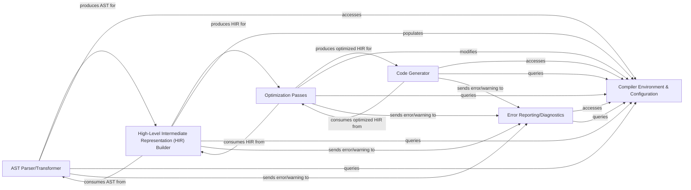

## Details

The React compiler subsystem orchestrates a multi-stage compilation process. It begins with the `AST Parser/Transformer` converting source code into an Abstract Syntax Tree. This AST is then transformed into a High-Level Intermediate Representation (HIR) by the `HIR Builder`, which serves as a more abstract and optimizable form. The `Optimization Passes` then apply various performance and feature-specific enhancements to the HIR. Finally, the `Code Generator` translates the optimized HIR back into executable JavaScript. Throughout these stages, the `Compiler Environment & Configuration` provides essential global context and mutable state, while the `Error Reporting/Diagnostics` component ensures comprehensive feedback on any issues encountered during compilation.

### Compiler Environment & Configuration [[Expand]](./Compiler_Environment_Configuration.md)
Provides the foundational global context, compiler options, and shared data structures essential for various phases of the React compilation process. It acts as the central repository for compiler-wide settings and mutable state.

**Related Classes/Methods**:

- <a href="https://github.com/facebook/react/blob/main/compiler/packages/babel-plugin-react-compiler/src/HIR/Environment.ts" target="_blank" rel="noopener noreferrer">`compiler/packages/babel-plugin-react-compiler/src/HIR/Environment.ts`</a>
- <a href="https://github.com/facebook/react/blob/main/compiler/packages/babel-plugin-react-compiler/src/Entrypoint/Options.ts" target="_blank" rel="noopener noreferrer">`compiler/packages/babel-plugin-react-compiler/src/Entrypoint/Options.ts`</a>

### AST Parser/Transformer
Responsible for parsing the input JavaScript/JSX code into an Abstract Syntax Tree (AST) and applying initial, syntax-level transformations before higher-level analysis.

**Related Classes/Methods**:

- <a href="https://github.com/facebook/react/blob/main/compiler/packages/babel-plugin-react-compiler/src/Babel/BabelPlugin.ts" target="_blank" rel="noopener noreferrer">`compiler/packages/babel-plugin-react-compiler/src/Babel/BabelPlugin.ts`</a>
- <a href="https://github.com/facebook/react/blob/main/compiler/packages/babel-plugin-react-compiler/src/Babel/RunReactCompilerBabelPlugin.ts" target="_blank" rel="noopener noreferrer">`compiler/packages/babel-plugin-react-compiler/src/Babel/RunReactCompilerBabelPlugin.ts`</a>

### High-Level Intermediate Representation (HIR) Builder
Converts the initial AST into a more semantic-rich High-Level Intermediate Representation (HIR). This HIR is designed to be easier to analyze and optimize, abstracting away syntactic details for more effective semantic analysis.

**Related Classes/Methods**:

- <a href="https://github.com/facebook/react/blob/main/compiler/packages/babel-plugin-react-compiler/src/HIR/BuildHIR.ts" target="_blank" rel="noopener noreferrer">`compiler/packages/babel-plugin-react-compiler/src/HIR/BuildHIR.ts`</a>
- <a href="https://github.com/facebook/react/blob/main/compiler/packages/babel-plugin-react-compiler/src/HIR/HIRBuilder.ts" target="_blank" rel="noopener noreferrer">`compiler/packages/babel-plugin-react-compiler/src/HIR/HIRBuilder.ts`</a>

### Optimization Passes
A series of algorithms that analyze and transform the HIR to improve performance, reduce bundle size, or enable new features specific to React's runtime behavior. These passes apply various compiler optimizations.

**Related Classes/Methods**:

- <a href="https://github.com/facebook/react/blob/main/compiler/packages/babel-plugin-react-compiler/src/Optimization/index.ts" target="_blank" rel="noopener noreferrer">`compiler/packages/babel-plugin-react-compiler/src/Optimization/index.ts`</a>

### Code Generator
Converts the optimized HIR back into executable JavaScript code, ensuring the transformations and optimizations are correctly reflected in the final output.

**Related Classes/Methods**:

- <a href="https://github.com/facebook/react/blob/main/compiler/packages/babel-plugin-react-compiler/src/ReactiveScopes/CodegenReactiveFunction.ts" target="_blank" rel="noopener noreferrer">`compiler/packages/babel-plugin-react-compiler/src/ReactiveScopes/CodegenReactiveFunction.ts`</a>

### Error Reporting/Diagnostics
Handles the collection and reporting of compilation errors and warnings encountered during various phases, providing feedback to the developer.

**Related Classes/Methods**:

- <a href="https://github.com/facebook/react/blob/main/compiler/packages/babel-plugin-react-compiler/src/CompilerError.ts" target="_blank" rel="noopener noreferrer">`compiler/packages/babel-plugin-react-compiler/src/CompilerError.ts`</a>

### [FAQ](https://github.com/CodeBoarding/GeneratedOnBoardings/tree/main?tab=readme-ov-file#faq)