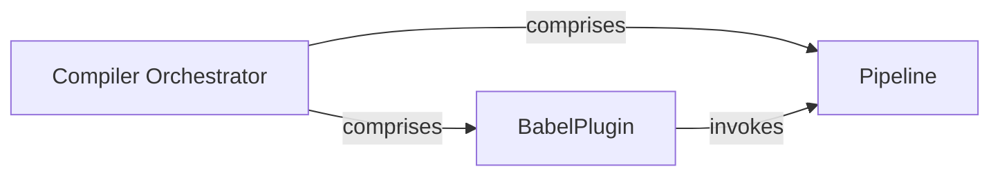

## Details

The React Compiler subsystem is designed to transform and optimize React code, ensuring efficient execution within the React runtime. It integrates with the Babel ecosystem, leveraging its AST processing capabilities to apply a series of analysis, transformation, and optimization passes. The core flow involves the BabelPlugin acting as the initial entry point, which then invokes the Pipeline to orchestrate the various compilation phases. The Compiler Orchestrator provides the overarching conceptual framework for this entire process, ensuring a cohesive and optimized transformation of declarative UI code.

### Compiler Orchestrator [[Expand]](./Compiler_Orchestrator.md)
This is the top-level conceptual component responsible for overseeing and coordinating the entire compilation process for React code. It ensures that the input (JSX, TypeScript) is correctly transformed into an optimized format suitable for the React runtime, directly supporting the project's declarative UI and Virtual DOM architectural patterns.

**Related Classes/Methods**:

- <a href="https://github.com/facebook/react/blob/main/" target="_blank" rel="noopener noreferrer">`react.compiler.CompilerOrchestrator`</a>
- <a href="https://github.com/facebook/react/blob/main/compiler/packages/babel-plugin-react-compiler/scripts/babel-plugin-annotate-react-code.ts#L12-L23" target="_blank" rel="noopener noreferrer">`BabelPlugin`:12-23</a>
- <a href="https://github.com/facebook/react/blob/main/compiler/packages/babel-plugin-react-compiler/src/Entrypoint/Pipeline.ts" target="_blank" rel="noopener noreferrer">`Pipeline`</a>

### BabelPlugin
Serves as the concrete entry point for the React Compiler within the Babel ecosystem. Its responsibility is to register the compiler's transformations and hook into Babel's Abstract Syntax Tree (AST) processing pipeline, making the compiler's capabilities available during the build phase of the UI library. This component is fundamental for integrating the compiler into typical JavaScript development workflows.

**Related Classes/Methods**:

- <a href="https://github.com/facebook/react/blob/main/compiler/packages/babel-plugin-react-compiler/src/Babel/BabelPlugin.ts" target="_blank" rel="noopener noreferrer">`babel_plugin_react_compiler.src.Babel.BabelPlugin`</a>

### Pipeline
This component defines and orchestrates the precise sequence of compilation phases or "passes" that the React Compiler applies to the source code. These phases include various analysis, transformation, and optimization steps. Its role is to ensure that the code undergoes the correct series of modifications to achieve the desired performance and runtime characteristics for the UI library.

**Related Classes/Methods**:

- <a href="https://github.com/facebook/react/blob/main/compiler/packages/babel-plugin-react-compiler/src/Entrypoint/Pipeline.ts" target="_blank" rel="noopener noreferrer">`babel_plugin_react_compiler.src.Entrypoint.Pipeline`</a>

### [FAQ](https://github.com/CodeBoarding/GeneratedOnBoardings/tree/main?tab=readme-ov-file#faq)