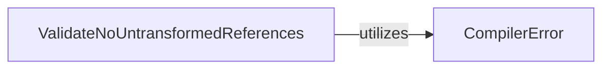

## Details

The React compiler's `babel-plugin-react-compiler` subsystem focuses on transforming React code to optimize its performance. The core flow involves defining and handling compilation errors, and then validating the transformed code to ensure its integrity. This process ensures that the output code adheres to React's rules and is free from unintended side effects or untransformed references.

### CompilerError
This component is responsible for defining, categorizing, and formatting compiler-specific errors. It provides a standardized mechanism for reporting issues encountered during the compilation process, which is crucial for a UI library to offer clear and actionable feedback to developers.

**Related Classes/Methods**:

- <a href="https://github.com/facebook/react/blob/main/compiler/packages/babel-plugin-react-compiler/src/CompilerError.ts#L263-L443" target="_blank" rel="noopener noreferrer">`CompilerError`:263-443</a>

### ValidateNoUntransformedReferences
This component performs a crucial post-transformation validation step. Its purpose is to ensure that all references within the compiled code have been correctly processed and transformed by the compiler, adhering to React's rules. This guarantees the integrity and correctness of the generated UI code.

**Related Classes/Methods**:

- <a href="https://github.com/facebook/react/blob/main/compiler/packages/babel-plugin-react-compiler/src/Entrypoint/ValidateNoUntransformedReferences.ts#L145-L181" target="_blank" rel="noopener noreferrer">`ValidateNoUntransformedReferences`:145-181</a>

### [FAQ](https://github.com/CodeBoarding/GeneratedOnBoardings/tree/main?tab=readme-ov-file#faq)