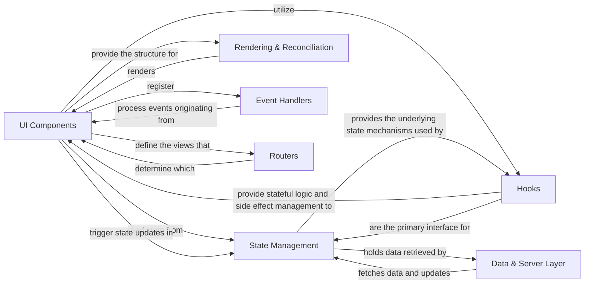

## Details

This React application is structured around a component-based architecture, where `UI Components` form the visual building blocks. `State Management` provides the mechanisms for these components to handle and share data, often leveraging React's built-in hooks. The `Rendering & Reconciliation` process efficiently updates the user interface based on state changes. Interactions with external data sources are managed by the `Data & Server Layer`, which fetches and manipulates data. `Hooks` extend the capabilities of functional components, enabling stateful logic and side effects. User interactions are handled by `Event Handlers`, which respond to UI events. Finally, `Routers` manage navigation within the single-page application.

### UI Components
The fundamental building blocks of the user interface, encapsulating rendering logic and UI elements. These are reusable, self-contained units that form the visual structure of the application.

**Related Classes/Methods**: _None_

### State Management
Manages the application's state, providing mechanisms for components to interact with and update shared data. This includes local component state, context, and potentially external state management solutions.

**Related Classes/Methods**: _None_

### Rendering & Reconciliation
Responsible for efficiently rendering UI components into the Document Object Model (DOM) and updating it. It achieves this by comparing the virtual DOM with the actual DOM to minimize direct DOM manipulations.

**Related Classes/Methods**: _None_

### Data & Server Layer [[Expand]](./Data_Server_Layer.md)
Handles data fetching, mutations, and interactions with backend services. This layer abstracts data persistence and retrieval logic from the UI, ensuring a clean separation of concerns.

**Related Classes/Methods**:

- <a href="https://github.com/facebook/react/blob/main/fixtures/flight-parcel/src/actions.ts" target="_blank" rel="noopener noreferrer">`fixtures.flight_parcel.src.actions`</a>

### Hooks
Provides a mechanism for functional components to "hook into" React features like state and lifecycle methods. This enables stateful logic and side effects (e.g., data fetching, subscriptions) directly within functional components.

**Related Classes/Methods**: _None_

### Event Handlers
Manages user interactions with UI components. It processes events (e.g., clicks, input changes, form submissions) originating from the UI and dispatches actions or updates state in response.

**Related Classes/Methods**: _None_

### Routers
Manages navigation within the application, mapping URLs to specific UI components and enabling single-page application (SPA) behavior without full page reloads.

**Related Classes/Methods**: _None_

### [FAQ](https://github.com/CodeBoarding/GeneratedOnBoardings/tree/main?tab=readme-ov-file#faq)