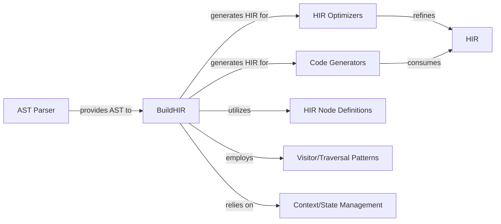

## Details

The babel-plugin-react-compiler operates by taking an Abstract Syntax Tree (AST) as input, which is provided by Babel (the AST Parser). The core of the subsystem is the BuildHIR component, which orchestrates the transformation of this AST into a High-Level Intermediate Representation (HIR). During this transformation, BuildHIR heavily relies on HIR Node Definitions to structure the intermediate representation, employs Visitor/Traversal Patterns to navigate the AST, and utilizes Context/State Management to maintain the necessary contextual information. Once the HIR is constructed, it is passed to HIR Optimizers for various performance enhancements. Finally, the optimized HIR is fed into Code Generators, which produce the final, optimized JavaScript/JSX output. This pipeline ensures a structured and efficient transformation of source code into an optimized form.

### BuildHIR
Orchestrates and executes the AST-to-HIR conversion. This is the primary component that drives the transformation process, acting as the central coordinator.

**Related Classes/Methods**:

- <a href="https://github.com/facebook/react/blob/main/compiler/packages/babel-plugin-react-compiler/src/HIR/BuildHIR.ts" target="_blank" rel="noopener noreferrer">`BuildHIR`</a>

### AST Parser
Conceptually represents the external parsing capability (Babel) that provides the initial Abstract Syntax Tree (AST) to the plugin. The plugin consumes this AST for further processing.

**Related Classes/Methods**: _None_

### HIR Optimizers
Performs various optimizations on the High-Level Intermediate Representation (HIR) to improve code efficiency and performance. This component represents a collection of optimization passes.

**Related Classes/Methods**:

- <a href="https://github.com/facebook/react/blob/main/compiler/packages/babel-plugin-react-compiler/src/Optimization/" target="_blank" rel="noopener noreferrer">`Optimization`</a>

### Code Generators
Translates the optimized HIR into executable JavaScript/JSX code, producing the final output of the compilation process.

**Related Classes/Methods**:

- <a href="https://github.com/facebook/react/blob/main/compiler/packages/babel-plugin-react-compiler/src/ReactiveScopes/CodegenReactiveFunction.ts#L347-L393" target="_blank" rel="noopener noreferrer">`CodegenReactiveFunction`:347-393</a>

### HIR Node Definitions
Defines the structure, types, and properties of nodes within the High-Level Intermediate Representation (HIR), ensuring consistency and correctness of the HIR data model.

**Related Classes/Methods**:

- <a href="https://github.com/facebook/react/blob/main/compiler/packages/react-mcp-server/src/index.ts" target="_blank" rel="noopener noreferrer">`HIR`</a>

### Visitor/Traversal Patterns
Provides mechanisms and patterns for systematically traversing the AST and HIR structures, enabling components like BuildHIR to navigate and process the code representation.

**Related Classes/Methods**:

- <a href="https://github.com/facebook/react/blob/main/compiler/packages/babel-plugin-react-compiler/src/HIR/visitors.ts" target="_blank" rel="noopener noreferrer">`visitors`</a>

### Context/State Management
Manages the contextual information and state throughout the transformation process, including scope, variable mappings, and error collection, ensuring data consistency and flow.

**Related Classes/Methods**:

- <a href="https://github.com/facebook/react/blob/main/packages/eslint-plugin-react-hooks/src/rules/ReactCompiler.ts#L105-L114" target="_blank" rel="noopener noreferrer">`Environment`:105-114</a>

### [FAQ](https://github.com/CodeBoarding/GeneratedOnBoardings/tree/main?tab=readme-ov-file#faq)