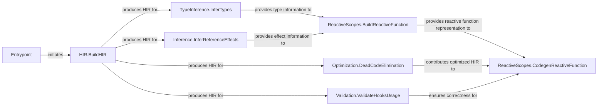

## Details

The `React Compiler Core` subsystem is responsible for transforming React source code into optimized output through a multi-stage compilation pipeline. Its boundaries are defined by the `compiler.packages.babel_plugin_react_compiler.src` package, which encapsulates the entire compilation process from initial AST transformation to final code generation.

### Entrypoint
The primary orchestrator, initiating and managing the overall compilation flow.

**Related Classes/Methods**:

- <a href="https://github.com/facebook/react/blob/main/compiler/packages/snap/src/sprout/evaluator.ts" target="_blank" rel="noopener noreferrer">`Entrypoint`</a>

### HIR.BuildHIR
The initial transformation step, crucial for converting source Abstract Syntax Tree (AST) into the compiler's internal Hierarchical Intermediate Representation (HIR).

**Related Classes/Methods**:

- <a href="https://github.com/facebook/react/blob/main/compiler/packages/babel-plugin-react-compiler/src/HIR/BuildHIR.ts" target="_blank" rel="noopener noreferrer">`HIR.BuildHIR`</a>

### TypeInference.InferTypes
Provides essential type information for subsequent analysis and optimization passes within the compiler.

**Related Classes/Methods**:

- <a href="https://github.com/facebook/react/blob/main/compiler/packages/babel-plugin-react-compiler/src/TypeInference/InferTypes.ts" target="_blank" rel="noopener noreferrer">`TypeInference.InferTypes`</a>

### Inference.InferReferenceEffects
Determines side effects of operations, which is critical for accurate memoization and understanding reactivity within React components.

**Related Classes/Methods**:

- <a href="https://github.com/facebook/react/blob/main/compiler/packages/babel-plugin-react-compiler/src/Inference/InferReferenceEffects.ts" target="_blank" rel="noopener noreferrer">`Inference.InferReferenceEffects`</a>

### ReactiveScopes.BuildReactiveFunction
A key analysis phase that identifies and constructs reactive scopes, directly impacting the compiler's memoization strategies and re-render optimizations.

**Related Classes/Methods**:

- <a href="https://github.com/facebook/react/blob/main/compiler/packages/babel-plugin-react-compiler/src/ReactiveScopes/BuildReactiveFunction.ts" target="_blank" rel="noopener noreferrer">`ReactiveScopes.BuildReactiveFunction`</a>

### Optimization.DeadCodeElimination
A standard compiler optimization that identifies and removes unreachable or unused code, improving performance and reducing the final bundle size.

**Related Classes/Methods**:

- <a href="https://github.com/facebook/react/blob/main/compiler/packages/babel-plugin-react-compiler/src/Optimization/DeadCodeElimination.ts" target="_blank" rel="noopener noreferrer">`Optimization.DeadCodeElimination`</a>

### Validation.ValidateHooksUsage
Ensures adherence to React's rules of Hooks, maintaining the correctness and predictability of React component behavior after compilation.

**Related Classes/Methods**:

- <a href="https://github.com/facebook/react/blob/main/compiler/packages/babel-plugin-react-compiler/src/Validation/ValidateHooksUsage.ts" target="_blank" rel="noopener noreferrer">`Validation.ValidateHooksUsage`</a>

### ReactiveScopes.CodegenReactiveFunction
The final code generation phase, responsible for transforming the optimized internal representation back into optimized JavaScript output.

**Related Classes/Methods**:

- <a href="https://github.com/facebook/react/blob/main/compiler/packages/babel-plugin-react-compiler/src/ReactiveScopes/CodegenReactiveFunction.ts" target="_blank" rel="noopener noreferrer">`ReactiveScopes.CodegenReactiveFunction`</a>

### [FAQ](https://github.com/CodeBoarding/GeneratedOnBoardings/tree/main?tab=readme-ov-file#faq)