```mermaid
graph LR
    Compiler_Orchestrator["Compiler Orchestrator"]
    Compiler_Environment_Configuration["Compiler Environment & Configuration"]
    HIR_Transformation_Engine["HIR Transformation Engine"]
    Code_Analysis_Inference_Engine["Code Analysis & Inference Engine"]
    Reactive_Scope_Optimizer["Reactive Scope Optimizer"]
    Code_Generation_Module["Code Generation Module"]
    Compiler_Validation_Diagnostics["Compiler Validation & Diagnostics"]
    Runtime_Support_Library["Runtime Support Library"]
    Compiler_Orchestrator -- "initializes and relies on" --> Compiler_Environment_Configuration
    Compiler_Orchestrator -- "initiates" --> HIR_Transformation_Engine
    Compiler_Environment_Configuration -- "provides context and shared data to" --> Compiler_Orchestrator
    Compiler_Environment_Configuration -- "is consulted by" --> HIR_Transformation_Engine
    Compiler_Environment_Configuration -- "is consulted by" --> Code_Analysis_Inference_Engine
    Compiler_Environment_Configuration -- "is consulted by" --> Code_Generation_Module
    Compiler_Environment_Configuration -- "is consulted by" --> Compiler_Validation_Diagnostics
    HIR_Transformation_Engine -- "outputs HIR consumed by" --> Code_Analysis_Inference_Engine
    HIR_Transformation_Engine -- "outputs HIR consumed by" --> Reactive_Scope_Optimizer
    Code_Analysis_Inference_Engine -- "consumes HIR generated by" --> HIR_Transformation_Engine
    Code_Analysis_Inference_Engine -- "annotates HIR for" --> Reactive_Scope_Optimizer
    Reactive_Scope_Optimizer -- "heavily relies on analysis results from" --> Code_Analysis_Inference_Engine
    Reactive_Scope_Optimizer -- "provides optimized HIR to" --> Code_Generation_Module
    Code_Generation_Module -- "takes optimized HIR from" --> Reactive_Scope_Optimizer
    Code_Generation_Module -- "produces output code that invokes" --> Runtime_Support_Library
    Compiler_Validation_Diagnostics -- "inspects HIR built by" --> HIR_Transformation_Engine
    Compiler_Validation_Diagnostics -- "uses to access definitions" --> Compiler_Environment_Configuration
    Runtime_Support_Library -- "provides utilities invoked by" --> Code_Generation_Module
    click Compiler_Orchestrator href "https://github.com/CodeBoarding/GeneratedOnBoardings/blob/main/react/Compiler_Orchestrator.md" "Details"
    click Compiler_Environment_Configuration href "https://github.com/CodeBoarding/GeneratedOnBoardings/blob/main/react/Compiler_Environment_Configuration.md" "Details"
    click HIR_Transformation_Engine href "https://github.com/CodeBoarding/GeneratedOnBoardings/blob/main/react/HIR_Transformation_Engine.md" "Details"
    click Code_Analysis_Inference_Engine href "https://github.com/CodeBoarding/GeneratedOnBoardings/blob/main/react/Code_Analysis_Inference_Engine.md" "Details"
    click Code_Generation_Module href "https://github.com/CodeBoarding/GeneratedOnBoardings/blob/main/react/Code_Generation_Module.md" "Details"
    click Compiler_Validation_Diagnostics href "https://github.com/CodeBoarding/GeneratedOnBoardings/blob/main/react/Compiler_Validation_Diagnostics.md" "Details"
```

## Details

The feedback highlights a crucial missing piece in the architectural analysis: concrete source code references for the abstract components. While the conceptual design of the compiler's architecture is well-understood, without these mappings, the analysis remains incomplete and cannot be fully validated. The primary actionable point is to identify specific classes, modules, or directories that correspond to each abstract component, ensuring that each component has at least one source code reference. This will allow for verification of source file completeness, relevance, and meaningful component naming.

### Compiler Orchestrator [[Expand]](./Compiler_Orchestrator.md)
Orchestrates the compilation pipeline, managing the overall flow from input to output.

**Related Classes/Methods**:

- <a href="https://github.com/facebook/react/blob/main/compiler/packages/babel-plugin-react-compiler/src/Babel/BabelPlugin.ts" target="_blank" rel="noopener noreferrer">`compiler/packages/babel-plugin-react-compiler/src/Babel/BabelPlugin.ts`</a>
- <a href="https://github.com/facebook/react/blob/main/compiler/packages/babel-plugin-react-compiler/src/Entrypoint/Pipeline.ts" target="_blank" rel="noopener noreferrer">`compiler/packages/babel-plugin-react-compiler/src/Entrypoint/Pipeline.ts`</a>

### Compiler Environment & Configuration [[Expand]](./Compiler_Environment_Configuration.md)
Provides global context, compiler options, and shared data structures necessary for various compilation phases.

**Related Classes/Methods**:

- <a href="https://github.com/facebook/react/blob/main/compiler/packages/babel-plugin-react-compiler/src/HIR/Environment.ts" target="_blank" rel="noopener noreferrer">`compiler/packages/babel-plugin-react-compiler/src/HIR/Environment.ts`</a>
- <a href="https://github.com/facebook/react/blob/main/compiler/packages/babel-plugin-react-compiler/src/Entrypoint/Options.ts" target="_blank" rel="noopener noreferrer">`compiler/packages/babel-plugin-react-compiler/src/Entrypoint/Options.ts`</a>

### HIR Transformation Engine [[Expand]](./HIR_Transformation_Engine.md)
Responsible for converting the initial Abstract Syntax Tree (AST) into the High-Level Intermediate Representation (HIR), structuring the code for subsequent analysis and optimization.

**Related Classes/Methods**:

- <a href="https://github.com/facebook/react/blob/main/compiler/packages/babel-plugin-react-compiler/src/HIR/BuildHIR.ts" target="_blank" rel="noopener noreferrer">`compiler/packages/babel-plugin-react-compiler/src/HIR/BuildHIR.ts`</a>

### Code Analysis & Inference Engine [[Expand]](./Code_Analysis_Inference_Engine.md)
Analyzes the HIR to infer critical properties such as side effects, mutability, and reactive dependencies, which are crucial for optimization.

**Related Classes/Methods**:

- <a href="https://github.com/facebook/react/blob/main/compiler/packages/babel-plugin-react-compiler/src/Inference/InferEffectDependencies.ts" target="_blank" rel="noopener noreferrer">`compiler/packages/babel-plugin-react-compiler/src/Inference/InferEffectDependencies.ts`</a>
- <a href="https://github.com/facebook/react/blob/main/compiler/packages/babel-plugin-react-compiler/src/Inference/InferMutableLifetimes.ts" target="_blank" rel="noopener noreferrer">`compiler/packages/babel-plugin-react-compiler/src/Inference/InferMutableLifetimes.ts`</a>
- <a href="https://github.com/facebook/react/blob/main/compiler/packages/babel-plugin-react-compiler/src/Inference/InferReactivePlaces.ts" target="_blank" rel="noopener noreferrer">`compiler/packages/babel-plugin-react-compiler/src/Inference/InferReactivePlaces.ts`</a>

### Reactive Scope Optimizer
Refines the HIR structures by identifying and merging reactive scopes, enabling memoization and efficient re-rendering.

**Related Classes/Methods**:

- <a href="https://github.com/facebook/react/blob/main/compiler/packages/babel-plugin-react-compiler/src/HIR/MergeOverlappingReactiveScopesHIR.ts" target="_blank" rel="noopener noreferrer">`compiler/packages/babel-plugin-react-compiler/src/HIR/MergeOverlappingReactiveScopesHIR.ts`</a>
- <a href="https://github.com/facebook/react/blob/main/compiler/packages/babel-plugin-react-compiler/src/HIR/PropagateScopeDependenciesHIR.ts" target="_blank" rel="noopener noreferrer">`compiler/packages/babel-plugin-react-compiler/src/HIR/PropagateScopeDependenciesHIR.ts`</a>

### Code Generation Module [[Expand]](./Code_Generation_Module.md)
Translates the optimized HIR into target JavaScript code, including the necessary runtime calls for memoization and reactivity.

**Related Classes/Methods**:

### Compiler Validation & Diagnostics [[Expand]](./Compiler_Validation_Diagnostics.md)
Ensures that the compiled code adheres to React's rules and provides error reporting and diagnostic messages for developers.

**Related Classes/Methods**:

- <a href="https://github.com/facebook/react/blob/main/compiler/packages/babel-plugin-react-compiler/src/CompilerError.ts" target="_blank" rel="noopener noreferrer">`compiler/packages/babel-plugin-react-compiler/src/CompilerError.ts`</a>
- <a href="https://github.com/facebook/react/blob/main/compiler/packages/babel-plugin-react-compiler/src/Entrypoint/ValidateNoUntransformedReferences.ts" target="_blank" rel="noopener noreferrer">`compiler/packages/babel-plugin-react-compiler/src/Entrypoint/ValidateNoUntransformedReferences.ts`</a>

### Runtime Support Library
Provides the necessary runtime utilities and helper functions that the generated code invokes for features like memoization and structural checks.

**Related Classes/Methods**:

- <a href="https://github.com/facebook/react/blob/main/compiler/packages/react-compiler-runtime/src/index.ts" target="_blank" rel="noopener noreferrer">`compiler/packages/react-compiler-runtime/src/index.ts`</a>

### [FAQ](https://github.com/CodeBoarding/GeneratedOnBoardings/tree/main?tab=readme-ov-file#faq)