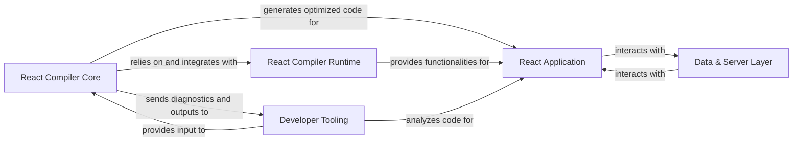

## Details

The React project architecture is structured around a core compilation pipeline, a runtime environment, a user-facing application, a data management layer, and developer tooling. The React Compiler Core acts as the central processing unit, transforming React source code into optimized output. This optimized code then leverages the React Compiler Runtime for efficient execution within the React Application. The React Application itself interacts with a Data & Server Layer to manage data flow and server-side operations. Complementing this, Developer Tooling provides essential support for development, including code analysis and an interactive playground, receiving diagnostics and outputs from the compiler.

### React Compiler Core [[Expand]](./React_Compiler_Core.md)
The central orchestration unit for the React Compiler, responsible for transforming React source code into optimized output through a multi-stage compilation pipeline.

**Related Classes/Methods**:

- <a href="https://github.com/facebook/react/blob/main/compiler/packages/babel-plugin-react-compiler/src/Entrypoint/index.ts" target="_blank" rel="noopener noreferrer">`compiler.packages.babel_plugin_react_compiler.src.Entrypoint.index`</a>
- <a href="https://github.com/facebook/react/blob/main/compiler/packages/babel-plugin-react-compiler/src/HIR/BuildHIR.ts" target="_blank" rel="noopener noreferrer">`compiler.packages.babel_plugin_react_compiler.src.HIR.BuildHIR`</a>
- <a href="https://github.com/facebook/react/blob/main/compiler/packages/babel-plugin-react-compiler/src/ReactiveScopes/BuildReactiveFunction.ts" target="_blank" rel="noopener noreferrer">`compiler.packages.babel_plugin_react_compiler.src.ReactiveScopes.BuildReactiveFunction`</a>
- <a href="https://github.com/facebook/react/blob/main/compiler/packages/babel-plugin-react-compiler/src/TypeInference/InferTypes.ts" target="_blank" rel="noopener noreferrer">`compiler.packages.babel_plugin_react_compiler.src.TypeInference.InferTypes`</a>
- <a href="https://github.com/facebook/react/blob/main/compiler/packages/babel-plugin-react-compiler/src/Inference/InferReferenceEffects.ts" target="_blank" rel="noopener noreferrer">`compiler.packages.babel_plugin_react_compiler.src.Inference.InferReferenceEffects`</a>
- <a href="https://github.com/facebook/react/blob/main/compiler/packages/babel-plugin-react-compiler/src/Optimization/DeadCodeElimination.ts" target="_blank" rel="noopener noreferrer">`compiler.packages.babel_plugin_react_compiler.src.Optimization.DeadCodeElimination`</a>
- <a href="https://github.com/facebook/react/blob/main/compiler/packages/babel-plugin-react-compiler/src/Optimization/ConstantPropagation.ts" target="_blank" rel="noopener noreferrer">`compiler.packages.babel_plugin_react_compiler.src.Optimization.ConstantPropagation`</a>
- <a href="https://github.com/facebook/react/blob/main/compiler/packages/babel-plugin-react-compiler/src/ReactiveScopes/CodegenReactiveFunction.ts" target="_blank" rel="noopener noreferrer">`compiler.packages.babel_plugin_react_compiler.src.ReactiveScopes.CodegenReactiveFunction`</a>
- <a href="https://github.com/facebook/react/blob/main/compiler/packages/babel-plugin-react-compiler/src/Validation/ValidateHooksUsage.ts" target="_blank" rel="noopener noreferrer">`compiler.packages.babel_plugin_react_compiler.src.Validation.ValidateHooksUsage`</a>

### React Compiler Runtime
Provides essential runtime utilities and hooks that are injected into or used by the code generated by the React Compiler, ensuring efficient execution of optimized React applications.

**Related Classes/Methods**:

- <a href="https://github.com/facebook/react/blob/main/compiler/packages/react-compiler-runtime/src/index.ts" target="_blank" rel="noopener noreferrer">`compiler.packages.react_compiler_runtime.src.index`</a>

### React Application
Represents any user interface application built using React, consuming the optimized output from the React Compiler and interacting with external data sources.

**Related Classes/Methods**:

### Data & Server Layer [[Expand]](./Data_Server_Layer.md)
Manages data fetching, mutations, and server-side interactions for React applications, abstracting the data persistence and retrieval logic from the UI.

**Related Classes/Methods**:

- <a href="https://github.com/facebook/react/blob/main/fixtures/flight-parcel/src/actions.ts" target="_blank" rel="noopener noreferrer">`fixtures.flight_parcel.src.actions`</a>

### Developer Tooling
A suite of tools including interactive playgrounds, static analysis linters (ESLint), and IDE integrations that enhance the developer experience by providing feedback, diagnostics, and visualization for React development and the React Compiler.

**Related Classes/Methods**:

- <a href="https://github.com/facebook/react/blob/main/compiler/apps/playground/lib/stores/store.ts" target="_blank" rel="noopener noreferrer">`compiler.apps.playground.lib.stores.store`</a>
- <a href="https://github.com/facebook/react/blob/main/compiler/apps/playground/lib/reactCompilerMonacoDiagnostics.ts" target="_blank" rel="noopener noreferrer">`compiler.apps.playground.lib.reactCompilerMonacoDiagnostics`</a>
- <a href="https://github.com/facebook/react/blob/main/packages/eslint-plugin-react-hooks/src/rules/RulesOfHooks.ts" target="_blank" rel="noopener noreferrer">`packages.eslint_plugin_react_hooks.src.rules.RulesOfHooks`</a>
- <a href="https://github.com/facebook/react/blob/main/packages/eslint-plugin-react-hooks/src/rules/ExhaustiveDeps.ts" target="_blank" rel="noopener noreferrer">`packages.eslint_plugin_react_hooks.src.rules.ExhaustiveDeps`</a>
- <a href="https://github.com/facebook/react/blob/main/compiler/packages/react-forgive/client/src/extension.ts" target="_blank" rel="noopener noreferrer">`compiler.packages.react_forgive.client.src.extension`</a>

### [FAQ](https://github.com/CodeBoarding/GeneratedOnBoardings/tree/main?tab=readme-ov-file#faq)