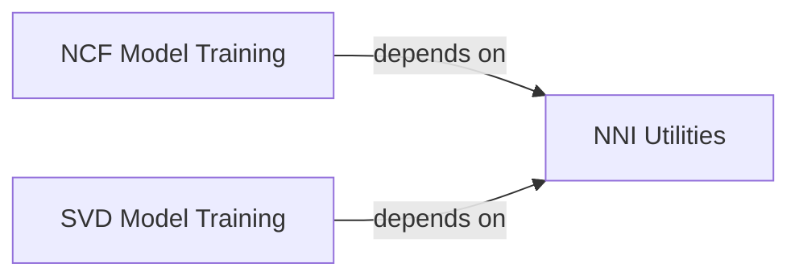

## Details

The `Model Optimization (Hyperparameter Tuning)` subsystem within the `recommenders` project is designed to facilitate automated hyperparameter tuning, primarily through integration with the NNI (Neural Network Intelligence) framework. This subsystem embodies the project's architectural bias towards experimentation and prototyping, providing a modular and extensible way to optimize various recommendation models.

### NNI Utilities
This component serves as the primary interface for programmatic interaction with the NNI framework. It provides essential functions to manage the lifecycle of NNI experiments, including starting, stopping, and checking the status of tuning jobs. It abstracts the underlying NNI API calls, offering a consistent way for different model training components to integrate with NNI.

**Related Classes/Methods**:

- <a href="https://github.com/recommenders-team/recommenders/blob/main/recommenders/tuning/nni/nni_utils.py" target="_blank" rel="noopener noreferrer">`nni_utils`</a>

### NCF Model Training
This component encapsulates the complete training pipeline for Neural Collaborative Filtering (NCF) models. It is specifically designed to be "tunable," meaning it can receive hyperparameters from an external optimization framework (NNI) and execute training based on those parameters. It then computes and reports relevant evaluation metrics back to the optimizer.

**Related Classes/Methods**:

- <a href="https://github.com/recommenders-team/recommenders/blob/main/recommenders/tuning/nni/ncf_training.py#L30-L119" target="_blank" rel="noopener noreferrer">`ncf_training`:30-119</a>

### SVD Model Training
Similar to `ncf_training`, this module implements the training procedure for Singular Value Decomposition (SVD) models. It is also structured to integrate seamlessly with NNI for hyperparameter tuning, consuming NNI-provided parameters for its training run and reporting its performance outcomes.

**Related Classes/Methods**:

- <a href="https://github.com/recommenders-team/recommenders/blob/main/recommenders/tuning/nni/svd_training.py#L24-L114" target="_blank" rel="noopener noreferrer">`svd_training`:24-114</a>

### [FAQ](https://github.com/CodeBoarding/GeneratedOnBoardings/tree/main?tab=readme-ov-file#faq)