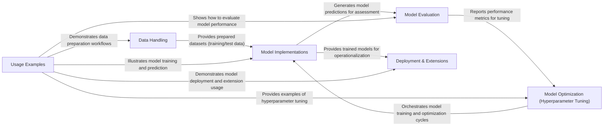

## Details

The `recommenders` project functions as a comprehensive ML toolkit for building and evaluating recommendation systems, following a pipeline architecture. The core flow begins with the Data Handling component, responsible for ingesting raw datasets and transforming them into prepared training and testing sets. These prepared datasets are then fed into the Model Implementations component, which encompasses a wide array of recommendation algorithms, from traditional methods to advanced deep learning and news recommendation models. Once models are trained and generate predictions, the Model Evaluation component steps in to assess their performance using various metrics. For optimizing model performance, the Model Optimization (Hyperparameter Tuning) component orchestrates the training process, leveraging evaluation metrics to refine model parameters. Finally, trained models can be moved to the Deployment & Extensions component for operationalization, including integration with platforms like Azure ML, or extended with specialized contributions like SARPlus. The entire workflow is extensively demonstrated and guided by the Usage Examples component, providing practical, runnable tutorials.

### Data Handling
Manages the entire data lifecycle from raw ingestion of various datasets (MovieLens, Criteo, Amazon Reviews, MIND, Wikidata) to initial cleaning, feature engineering, and splitting into training, validation, and test sets using diverse strategies (e.g., chronological, stratified). Supports both Pandas and Spark DataFrames.

**Related Classes/Methods**:

- <a href="https://github.com/recommenders-team/recommenders/blob/main/recommenders/datasets/movielens.py" target="_blank" rel="noopener noreferrer">`recommenders/datasets/movielens.py`</a>
- <a href="https://github.com/recommenders-team/recommenders/blob/main/recommenders/datasets/criteo.py" target="_blank" rel="noopener noreferrer">`recommenders/datasets/criteo.py`</a>
- <a href="https://github.com/recommenders-team/recommenders/blob/main/recommenders/datasets/amazon_reviews.py" target="_blank" rel="noopener noreferrer">`recommenders/datasets/amazon_reviews.py`</a>
- <a href="https://github.com/recommenders-team/recommenders/blob/main/recommenders/datasets/mind.py" target="_blank" rel="noopener noreferrer">`recommenders/datasets/mind.py`</a>
- <a href="https://github.com/recommenders-team/recommenders/blob/main/recommenders/datasets/python_splitters.py" target="_blank" rel="noopener noreferrer">`recommenders/datasets/python_splitters.py`</a>
- <a href="https://github.com/recommenders-team/recommenders/blob/main/recommenders/datasets/spark_splitters.py" target="_blank" rel="noopener noreferrer">`recommenders/datasets/spark_splitters.py`</a>

### Model Implementations
Houses a comprehensive suite of recommendation algorithms, including traditional methods (e.g., SAR), deep learning models (e.g., NCF, VAE, xDeepFM, DKN, sequential models like Caser, GRU), and specialized news recommendation models (e.g., LSTUR, NRMS). These models are designed for training and prediction.

**Related Classes/Methods**:

- <a href="https://github.com/recommenders-team/recommenders/blob/main/recommenders/models/ncf/ncf_singlenode.py" target="_blank" rel="noopener noreferrer">`recommenders/models/ncf/ncf_singlenode.py`</a>
- <a href="https://github.com/recommenders-team/recommenders/blob/main/recommenders/models/vae/standard_vae.py" target="_blank" rel="noopener noreferrer">`recommenders/models/vae/standard_vae.py`</a>
- <a href="https://github.com/recommenders-team/recommenders/blob/main/recommenders/models/sar/sar_singlenode.py" target="_blank" rel="noopener noreferrer">`recommenders/models/sar/sar_singlenode.py`</a>
- <a href="https://github.com/recommenders-team/recommenders/blob/main/recommenders/models/sasrec/model.py" target="_blank" rel="noopener noreferrer">`recommenders/models/sasrec/model.py`</a>
- <a href="https://github.com/recommenders-team/recommenders/blob/main/recommenders/models/deeprec/models/base_model.py" target="_blank" rel="noopener noreferrer">`recommenders/models/deeprec/models/base_model.py`</a>
- <a href="https://github.com/recommenders-team/recommenders/blob/main/recommenders/models/newsrec/models/base_model.py" target="_blank" rel="noopener noreferrer">`recommenders/models/newsrec/models/base_model.py`</a>

### Model Evaluation
Provides a robust set of metrics to assess the performance of recommendation models, covering both rating prediction (e.g., RMSE) and ranking tasks (e.g., Precision@k, NDCG@k, Diversity, Novelty). Supports both Python (Pandas) and Spark DataFrames.

**Related Classes/Methods**:

- <a href="https://github.com/recommenders-team/recommenders/blob/main/recommenders/evaluation/python_evaluation.py" target="_blank" rel="noopener noreferrer">`recommenders/evaluation/python_evaluation.py`</a>
- <a href="https://github.com/recommenders-team/recommenders/blob/main/recommenders/evaluation/spark_evaluation.py" target="_blank" rel="noopener noreferrer">`recommenders/evaluation/spark_evaluation.py`</a>

### Model Optimization (Hyperparameter Tuning) [[Expand]](./Model_Optimization_Hyperparameter_Tuning_.md)
Integrates with NNI (Neural Network Intelligence) to facilitate automated hyperparameter optimization, enabling efficient tuning and improvement of model performance.

**Related Classes/Methods**:

- <a href="https://github.com/recommenders-team/recommenders/blob/main/recommenders/tuning/nni/nni_utils.py" target="_blank" rel="noopener noreferrer">`recommenders/tuning/nni/nni_utils.py`</a>

### Deployment & Extensions
Encompasses modules for operationalizing models, including integration with Azure Machine Learning Designer for streamlined deployment, and community contributions like the optimized SARPlus model.

**Related Classes/Methods**:

- <a href="https://github.com/recommenders-team/recommenders/blob/main/contrib/azureml_designer_modules/entries/train_sar_entry.py" target="_blank" rel="noopener noreferrer">`contrib/azureml_designer_modules/entries/train_sar_entry.py`</a>
- <a href="https://github.com/recommenders-team/recommenders/blob/main/contrib/sarplus/python/pysarplus/SARPlus.py" target="_blank" rel="noopener noreferrer">`contrib/sarplus/python/pysarplus/SARPlus.py`</a>

### Usage Examples
Offers a collection of runnable examples and Jupyter notebooks that demonstrate how to effectively utilize the `recommenders` library across various datasets, models, and evaluation scenarios.

**Related Classes/Methods**:

- <a href="https://github.com/recommenders-team/recommenders/blob/main/recommenders/utils/notebook_utils.py" target="_blank" rel="noopener noreferrer">`recommenders/utils/notebook_utils.py`</a>
- <a href="https://github.com/recommenders-team/recommenders/blob/main/examples/" target="_blank" rel="noopener noreferrer">`examples/`</a>

### [FAQ](https://github.com/CodeBoarding/GeneratedOnBoardings/tree/main?tab=readme-ov-file#faq)