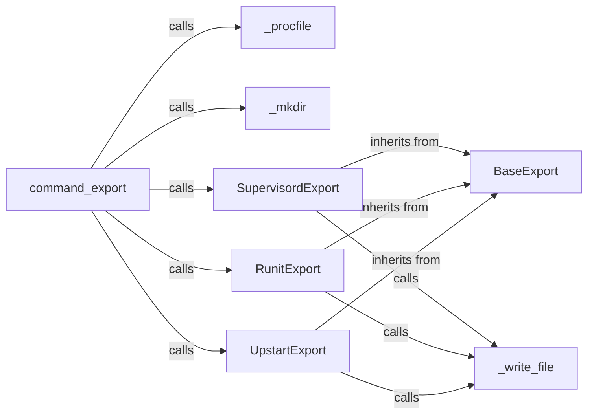

## Component Details

The Configuration Exporter component in Honcho is responsible for translating a Procfile into configuration files suitable for various process management systems like Supervisord, Runit, and Upstart. The `command_export` function serves as the entry point, parsing arguments and reading the Procfile. It then creates the target directory and instantiates the appropriate exporter class (SupervisordExport, RunitExport, or UpstartExport) based on the user's choice. These exporter classes inherit from a common `BaseExport` class, providing a consistent interface. Each exporter class renders the configuration files specific to its target system and writes them to the target directory.

### command_export
Entry point for the export command. It parses arguments, reads the Procfile, creates the target directory, and calls the appropriate export renderer.
- **Related Classes/Methods**: `honcho.honcho.command:command_export`

### _procfile
Reads and parses the Procfile, returning a dictionary representing the processes defined within it.
- **Related Classes/Methods**: `honcho.honcho.command:_procfile`

### _mkdir
Creates the target directory where the exported configuration files will be stored.
- **Related Classes/Methods**: `honcho.honcho.command:_mkdir`

### _write_file
Writes the rendered configuration file to the specified path.
- **Related Classes/Methods**: `honcho.honcho.command:_write_file`

### BaseExport
Base class for all export format renderers. It provides common functionality and defines the interface for rendering configuration files.
- **Related Classes/Methods**: `honcho.honcho.export.base.BaseExport:__init__`

### SupervisordExport
Renders Supervisord configuration files based on the Procfile.
- **Related Classes/Methods**: `honcho.honcho.export.supervisord.Export:render`

### RunitExport
Renders Runit configuration files based on the Procfile.
- **Related Classes/Methods**: `honcho.honcho.export.runit.Export:render`

### UpstartExport
Renders Upstart configuration files based on the Procfile.
- **Related Classes/Methods**: `honcho.honcho.export.upstart.Export:render`
