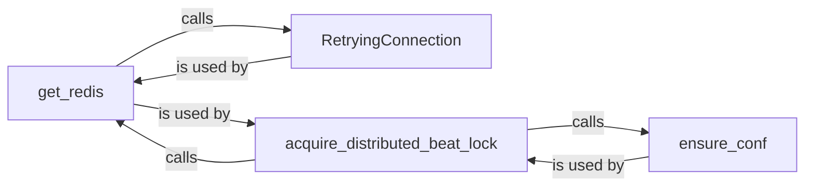

## Component Details

The Redbeat scheduler uses Redis to manage periodic tasks in Celery. It ensures that only one beat process is active at a time using a distributed lock. The process involves configuring and establishing a Redis connection, acquiring a lock, running the scheduler, and releasing the lock upon completion or interruption. This prevents multiple beat processes from interfering with each other, ensuring tasks are executed as expected.

### get_redis
Retrieves a Redis connection. It first ensures the Redis configuration is valid and then attempts to establish a connection using `RetryingConnection`. This function is crucial for interacting with Redis, where the schedule and lock information are stored.
- **Related Classes/Methods**: `redbeat.redbeat.schedulers:get_redis`

### ensure_conf
Ensures that the Redis configuration is properly set up. This might involve setting specific Redis settings or performing other configuration tasks to ensure Redbeat can function correctly. It's a setup step before acquiring a Redis connection.
- **Related Classes/Methods**: `redbeat.redbeat.schedulers:ensure_conf`

### RetryingConnection
A class that handles establishing a Redis connection with retry logic. This is important for handling temporary connection issues and ensuring the scheduler can reliably connect to Redis.
- **Related Classes/Methods**: `redbeat.redbeat.schedulers.RetryingConnection`

### acquire_distributed_beat_lock
Acquires a distributed lock to ensure only one beat process is running at a time. This prevents multiple beat processes from executing the same tasks simultaneously, which could lead to data corruption or other issues. It uses `get_redis` to obtain a Redis connection for managing the lock.
- **Related Classes/Methods**: `redbeat.redbeat.schedulers:acquire_distributed_beat_lock`
