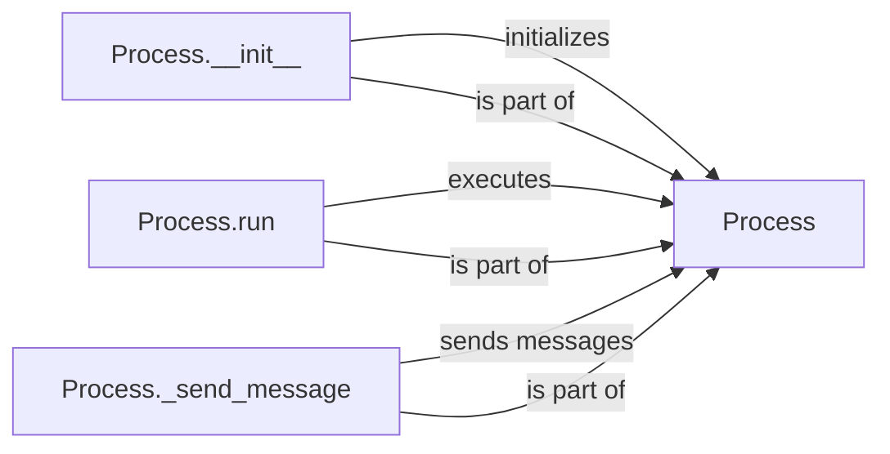

## Component Details

The Process Executor component is responsible for managing the lifecycle of individual processes defined in a Procfile. It handles process creation, monitoring, and communication, ensuring that each process runs according to its specified configuration. The component abstracts the complexities of process management, providing a clean interface for starting, stopping, and monitoring processes.

### Process
The `Process` class encapsulates the execution and monitoring of a single process. It's responsible for starting the process, capturing its output (stdout and stderr), and sending messages about its status (e.g., starting, stopping, crashing). It interacts with the operating system to manage the process and communicates with other components to report its status.
- **Related Classes/Methods**: `honcho.honcho.process.Process`

### Process.__init__
The `__init__` method initializes a `Process` object. It takes arguments such as the process name, command to execute, environment variables, and other configuration options. It sets up the process's attributes and prepares it for execution by storing the configuration and initializing internal state.
- **Related Classes/Methods**: `honcho.honcho.process.Process:__init__`

### Process.run
The `run` method is the core of the `Process` class. It starts the process using the configured command and environment. It then monitors the process's output streams (stdout and stderr), capturing and logging them. It also handles process termination, whether it's a normal exit or a crash, and sends appropriate status messages.
- **Related Classes/Methods**: `honcho.honcho.process.Process:run`

### Process._send_message
The `_send_message` method is responsible for sending status messages about the process to a central Honcho manager or logger. These messages include information about the process's state (e.g., starting, running, stopped, crashed), its output, and any errors that occur. This allows other parts of the system to track the process's lifecycle and respond accordingly.
- **Related Classes/Methods**: `honcho.honcho.process.Process:_send_message`
