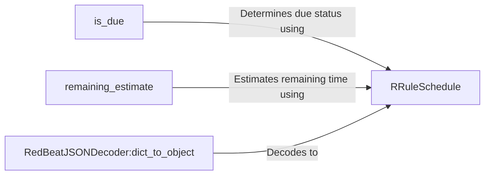

## Component Details

The RRuleSchedule component provides a way to schedule tasks based on recurrence rules defined using the `dateutil` library. It allows for complex and flexible scheduling patterns, enabling users to define sophisticated schedules. The component is responsible for determining when a task is due to be run, estimating the remaining time until the next scheduled execution, and decoding rrule schedules from JSON data.

### RRuleSchedule
Represents a recurring task schedule using the `rrule` library. It encapsulates the rules for when a task should be executed, allowing for complex scheduling patterns. It uses the `dateutil` library to provide advanced scheduling capabilities, enabling users to define sophisticated schedules.
- **Related Classes/Methods**: `redbeat.redbeat.schedules.rrule`

### is_due
Determines if a task is due to be run based on its rrule schedule and the current time. It uses the rrule's `after` method to find the next scheduled time and compares it to the current time.
- **Related Classes/Methods**: `redbeat.redbeat.schedules.rrule`

### remaining_estimate
Estimates the remaining time until the next scheduled execution of a task. It calculates the difference between the next scheduled time (determined by the rrule) and the current time.
- **Related Classes/Methods**: `redbeat.redbeat.schedules.rrule`

### RedBeatJSONDecoder:dict_to_object
Responsible for decoding JSON data into Python objects, specifically handling the conversion of dictionaries representing rrule schedules into `rrule` objects. This is crucial for loading schedule definitions from storage.
- **Related Classes/Methods**: `redbeat.redbeat.decoder`
