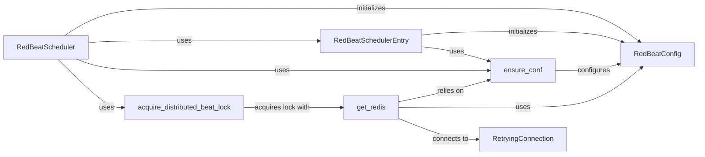

## Component Details

The RedBeat system extends Celery's beat scheduler to manage periodic tasks using Redis as a storage backend. It provides a way to define and manage schedules dynamically, allowing tasks to be added, modified, or removed without restarting the Celery beat process. The core components work together to load configurations, manage Redis connections, serialize and deserialize task schedules, and ensure that only one beat scheduler is active at a time.

### RedBeatConfig
Manages the configuration settings for RedBeat, including Redis connection parameters, key prefixes, and other settings. It provides a centralized point for accessing and managing configuration values used throughout the RedBeat system.
- **Related Classes/Methods**: `redbeat.redbeat.schedulers.RedBeatConfig`

### RedBeatScheduler
The main scheduler class that inherits from Celery's `Scheduler`. It's responsible for loading entries from Redis, updating the schedule, and ensuring the configuration is properly set up. It interacts with `RedBeatConfig` to manage configuration and `RedBeatSchedulerEntry` to represent individual schedule entries.
- **Related Classes/Methods**: `redbeat.redbeat.schedulers.RedBeatScheduler`

### RedBeatSchedulerEntry
Represents a single entry in the schedule, loaded from Redis. It handles serialization and deserialization of task data to and from Redis. It interacts with `RedBeatConfig` for configuration and stores the details of a Celery task to be scheduled.
- **Related Classes/Methods**: `redbeat.redbeat.schedulers.RedBeatSchedulerEntry`

### ensure_conf
A function that ensures the RedBeat configuration is properly initialized and available. It's called by various components to guarantee that the necessary settings are in place before proceeding. It interacts with `RedBeatConfig` to initialize or retrieve the configuration.
- **Related Classes/Methods**: `redbeat.redbeat.schedulers:ensure_conf`

### get_redis
Retrieves the Redis client instance based on the configuration. It's used to interact with the Redis server for storing and retrieving schedule entries. It relies on `ensure_conf` to ensure the configuration is loaded before attempting to connect to Redis.
- **Related Classes/Methods**: `redbeat.redbeat.schedulers:get_redis`

### RetryingConnection
A proxy for the Redis connection that retries calls to the underlying Redis connection upon connection or timeout errors. This ensures resilience against transient network issues.
- **Related Classes/Methods**: `redbeat.redbeat.schedulers.RetryingConnection`

### acquire_distributed_beat_lock
A function that acquires a distributed lock using Redis to ensure that only one beat scheduler is running at a time. This prevents multiple schedulers from executing the same tasks simultaneously.
- **Related Classes/Methods**: `redbeat.redbeat.schedulers:acquire_distributed_beat_lock`
