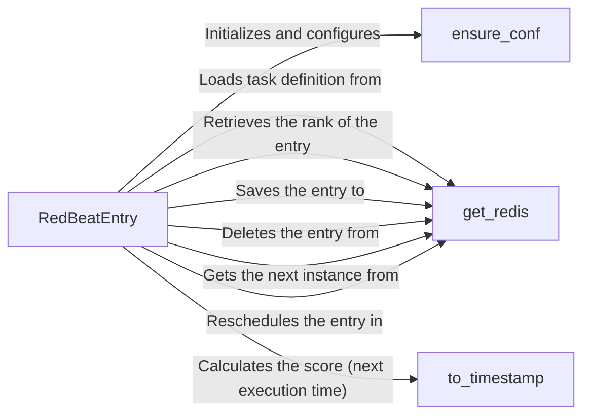

## Component Details

The RedBeat subsystem manages scheduled tasks within a Celery application, leveraging Redis for storage and coordination. It allows defining tasks with specific schedules, persisting them in Redis, and ensuring they are executed at the correct times. The core functionality revolves around defining, storing, retrieving, and executing scheduled tasks based on their defined schedules.

### RedBeatEntry
Represents a single scheduled task, encapsulating its schedule, task details, and metadata. It handles loading, saving, and deleting schedule entries in Redis, as well as determining if a task is due for execution based on the schedule.
- **Related Classes/Methods**: `redbeat.redbeat.schedulers.RedBeatSchedulerEntry`

### get_redis
Retrieves the Redis client instance used for interacting with the Redis server. This client is used for all Redis operations related to storing and retrieving schedule information.
- **Related Classes/Methods**: `redbeat.redbeat.schedulers.get_redis`

### ensure_conf
Ensures that the Celery application configuration is properly set up for RedBeat. This includes verifying that the necessary settings for Redis connection and other RedBeat-related configurations are in place.
- **Related Classes/Methods**: `redbeat.redbeat.schedulers.ensure_conf`

### to_timestamp
Converts a datetime object to a timestamp, which is used for calculating the score (next execution time) of a scheduled task. This allows for easy comparison and sorting of tasks based on their scheduled execution time.
- **Related Classes/Methods**: `redbeat.redbeat.decoder.to_timestamp`
