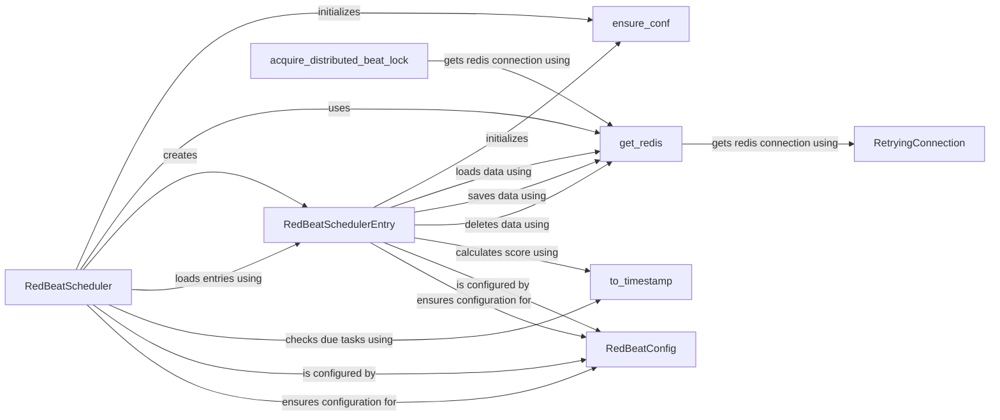

## Component Details

The RedBeatScheduler is a Celery beat scheduler that persists schedules in Redis. It manages the scheduling and execution of Celery tasks based on configurations stored in Redis. The scheduler retrieves schedules, determines task execution times, and triggers tasks accordingly, while also ensuring only one beat process runs at a time using distributed locking.

### RedBeatScheduler
The central scheduler class responsible for loading schedules from Redis, scheduling tasks for execution, and persisting schedule updates. It inherits from Celery's Beat scheduler and orchestrates the interaction between other components to manage periodic tasks.
- **Related Classes/Methods**: `redbeat.redbeat.schedulers.RedBeatScheduler`

### RedBeatSchedulerEntry
Represents a single entry in the schedule, encapsulating the details of a periodic task. It handles loading, saving, and deleting schedule definitions from Redis, and determines when a task is due to be run based on its configured schedule.
- **Related Classes/Methods**: `redbeat.redbeat.schedulers.RedBeatSchedulerEntry`

### RedBeatConfig
Configuration class for RedBeat, responsible for managing settings related to Redis connection and schedule storage. It provides a centralized way to access and modify RedBeat's configuration parameters.
- **Related Classes/Methods**: `redbeat.redbeat.schedulers.RedBeatConfig`

### get_redis
A function that retrieves a Redis connection instance, using connection parameters from the Celery app configuration. It provides a consistent way to obtain a Redis connection for interacting with the schedule storage.
- **Related Classes/Methods**: `redbeat.redbeat.schedulers.get_redis`

### ensure_conf
Ensures that the redbeat configuration is properly initialized within the Celery app. It sets up the necessary configuration parameters for RedBeat to function correctly.
- **Related Classes/Methods**: `redbeat.redbeat.schedulers.ensure_conf`

### to_timestamp
Converts a datetime object to a timestamp, used for scheduling tasks. It provides a consistent way to represent task execution times.
- **Related Classes/Methods**: `redbeat.redbeat.decoder.to_timestamp`

### acquire_distributed_beat_lock
Acquires a distributed lock to ensure only one beat process is running at a time. It prevents multiple beat processes from interfering with each other and ensures consistent scheduling.
- **Related Classes/Methods**: `redbeat.redbeat.schedulers.acquire_distributed_beat_lock`

### RetryingConnection
A wrapper around Redis connection that retries on connection errors. It enhances the reliability of Redis connections by automatically retrying failed attempts.
- **Related Classes/Methods**: `redbeat.redbeat.schedulers.RetryingConnection`
