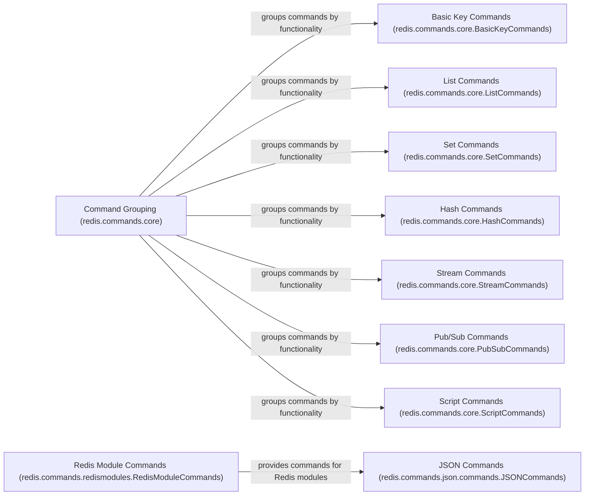

## Component Details

The Redis Command Abstraction component provides a high-level API for interacting with Redis data structures and functionalities. It organizes Redis commands by data type and functionality, such as keys, strings, lists, sets, and hashes. It also includes support for Redis Modules, allowing users to extend Redis with custom commands and data types. The component simplifies the process of executing Redis commands and managing data within the Redis server.

### Command Grouping (redis.commands.core)
This component groups Redis commands by functionality, providing a structured way to access and organize them. It acts as a central point for accessing different categories of Redis commands, such as key operations, list operations, and set operations.
- **Related Classes/Methods**: `redis.commands.core.BasicKeyCommands`, `redis.commands.core.ListCommands`, `redis.commands.core.SetCommands`, `redis.commands.core.SortedSetCommands`, `redis.commands.core.HashCommands`, `redis.commands.core.StreamCommands`, `redis.commands.core.PubSubCommands`, `redis.commands.core.ScriptCommands`, `redis.commands.core.GeoCommands`, `redis.commands.core.HyperlogCommands`, `redis.commands.core.ManagementCommands`, `redis.commands.core.ACLCommands`, `redis.commands.core.ModuleCommands`, `redis.commands.core.FunctionCommands`, `redis.commands.core.ClusterCommands`

### Basic Key Commands (redis.commands.core.BasicKeyCommands)
This component implements Redis commands related to basic key operations, such as setting, getting, deleting, and expiring keys. It provides methods for interacting with key-value pairs in Redis.
- **Related Classes/Methods**: `redis.commands.core.BasicKeyCommands`

### List Commands (redis.commands.core.ListCommands)
This component implements Redis list commands, providing methods for manipulating lists, such as pushing, popping, inserting, and trimming elements. It allows users to perform various operations on Redis lists.
- **Related Classes/Methods**: `redis.commands.core.ListCommands`

### Set Commands (redis.commands.core.SetCommands)
This component implements Redis set commands, offering methods for adding, removing, checking membership, and performing set operations like union and intersection. It enables users to work with Redis sets.
- **Related Classes/Methods**: `redis.commands.core.SetCommands`

### Hash Commands (redis.commands.core.HashCommands)
This component implements Redis hash commands, offering methods for manipulating hash fields and values, such as setting, getting, deleting, and incrementing fields. It allows users to manage data within Redis hashes.
- **Related Classes/Methods**: `redis.commands.core.HashCommands`

### Stream Commands (redis.commands.core.StreamCommands)
This component implements Redis stream commands, providing methods for adding, reading, and managing stream entries and consumer groups. It enables users to work with Redis streams for real-time data processing.
- **Related Classes/Methods**: `redis.commands.core.StreamCommands`

### Pub/Sub Commands (redis.commands.core.PubSubCommands)
This component implements Redis pub/sub commands, providing methods for publishing messages and subscribing to channels. It allows users to implement publish-subscribe patterns with Redis.
- **Related Classes/Methods**: `redis.commands.core.PubSubCommands`

### Script Commands (redis.commands.core.ScriptCommands)
This component implements Redis scripting commands, providing methods for registering, evaluating, and managing Lua scripts. It enables users to extend Redis functionality with custom scripts.
- **Related Classes/Methods**: `redis.commands.core.ScriptCommands`

### Redis Module Commands (redis.commands.redismodules.RedisModuleCommands)
This component provides commands specific to Redis modules like JSON, FT (RediSearch), and others. It allows users to interact with Redis modules and utilize their functionalities.
- **Related Classes/Methods**: `redis.commands.redismodules.RedisModuleCommands`

### JSON Commands (redis.commands.json.commands.JSONCommands)
This component implements commands for the RedisJSON module, providing methods for manipulating JSON values stored in Redis. It allows users to store, retrieve, and manipulate JSON data within Redis.
- **Related Classes/Methods**: `redis.commands.json.commands.JSONCommands`
