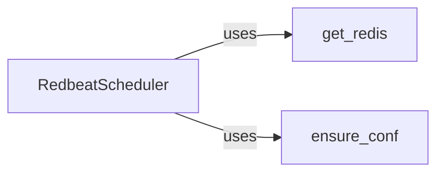

## Component Details

The Redbeat Redis Connection Manager is responsible for handling the connection to the Redis server, ensuring that the Celery application can reliably access Redis for scheduling tasks. It encompasses the retrieval of the Redis client, ensuring the Celery app is properly configured to use Redis, and providing the Redbeat scheduler with the necessary Redis connection. This system abstracts the complexities of Redis connection management, offering a simplified interface for other components.

### get_redis
Retrieves the Redis client instance used by Redbeat. It checks if a Redis client is already available and returns it, or it creates a new Redis client based on the Celery app's configuration. This function ensures that Redbeat has a valid Redis connection to work with.
- **Related Classes/Methods**: `redbeat.redbeat.schedulers:get_redis`

### ensure_conf
Ensures that the Celery app has the necessary configuration for Redbeat to function correctly. This involves setting the `redbeat_redis` configuration option if it's not already set, using the Celery app's broker URL. This configuration is crucial for Redbeat to locate and connect to the Redis server.
- **Related Classes/Methods**: `redbeat.redbeat.schedulers:ensure_conf`

### RedbeatScheduler
The main scheduler class that integrates with Celery and uses Redis to store and manage scheduled tasks. It utilizes `get_redis` to obtain a Redis connection and `ensure_conf` to ensure proper configuration. The scheduler is the central component that orchestrates the scheduling and execution of tasks based on the data stored in Redis.
- **Related Classes/Methods**: `redbeat.redbeat.schedulers:RedbeatScheduler`
