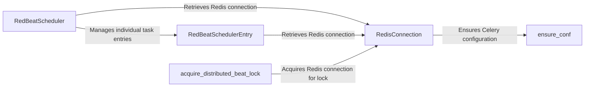

## Component Details

The RedBeat scheduler leverages Redis for managing Celery beat schedules, providing a distributed and persistent alternative to the default in-memory scheduler. It ensures that only one beat scheduler is active at a time using a distributed lock. The scheduler retrieves task schedules from Redis, schedules them with Celery, and periodically checks for due tasks. Redis is used for storing and retrieving schedule entries, as well as for acquiring a distributed lock to prevent multiple schedulers from running concurrently.

### RedBeatScheduler
The main scheduler class that integrates with Celery's beat scheduler. It is responsible for setting up the schedule by retrieving entries from Redis and scheduling them with Celery. It also handles the periodic tick to check for due tasks. It uses `RedBeatSchedulerEntry` to manage individual task entries and `get_redis` to connect to Redis.
- **Related Classes/Methods**: `redbeat.redbeat.schedulers.RedBeatScheduler:setup_schedule`, `redbeat.redbeat.schedulers.RedBeatScheduler:schedule`, `redbeat.redbeat.schedulers.RedBeatScheduler:tick`

### RedBeatSchedulerEntry
Represents a single entry in the RedBeat schedule. It handles loading task definitions and metadata from Redis, saving and deleting entries, and calculating the next execution time. It interacts with Redis to persist and retrieve task schedules.
- **Related Classes/Methods**: `redbeat.redbeat.schedulers.RedBeatSchedulerEntry:load_definition`, `redbeat.redbeat.schedulers.RedBeatSchedulerEntry:load_meta`, `redbeat.redbeat.schedulers.RedBeatSchedulerEntry:from_key`, `redbeat.redbeat.schedulers.RedBeatSchedulerEntry:rank`, `redbeat.redbeat.schedulers.RedBeatSchedulerEntry:save`, `redbeat.redbeat.schedulers.RedBeatSchedulerEntry:delete`, `redbeat.redbeat.schedulers.RedBeatSchedulerEntry:_next_instance`, `redbeat.redbeat.schedulers.RedBeatSchedulerEntry:reschedule`

### RedisConnection
Handles the connection to the Redis server, including connection pooling, retry mechanisms, and configuration management. It provides a reliable and efficient interface for interacting with Redis, ensuring that RedBeat can consistently access and manage schedules.
- **Related Classes/Methods**: `redbeat.redbeat.schedulers.get_redis`, `redbeat.redbeat.schedulers.RetryingConnection`

### acquire_distributed_beat_lock
A function that acquires a distributed lock using Redis to ensure that only one beat scheduler is running at a time. It uses `get_redis` to connect to Redis and manage the lock.
- **Related Classes/Methods**: `redbeat.redbeat.schedulers:acquire_distributed_beat_lock`

### ensure_conf
A function that ensures the Celery configuration is properly set up for RedBeat, specifically setting the broker URL to Redis if it's not already configured.
- **Related Classes/Methods**: `redbeat.redbeat.schedulers:ensure_conf`
